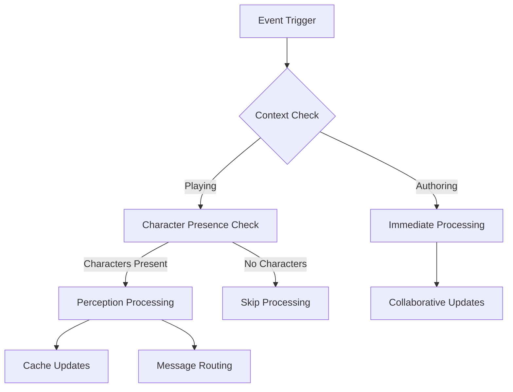

# Event Architecture - Agent Navigation Guide

## Overview

Make The World operates as a complex event-driven system where **character presence filtering** determines when computational work occurs. This document details the technical implementation of event propagation, filtering, and processing that supports the [Architectural Philosophy](AGENT.architecture.philosophy.md) of perception-driven computing.

## Event Processing Flow

### Primary Event Pipeline



### Event Categories

#### **1. Authoring Events**
Events that occur in collaborative content creation context:
- **WML Asset Updates**: Changes to world markup language files
- **Permission Changes**: Asset access modifications
- **Version Control**: Asset state synchronization
- **Draft Management**: Collaborative editing coordination

**Processing**: Always immediate, regardless of character presence

#### **2. Playing Events** 
Events that occur in character-based gameplay context:
- **Character Actions**: Movement, interaction, communication
- **Environmental Changes**: Room updates, feature modifications
- **Perception Requests**: Character observation of world elements
- **World State Changes**: Dynamic content updates

**Processing**: Filtered through character presence detection

This dual-mode distinction is driven by the core [Architectural Philosophy](AGENT.architecture.philosophy.md) and manifests in the user interface as documented in [Client Architecture](charcoal-client/AGENT.md).

## Character Presence Detection

### Primary Mechanism

The core filtering occurs in the perception system (`lambda/ephemera/perception/index.ts`). Processing is keyed by `ephemeraId` (asset, room, feature, knowledge, character, or map), for example:

```typescript
export const perceptionMessage = async ({ payloads, messageBus }: PerceptionParams) => {
    await Promise.all(payloads.map(async (payload) => {
        if (isPerceptionRoomMessage(payload)) {
            const characterList = payload.characterId
                ? [payload.characterId]
                : (await internalCache.RoomCharacterList.get(payload.ephemeraId)).map(({ EphemeraId }) => EphemeraId)
            await Promise.all(characterList.map(async (characterId) => {
                const cacheRows = await internalCache.RenderCache.get(payload.ephemeraId)
                const wmlContent = roomRenderChannelWmlForRoomId(payload.ephemeraId, cacheRows)
                messageBus.send({
                    type: 'PublishMessage',
                    displayProtocol: 'PerceptionMessage',
                    /* ... */
                })
            }))
        }
        // ... asset, component, map branches
    }))
}
```

WML `Message` components (`MESSAGE#`) are not routed through Ephemera perception; see `lambda/ephemera/perception/AGENT.md`.

### Character Location Tracking

The system maintains real-time character location data through:

#### **RoomCharacterList Cache**
```typescript
// Updated whenever characters move
await internalCache.RoomCharacterList.set({
    key: roomId,
    value: activeCharacters
})

// Queried before processing perception events
const characterList = await internalCache.RoomCharacterList.get(roomId)
```

#### **Character Movement Events** *(legacy `MoveCharacter` bus message retired --- see `mtw.ephemera.positions` / `navigate/executeCharacterNavigate`)*
```typescript
export const moveCharacter = async ({ payloads, messageBus }: MoveCharacterParams) => {
    await Promise.all(payloads.map(async (payload) => {
        // Update character location in database
        await ephemeraDB.transactWrite([
            {
                Update: {
                    Key: {
                        EphemeraId: payload.characterId,
                        DataCategory: 'Meta::Character'
                    },
                    updateKeys: ['RoomId'],
                    updateReducer: (draft) => {
                        draft.RoomId = payload.roomId
                    }
                }
            },
            {
                Update: {
                    Key: {
                        EphemeraId: payload.roomId,
                        DataCategory: 'Room::Active'
                    },
                    updateKeys: ['activeCharacters'],
                    updateReducer: (draft) => {
                        // Add character to room's active list
                        draft.activeCharacters = [
                            ...draft.activeCharacters.filter(char => char.EphemeraId !== payload.characterId),
                            { EphemeraId: payload.characterId, Name: characterMeta.Name }
                        ]
                    },
                    successCallback: ({ activeCharacters }) => {
                        // Update cache with new character list
                        internalCache.RoomCharacterList.set({ 
                            key: payload.roomId, 
                            value: activeCharacters 
                        })
                    }
                }
            }
        ])
    }))
}
```

## Event Types and Processing

### Perception Events

#### **Room Perception**
```typescript
// Triggered when: room content changes, character enters room
{
    type: 'Perception',
    characterId?: EphemeraCharacterId,  // Optional: specific character
    ephemeraId: EphemeraRoomId,         // Room to describe
    header?: boolean,                    // Header vs full description
    messageGroupId?: MessageGroupId
}
```

**Processing Logic:**
1. If `characterId` specified: send to that character only
2. If no `characterId`: get all characters in room via `RoomCharacterList.get(roomId)`
3. For each present character: build render-channel WML from `RenderCache` via `roomRenderWmlFromCacheRecord`
4. Send `PerceptionMessage` via message bus

#### **Component Perception**
```typescript
// Triggered when: character examines feature/knowledge, component changes
{
    type: 'Perception',
    characterId: EphemeraCharacterId,
    ephemeraId: EphemeraFeatureId | EphemeraKnowledgeId | EphemeraCharacterId,
    directResponse?: boolean
}
```

**Processing Logic:**
1. Validate character and component existence
2. Check character permissions for component access
3. Correlated delivery via `mtw.ephemera.perception` (`Render Pertains` terminal WML from `renderCache`)
4. Send appropriately formatted message (`FeatureDescription`, `KnowledgeDescription`, etc.)

### Movement Events *(legacy)*

> **Retired:** Imperative `MoveCharacter` bus messages were removed. Character navigate/home execution is owned by **`mtw.ephemera.positions`** via stream ingress (`Character Navigate`, `Character Home`) and **`executeCharacterNavigate`**.

#### **Character Movement** *(historical bus shape)*
```typescript
{
    type: 'MoveCharacter',
    characterId: EphemeraCharacterId,
    roomId: EphemeraRoomId,
    suppressArrival?: boolean,
    suppressDeparture?: boolean,
    arriveMessage?: string,
    leaveMessage?: string
}
```

**Processing Chain:**
1. **Database Update**: Character location and room occupancy
2. **Cache Update**: `RoomCharacterList` for both origin and destination rooms
3. **Departure Processing**: If other characters in origin room:
   - Send departure message to remaining characters
   - Skip if `suppressDeparture` is true
4. **Arrival Processing**: If other characters in destination room:
   - Send arrival message to present characters  
   - Skip if `suppressArrival` is true
5. **Perception Trigger**: Send room description to moving character
6. **Map Update**: Trigger map updates for character's UI

### Action Events

#### **Character Actions**
```typescript
{
    type: 'ExecuteAction',
    actionId: EphemeraActionId,
    characterId: EphemeraCharacterId
}
```

**Processing Chain:**
1. **Parse Action**: Determine action type and parameters
2. **Validate Permissions**: Check character access to action
3. **Execute Logic**: Perform action-specific computation
4. **Effect Calculation**: Determine observable consequences
5. **Witness Detection**: Find characters who can observe effects
6. **Perception Distribution**: Send results only to witnessing characters

## Caching Strategy

### Presence-Dependent Caches

#### **RenderCache and compose caches**
- **RenderCache**: Populated by render orchestration hydrate; read for room/F/K prose WML
- **AffordanceRoomDeliverable**: Per-invocation compose memo for affordance-channel structural WML
- **GenerationContext**: Per-invocation shortName cache for LLM grounding
- **Invalidation**: Gateway cache handlers clear/flush per lambda invocation; Dynamo memo patches on write paths

```typescript
// Room render-channel prose (imperative and correlated paths)
const cacheRows = await internalCache.RenderCache.get(roomId)
const wmlContent = roomRenderChannelWmlForRoomId(roomId, cacheRows)
```

#### **RoomCharacterList Cache**
- **Population**: Real-time maintenance as characters move
- **Critical Function**: Enables presence detection for all other caches
- **Update Frequency**: Every character movement event

```typescript
// Maintained in real-time to enable presence checking
internalCache.RoomCharacterList.set({ key: roomId, value: activeCharacters })
```

### Presence-Independent Caches

#### **ComponentData Cache**
- **Population**: On-demand when needed for any processing
- **Function**: Asset structure and relationship information
- **Scope**: Asset-level (not character-specific)

#### **AssetRooms Cache**
- **Population**: When assets are loaded or modified
- **Function**: Maps assets to their associated rooms for event routing
- **Invalidation**: When asset structure changes

## Message Bus Integration

### Event Routing

The message bus (`lambda/ephemera/messageBus/index.ts`) coordinates event processing:

```typescript
export const messageBus = new MessageBus()

// Character movement no longer uses a MoveCharacter bus subscriber.
// Positions DataSource receiveEvents routes stream ingress to executeCharacterNavigate.

// Medium priority: Perception processing
messageBus.subscribe({
    tag: 'Perception',
    priority: 15,  
    callback: perceptionMessage
})

// Lower priority: Message distribution
messageBus.subscribe({
    tag: 'PublishMessage',
    priority: 10,
    callback: publishMessage
})
```

### Event Orchestration

#### **Message Groups**
Coordinate related events that should be processed together:

```typescript
const messageGroupId = internalCache.OrchestrateMessages.newMessageGroup()

// Multiple related events (example: navigate orchestration messageGroupId)
messageBus.publish({
    type: 'MapUpdate',
    characterId,
    messageGroupId
})

messageBus.send({
    type: 'Perception', 
    characterId,
    ephemeraId: roomId,
    messageGroupId: internalCache.OrchestrateMessages.after(messageGroupId)
})
```

## Performance Optimization

### Batch Processing

```typescript
// Process multiple perception events in parallel
await Promise.all(payloads.map(async (payload) => {
    // Individual event processing
}))

// But check character presence once per room
const roomCharacterLists = await Promise.all(
    uniqueRooms.map(async (roomId) => (
        internalCache.RoomCharacterList.get(roomId)
    ))
)
```

### Selective Processing

```typescript
// Only process if someone can perceive the results
if (characterList.length > 0) {
    await processPerceptionEvent(payload)
} else {
    // Skip processing entirely - no computational cost
    return
}
```

### Asset Filtering

```typescript
// Further filter by asset access when specified
if (onlyForAssets) {
    const { assets } = await internalCache.CharacterMeta.get(EphemeraId)
    if (!assets.find((asset) => (onlyForAssets.includes(asset)))) {
        return // Character doesn't have access to relevant assets
    }
}
```

## Error Handling and Resilience

### Graceful Degradation

```typescript
try {
    const characterList = await internalCache.RoomCharacterList.get(roomId)
    // Process normally
} catch (error) {
    // If character presence check fails, err on side of processing
    console.warn(`Character presence check failed for ${roomId}:`, error)
    await processPerceptionEvent(payload) // Process anyway to avoid missed events
}
```

### Retry Logic

```typescript
await exponentialBackoffWrapper(async () => {
    await ephemeraDB.transactWrite([/* transaction operations */])
}, { 
    retryErrors: ['TransactionCanceledException'],
    maxRetries: 3 
})
```

## Integration Points

### Database Layer
- **EphemeraDB**: Character locations, room occupancy, asset metadata
- **Optimistic Updates**: Handle concurrent character movements
- **Transactions**: Ensure consistency across character location updates

### WebSocket Layer  
- **Connection Management**: Track active user sessions
- **Message Routing**: Deliver perception results to connected clients
- **Session Isolation**: Ensure messages reach intended recipients

### Asset System
- **WML Processing**: Parse world markup for content structure
- **Permission System**: Validate character access to assets and components
- **Version Control**: Handle asset updates and their propagation

## Development Patterns

### Adding New Event Types

1. **Define Event Interface**: Create TypeScript interface for event payload
2. **Add Type Guard**: Create validation function for event detection
3. **Implement Handler**: Create processing function with character presence checks
4. **Register with Message Bus**: Add subscription with appropriate priority
5. **Update Tests**: Ensure presence filtering works correctly

### Debugging Event Flow

1. **Enable Event Tracing**: Log event propagation through system
2. **Check Character Presence**: Verify `RoomCharacterList` cache state
3. **Examine Message Bus**: Review event ordering and priority
4. **Validate Permissions**: Ensure character access rights are correct
5. **Test Edge Cases**: No characters present, character permissions, etc.

## Future Architecture Considerations

### Planned Enhancements

#### **Event Prediction**
- **Character Movement Prediction**: Preload likely destinations
- **Interaction Prediction**: Cache probable character interactions
- **Smart Preloading**: Balance cost vs responsiveness

#### **Advanced Filtering**
- **Permission-Based Events**: More granular character access control
- **Temporal Filtering**: Events that only matter to characters at specific times
- **Context-Aware Processing**: Different event handling based on character state

### Scalability Patterns

#### **Event Partitioning**
- **Room-Based Partitioning**: Process events by geographic region
- **Character-Based Partitioning**: Isolate processing by character groups
- **Asset-Based Partitioning**: Separate processing by content ownership

#### **Caching Evolution**
- **Predictive Caching**: Anticipate likely character actions
- **Shared Perception Caching**: Cache common perceptions across characters
- **Adaptive TTL**: Adjust cache expiration based on character activity

## Navigation Tips

1. **Start with Flow Diagram**: Understand the basic event processing pipeline
2. **Examine Character Presence**: Focus on `RoomCharacterList` management
3. **Follow Event Types**: Trace specific event types through their processing
4. **Check Integration Points**: Understand how events connect to other systems
5. **Review Performance Patterns**: See how presence filtering optimizes resource usage

## Domain-Specific Event Flows

The Domain-Authoritative Event Mesh pattern manifests through specific event processing patterns within each lambda subsystem. The following documents provide detailed analysis of event flows within each domain:

### **Lambda-Specific Event Documentation**
- **[Assets Event Flows](lambda/assets/AGENT.event.md)**: Component caching, metadata management, and file coordination events
- **[Ephemera Event Flows](lambda/ephemera/AGENT.event.md)**: Real-time character state, perception filtering, and WebSocket communication events  
- **[WML Event Flows](lambda/wml/AGENT.event.md)**: Content parsing, schema validation, and transformation workflow events

### **Data Transformation Pipeline**

The WML-to-Assets relationship exemplifies how domain authority operates across transformation boundaries:

#### **Source of Truth: WML Lambda**
- **Authoritative Source**: S3 WML files are the canonical source of all content
- **Content Operations**: All create, update, delete operations on source content
- **Schema Validation**: Ensures WML content meets structural requirements
- **Transformation Coordination**: Publishes events when source content changes

#### **Materialized Views: Assets Lambda**
- **Parsed Representation**: Maintains DynamoDB tables with component-level granularity
- **Query Optimization**: Structures data for efficient component lookups and cross-references
- **Cache Management**: Handles incremental updates and cache invalidation
- **Integration Authority**: Serves parsed component data to other subsystems (especially Ephemera)

#### **Event-Driven Coordination** *(Migration In Progress)*
- **WML Changes**: WML Lambda publishes Content Update events when source files change
- **Cache Updates**: 🔄 **Migration Incomplete** - Assets Lambda should subscribe to these events but migration was paused due to downstream complexities
- **Perception Integration**: 🔄 **Legacy Pattern** - Ephemera Lambda currently receives WML events directly to support Variable/Computed/Action systems

**Current Flow (Legacy)**: `WML → Ephemera (direct cacheAsset)`  
**Target Flow (Post-Migration)**: `WML → Assets → Ephemera`

This pattern reflects a partially-completed migration from Ephemera-owned asset caching to Assets Lambda domain authority. The migration was paused due to complex dependencies in the Variable/Computed/Action system that rely on Ephemera's asset caching implementation.

This separation enables the WML Lambda to focus on content integrity and validation while the Assets Lambda optimizes for runtime access patterns and integration needs.

For implementation details of this pipeline, see:
- **[WML Event Flows](lambda/wml/AGENT.event.md)**: Source content event generation and publishing
- **[Assets Event Flows](lambda/assets/AGENT.event.md)**: Materialized view updates and cache management
- **[Ephemera Event Flows](lambda/ephemera/AGENT.event.md)**: Real-time consumption of component data for character interactions

## Related Documentation

- **[Architectural Philosophy](AGENT.architecture.philosophy.md)**: Core principles driving event design including Domain-Authoritative Event Mesh pattern
- **[Client Architecture](charcoal-client/AGENT.md)**: Frontend implementation of dual-mode user experience
- **[Perception System](lambda/ephemera/perception/AGENT.md)**: Detailed perception processing documentation  
- **[Internal Cache](lambda/ephemera/internalCache/AGENT.md)**: Caching system supporting event processing
- **[Message Bus](lambda/ephemera/messageBus/)**: Event routing and coordination system

This event architecture enables Make The World to achieve its core philosophical goal: computational work only occurs when there are characters present to perceive the results, ensuring both cost efficiency and narrative consistency.
