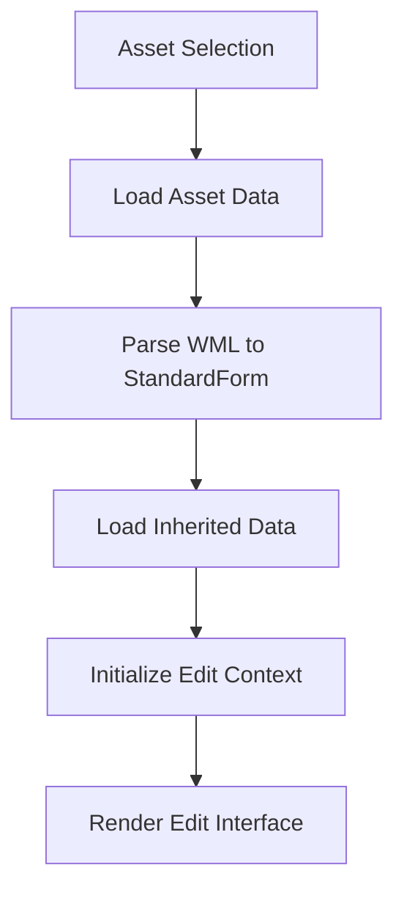
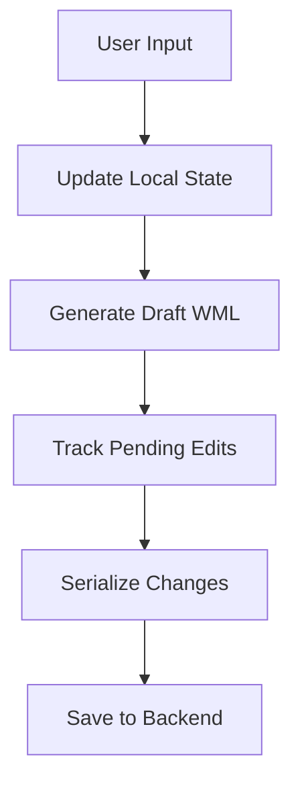

# Library Edit System

## Overview

The Library Edit System provides the user interface for editing and managing Make The World assets and characters. It handles the complete editing workflow from asset loading through to saving changes, including specialized handling for different asset types and their associated resources.

## Core Components

### LibraryAsset Context Provider

The `LibraryAsset` component serves as the central context provider for the editing system:

```typescript
export const LibraryAsset: FunctionComponent<LibraryAssetProps> = ({ 
    assetKey, 
    children, 
    character 
}) => {
    // Provides context for asset editing state
    // Manages WML, StandardForm, and asset properties
    // Handles inheritance and pending edits
}
```

**Key Responsibilities**:
- **Asset State Management**: Maintains current WML, draft WML, and StandardForm data
- **Inheritance Handling**: Manages inherited data from imported assets
- **Edit Tracking**: Tracks pending edits and serialization state
- **Property Management**: Handles asset properties including image associations
- **Context Provision**: Provides unified interface for child components

### Edit Workflow Components

#### EditCharacter
- **Purpose**: Specialized editor for character assets
- **Features**: Character-specific fields, icon management, player associations
- **Integration**: Uses `useLibraryImageURL` for character icon display

#### ImageHeader
- **Purpose**: Displays and manages image components
- **Features**: Image preview, upload integration, URL generation
- **Dependencies**: Relies on `useLibraryImageURL` for image serving

#### Other Edit Components
- **Asset-specific editors**: Room editors, feature editors, etc.
- **Form components**: Input fields, validation, change tracking
- **Preview components**: Real-time preview of changes

## Data Flow

### Asset Loading


### Edit Processing


## State Management

### Context Structure
```typescript
type LibraryAssetContextType = {
    assetKey: string;
    AssetId: EphemeraCharacterId | EphemeraAssetId;
    currentWML: string;
    draftWML: string;
    standardForm: StandardForm;
    localStandardForm: StandardForm;
    inheritedStandardForm: StandardFormData;
    inheritedByAssetId: { assetId: string; standardForm: StandardFormData }[];
    updateStandard: (action: UpdateStandardPayload) => void;
    loadedImages: Record<string, PersonalAssetsLoadedImage>;
    properties: Record<string, { fileName: string }>;
    readonly: boolean;
    serialized?: boolean;
    status?: keyof PersonalAssetsNodes;
    saving: boolean;
}
```

### Key State Elements
- **WML Data**: Current and draft WML representations
- **StandardForm**: Parsed component data for editing
- **Inheritance**: Data inherited from imported assets
- **Pending Edits**: Changes awaiting serialization
- **Properties**: Asset-specific metadata (including image associations)
- **Loaded Images**: Client-side image data for preview

## Integration Points

### Dependencies
- **Redux Store**: Configuration and global state
- **Asset System**: WML parsing and serialization
- **Image System**: Upload and serving infrastructure
- **Ephemera System**: Real-time state updates

### Cross-References
- **[Asset System](../../../lambda/assets/)**: Asset management backend
- **[WML System](../../../packages/mtw-wml/)**: Content parsing and validation
- **[Image Upload](../../../lambda/assets/upload/)**: Image upload process
- **[Image Processing](../../../lambda/wml/formatImage/)**: **DEPRECATED** - Old image processing system, replaced by `lambda/imageProcessor/`

## Usage Patterns

### Basic Asset Editing
```typescript
<LibraryAsset assetKey="myAsset">
    <EditCharacter />
    <ImageHeader ItemId="characterIcon" />
    <OtherEditComponents />
</LibraryAsset>
```

### Character-Specific Editing
```typescript
<LibraryAsset assetKey="myCharacter" character>
    <EditCharacter />
    <ImageHeader ItemId="characterIcon" />
</LibraryAsset>
```

## Image Handling Subsystem

### Current Architecture

The image handling system is currently integrated within the Library/Edit system through the `useLibraryImageURL` hook:

```typescript
export const useLibraryImageURL = (key: string): string => {
    const { loadedImages, properties } = useLibraryAsset()
    const { AppBaseURL = '' } = useSelector(getConfiguration)
    const [syntheticURL, setSyntheticURL] = useState<ImageHeaderSyntheticURL | undefined>()
    
    // ... URL generation logic
    
    const fileURL = useMemo(() => {
        const appBaseURL = DevEnvironment ? `https://${AppBaseURL}` : ''
        return syntheticURL ? syntheticURL.fileURL : 
               properties[key] ? `${appBaseURL}/images/${properties[key].fileName}.png` : ''
    }, [syntheticURL, properties, key])
    
    return fileURL
}
```

### Current URL Sources

1. **CloudFront URLs**: Primary serving mechanism
   ```typescript
   `${appBaseURL}/images/${properties[key].fileName}.png`
   ```

2. **Synthetic Object URLs**: Fallback for loaded images
   ```typescript
   URL.createObjectURL(loadedImage.file)
   ```

### Current Issues

1. **Dual URL System**: Complex logic for synthetic vs CloudFront URLs
2. **Property Dependencies**: Relies on fileName properties in JSON
3. **Memory Management**: Manual cleanup of synthetic URLs
4. **No Universal Key Integration**: Doesn't leverage universalKey system
5. **Tight Coupling**: Image handling tightly coupled to Library/Edit system

### Proposed Universal Key Solution

The system can be simplified by using `universalKey` directly for URL generation:

```typescript
// Current: `${appBaseURL}/images/${properties[key].fileName}.png`
// Proposed: `${appBaseURL}/images/${universalKey}.png`
```

### Benefits

1. **Simplified URL Generation**: Direct URL construction from universalKey
2. **Eliminated Properties**: No need for fileName property storage
3. **Predictable URLs**: URLs based on component identity
4. **Reduced Complexity**: Single URL generation strategy
5. **Automatic Cleanup**: No manual URL cleanup needed

### Implementation Plan

#### Phase 1: Universal Key Integration
```typescript
// Proposed implementation
export const useLibraryImageURL = (key: string): string => {
    const { loadedImages, standardForm } = useLibraryAsset()
    const { AppBaseURL = '' } = useSelector(getConfiguration)
    
    // Get component's universalKey
    const component = standardForm.byId[key]
    const universalKey = component?.universalKey
    
    const fileURL = useMemo(() => {
        if (!universalKey) return ''
        
        const appBaseURL = DevEnvironment ? `https://${AppBaseURL}` : ''
        return `${appBaseURL}/images/${universalKey}.png`
    }, [universalKey, AppBaseURL])
    
    return fileURL
}
```

## Future Development Plans

### Image System Reorganization

The current image handling is tightly coupled to the Library/Edit system, but it should be reorganized for better modularity:

#### Phase 1: Hook Extraction
1. **Extract Image Hook**: Move `useLibraryImageURL` to a dedicated image utilities module
2. **Create Image Context**: Establish dedicated image handling context
3. **Separate Concerns**: Decouple image logic from asset editing logic

#### Phase 2: Documentation Granularity
1. **Component-Level Docs**: Create focused documentation for each image-related component
2. **Hook Documentation**: Dedicated documentation for image handling hooks
3. **Utility Documentation**: Document image processing utilities

#### Phase 3: System Integration
1. **Universal Key Migration**: Implement universalKey-based image handling
2. **Property Elimination**: Remove fileName property dependencies
3. **Performance Optimization**: Optimize image loading and caching

### Proposed Structure

```
charcoal-client/src/
├── components/
│   ├── Library/Edit/
│   │   ├── AGENT.md (this file)
│   │   ├── LibraryAsset.tsx
│   │   ├── EditCharacter.tsx
│   │   └── ImageHeader.tsx
│   └── ImageHandling/ (future)
│       ├── AGENT.md
│       ├── ImageContext.tsx
│       └── ImageComponents.tsx
├── hooks/
│   └── imageHandling/ (future)
│       ├── AGENT.md
│       ├── useImageURL.ts
│       └── useImageUpload.ts
└── utils/
    └── imageHandling/ (future)
        ├── AGENT.md
        ├── imageProcessing.ts
        └── imageValidation.ts
```

### Migration Strategy

1. **Dual System Support**: Support both property and universalKey systems
2. **Gradual Migration**: Migrate components one by one
3. **Backward Compatibility**: Maintain existing functionality
4. **Cleanup Phase**: Remove old system after migration

## Error Handling

### Current Issues
- **Missing Properties**: fileName properties pointing to non-existent files
- **Synthetic URL Leaks**: Memory leaks from unrevoked object URLs
- **Fallback Complexity**: Complex logic for different URL sources
- **Tight Coupling**: Image handling tightly coupled to asset editing

### Proposed Improvements
- **Universal Key Validation**: Validate universalKey before URL generation
- **Simplified Error Handling**: Single URL generation strategy
- **No Memory Leaks**: No synthetic URL management needed
- **Modular Design**: Separated image handling concerns

## Development Notes

### Current State
- **Integrated System**: Image handling tightly coupled to Library/Edit
- **Property Dependencies**: Relies on fileName properties
- **Memory Management**: Manual synthetic URL cleanup
- **Complex Logic**: Dual URL system with fallback logic

### Future State
- **Universal Key System**: Simplified and elegant
- **Modular Architecture**: Separated image handling concerns
- **Direct URLs**: Single URL generation strategy
- **No Memory Management**: No synthetic URL handling

## Navigation Tips

### Key Files
- `LibraryAsset.tsx`: Main context provider and image hook
- `EditCharacter.tsx`: Character-specific editing
- `ImageHeader.tsx`: Image display component
- `baseClasses.ts`: Type definitions

### Related Systems
- **[Asset System](../../../lambda/assets/)**: Asset management backend
- **[Image Upload](../../../lambda/assets/upload/)**: Image upload process
- **[Image Processing](../../../lambda/wml/formatImage/)**: **DEPRECATED** - Old image processing system, replaced by `lambda/imageProcessor/`
- **[WML System](../../../packages/mtw-wml/)**: Content parsing and validation
