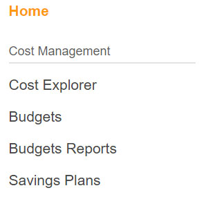
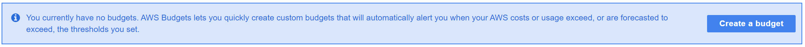
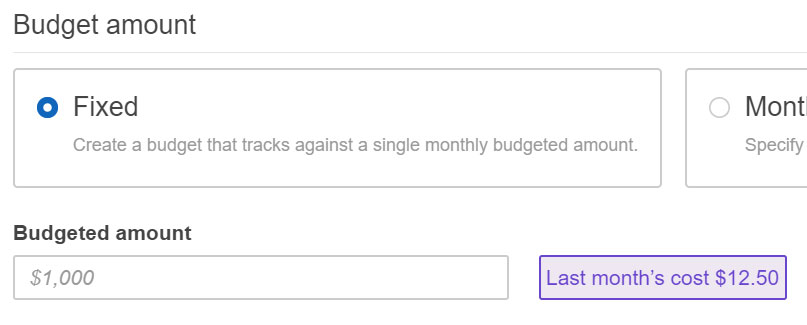

Creating a Budget
=================

1. First, navigate to your budget panel.  You can only do this on the root identity of your account (the one you log into with your email address).  Go to
the upper right side, and you should see an account menu item, which you can click to get several options (see below).  Select "My Billing Dashboard".

2. The dashboard gives you access to a lot of good billing information, but for right now we just want to go to the menu at left and choose 'Budgets'

3. Create a budget ... if you have not already done so, the page makes it very obvious:

4. Here’s another place it’s easy to get baffled: name your budget something like “MakeTheWorldMINE” or the name of the game you’re making a world for like “MTWSwords”, then there’s a list of different types of budgets that pops up.  Select fixed budget, and set an amount ... you can leave everything else as a default.  Then click "Configure alerts" at bottom right

5. Choose how you want to be alerted when you exceed some percentage of your budget:  I recommend 50%, and an email sent to you.