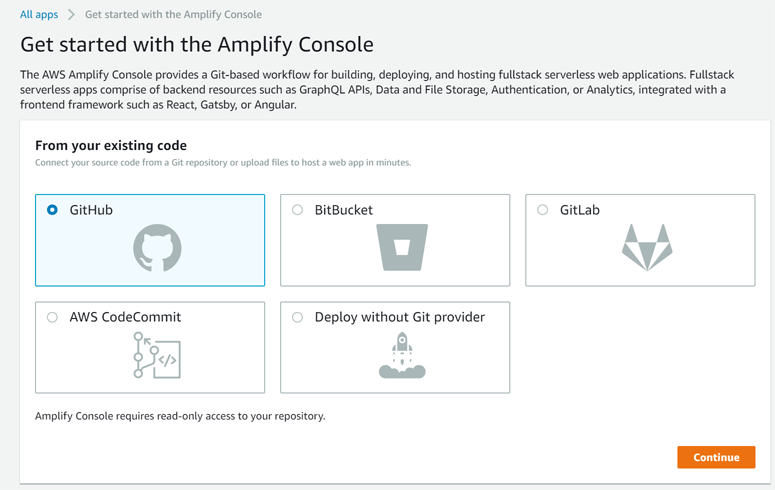
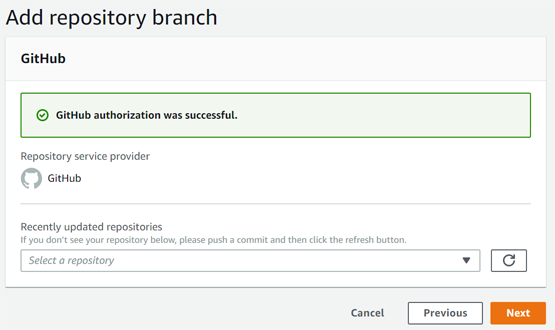
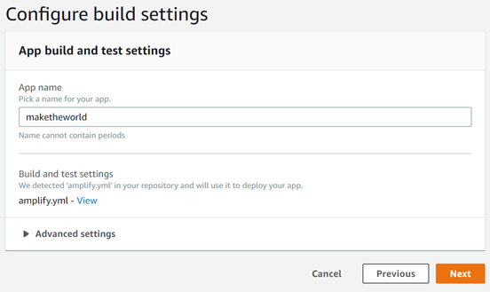
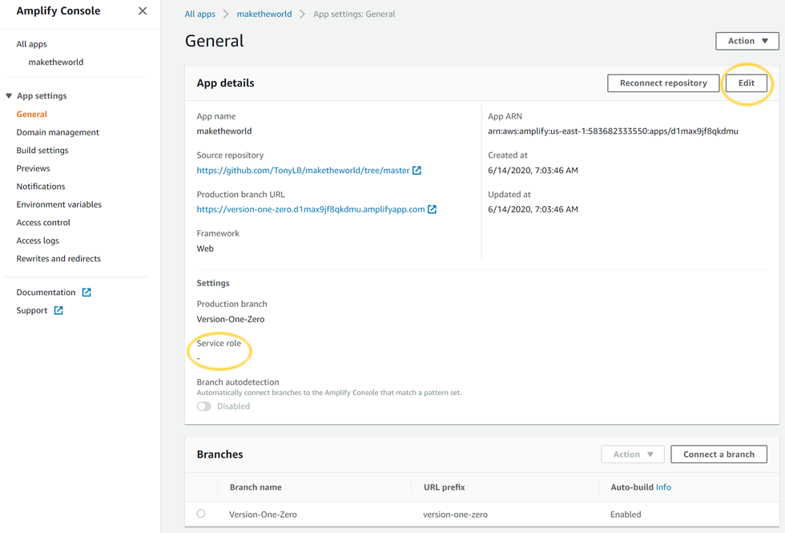
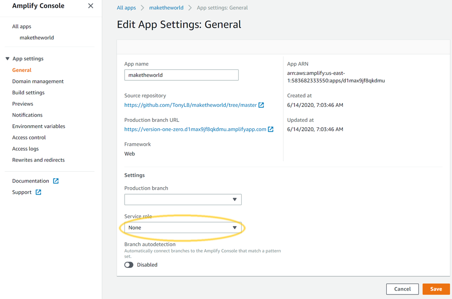
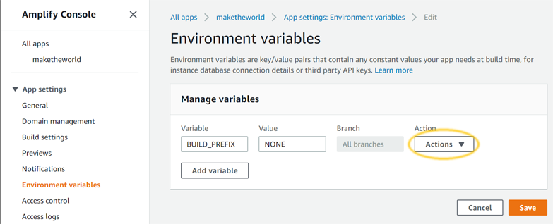

*** OUTDATED:  These are the old instructions for Version 1 of the system.  These instructions are completely inaccurate for Version 2 alpha,
which will be installed automatically (with many fewer steps).  Kept for historical reasons until the install procedure for v2alpha is
sorted. ***

You have both an AWS account and a GitHub account with the MTW code.  What you're going to do now is to create the *idea* of an application in
AWS Amplify, so that it knows what you want it to do, and then guide the Amplify service through building your application.

The thing is ... sorry ... it's going to *fail* the first time.  Remember the service role you created to let Amplify do its job?  Amplify doesn't know
about that Service Role setting until after you've set it *on a particular project*, and you don't have a project to set it on until after the first time
you've tried to deploy (and failed).  We're consulting with AWS support to find a way around that for version 1.1, but for 1.0 you're going to make a
first attempt at a deploy, have it fail, set the service role, then redeploy.

1. To get started, navigate to Amplify: [Amplify](https://console.aws.amazon.com/amplify/).  If you see a big, graphics-heavy introductor page with multiple "Get Started" buttons, click the "Get Started" underneath "Deploy".  Otherwise (particularly if you already have a prior application) click "Connect App".

2. You should see a screen like the one below.  Select "GitHub" in the "From your existing code" section, and then click either "Continue" or "Connect Branch" (basically
whatever AWS gives you to move on to the next step).

3. Amplify will take a moment to connect to GitHub using your authorization tokens, and then will show you a list where you can select a repository.
Select your *maketheworld* repository.

4. You will be presented with a new list where you can select the branch in your repository that you want to work with.  Choose the branch you created
in the previous section, and click "Next".

5. On the next screen, accept the default name (or invent one of your own) and click "Next".

6. The next step reviews what you've set.  You are ready to deploy.  The thing is ... sorry ... it's going to *fail* the first time.  Remember the service
role you created to let Amplify do its job?  Amplify doesn't know about that Service Role setting (and some other things) until after you've set then
*on a particular project*, and you don't have a project to set anything on until after the first time you've tried to deploy (and failed).  We're
consulting with AWS support to find a way around that for version 1.1, but for 1.0 you're going to make a first attempt at a deploy, have it fail,
tweak the settings, then redeploy.  Click the "Save and deploy" button.

7. Amplify will take you to the main console for your new application, and show you the branch you have connected, with its progress as it tries to
deploy.  It should fail at the Build stage, with a screen like that below.  You've made progress, though!  Amplify now knows about your application, it
just needs a little guidance to get to the point where it can install it.  Start by finding the menu-button (highlighted below with an orange circle, to help pick it out)
and click it to open the Amplify sidebar.

8. On the menu that pops up at left, click "General" to get to the console for general application-wide settings.  This will show you two panels (as below),
one at the bottom showing you the branches you have connected (and letting you connect more), and a larger one at the top showing the settings that apply to
all the branches in your application.  What matters to us now is that the Service Role field (highlighted below) on that panel is empty:  Amplify does not know to assign the
service role you created earlier to this application, and to build using those permissions.  Click the Edit button at upper right (highlighted below) to edit
those values:

9. In the edit panel that gets opened, find the dropdown for Service Role (highlighted below) and select the service role you created earlier.  Click "Save".

10.  Now we need to make Amplify aware of the variable we will use to differentiate the resources of different branches (to make it possible for users to
make more than one MTW instance in their AWS account).  In the menu panel at left, select Environment Variables, and then click the "Manage Variables" button
at upper right (highlighted below).

11. We need to give Amplify the information that will help it know how to name the internal resources it creates.  We will do that by setting a variable.
Amplify lets you set variables (a place to store settings) on your application *generally* (across all branches) and then to override that setting with
a particular value for a particular branch.  That's what we're going to do.  On the edit panel that should now be open, enter the text "BUILD_PREFIX" in
the *Variable* field, and "NONE" in the *Value* field.  All-caps, no spaces, one underscore ... it's read by a computer, which has no sense of self-correction
at all, so it has to be right in every particular.  That sets the general setting, now click the Action button at right (highlighted below) and select
"Add Variable Override" to give yourself the opportunity to set a value for your particular branch.

12. Now we set an internal prefix for your resource names that Amplify provisions for the applicaton we're trying to create.  This prefix will appear
wherever resources are allocated, and will distinguish *this* Make The World instance from any other instance you choose to create later.
If you enter 'katanaworld' for your prefix, then in *CloudFormation* (for instance) your stack will be "katanaworldStack".  If you connect a second
branch, and give it a prefix of 'trenchcoatcity' then you will have two separate stacks ('katanaworldStack' and 'trenchcoatcityStack'),
independent of each other.  In the new line just created, you will note that the Variable field is already filled in with BUILD_PREFIX (and disabled).  Select
your branch in the Branch field, and enter a prefix in the Value field.  The prefix must be all lower-case letters:  No spaces, no special characters, no
numbers, no capitals.  So you can enter "maketheworldonetwothree" but not "MTW123".  Click Save.

13. You're now ready for your second (hopefully successful) deploy:  In the menu at left, underneath "All Apps", select your Make The World application.  This will
take you to the application home page.  You will see an overview that includes a list of branches you have connected (as well as their status).  You should see one
branch, which failed its attempt to build.  Each branch here presents two important links (highlighted below):  At top, there is a link you can click to go to a
console that lets you adjust branch details.  At bottom, there is an application URL, that you can click to go to the application once it is deployed.  Click the
branch details link.

14. On the page the opens, click the "Redeploy this version" button in upper right (highlighted below).  This will kick off a job to try to rebuild your
application (with its new settings).  In the menu at left, underneath "All Apps", select your Make The World application to return to the application home
page, and you should be able to watch the progress of the job.  It should successfully complete this time.  Be warned:  Succeeding takes *even longer* than
failing, since the system has a create a bunch of resources that will sustain your instance.  Be patient.

15. Sometimes something does go wrong, usually in the Build stage.  If the process ends with a red X in some circle, you can click on that to open
a log of everything that has happened.  Some subsection will also have a red X:  Click to open that section, and it will give you a gigantic list of the
command-line outputs of the process.  Near the bottom of that list will be the last few commands that caused the error, and they may give you a good idea of
what happened and how to fix it (Trouble-shooting section coming soon).

16. When all four circles fill green, you *have a working MTW instance installed*.  As mentioned in step 13, there is a link at the bottom left of the "Version-One-Zero"
section.  It looks like a web address.  It is the web address of your MTW world.  If you click on that, you should end up at a screen asking you to log in to the
system.  That's probably a good web address to bookmark.
