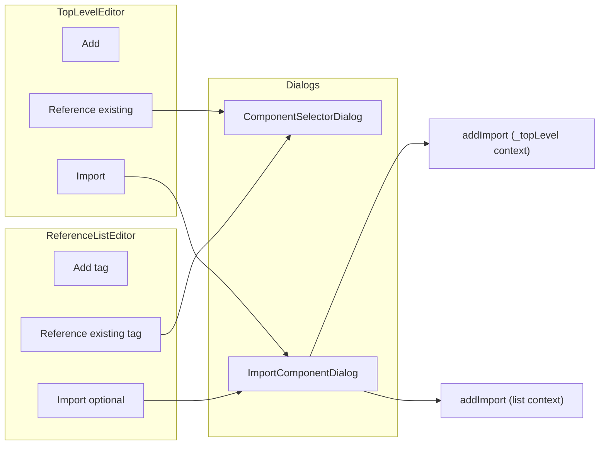

# Import parity and unified Import dialog

**Overview:** Achieve parity between ReferenceListEditor and TopLevelEditor for Import by (1) adding an Import option to ReferenceListEditor when the list's tag is importable, (2) extending addImport so imports can target a specific reference list (e.g. Room's features) instead of _topLevel, and (3) extending ImportComponentDialog with optional tag filter and display options so one dialog serves both TopLevelEditor and ReferenceListEditor with consistent UX.

---

## Current state

- **TopLevelEditor** ([charcoal-client/src/components/Workbench/foundations/ReferenceList/TopLevelEditor.tsx](charcoal-client/src/components/Workbench/foundations/ReferenceList/TopLevelEditor.tsx)): has Add, Reference existing (ComponentSelectorDialog), and **Import** (ImportComponentDialog). Import dispatches `addImport`; `addImport` creates the component with `_from`, adds it to `_topLevel` when `!explicitParent`, and runs `fetchImports`.
- **ReferenceListEditor** ([charcoal-client/src/components/Workbench/foundations/ReferenceList/ReferenceListEditor.tsx](charcoal-client/src/components/Workbench/foundations/ReferenceList/ReferenceListEditor.tsx)): has Add and optional Reference existing (ComponentSelectorDialog with `tag` + `isExcluded`). **No Import**.
- **ImportComponentDialog** ([charcoal-client/src/components/Workbench/ImportComponentDialog.tsx](charcoal-client/src/components/Workbench/ImportComponentDialog.tsx)): tabs (Recently Visited, Canon, Library, Personal), asset selector, components grouped by type. No tag filter, no search, no `isExcluded`.
- **ComponentSelectorDialog** ([charcoal-client/src/components/Workbench/foundations/ComponentSelector/ComponentSelectorDialog.tsx](charcoal-client/src/components/Workbench/foundations/ComponentSelector/ComponentSelectorDialog.tsx)): optional `tag` (flat list vs grouped), `isExcluded`, section headers with icons, primary/secondary text.

Schema import types ([packages/mtw-base/ts/schema/metaData.ts](packages/mtw-base/ts/schema/metaData.ts)): `Room | Area | Feature | Knowledge | Map | Moment | Message | Lens`. Content headers' `groupComponentsByType` groups Room, Area, Feature, Knowledge, Map, Image, Character (no Moment/Message/Lens in grouping yet).

---

## 1. Refactor `addImport` to always use `addToReferenceList`

Refactor `addImport` so that **all** callers pass an `addToReferenceList` context-function. Routing of the new ref (and `explicitParent`) is determined solely by that callback; `addImport` no longer bakes in _topLevel as a default.

- In [charcoal-client/src/slices/personalAssets/index.ts](charcoal-client/src/slices/personalAssets/index.ts):
  - **Signature**: `addToReferenceList` is a **required** parameter: `addToReferenceList: (draft: StandardForm) => { referenceList: ReferenceList; setReferenceList: (list: ReferenceList) => void; parentKey: StandardKey | undefined } | null`. When the callback returns `null`, the import is still applied (component created/updated with `_from`) but no ref is added to any list (edge case; normally callers always return a descriptor).
  - **Behavior**: `addImport` will: create/update the component with `_from`; call `addToReferenceList(draft)` to get the descriptor; if non-null, set `component.explicitParent` from `parentKey` (when `parentKey` is defined; top-level uses `undefined` or ASSET sentinel as needed); call `setReferenceList(referenceList.assureItem(component.reference))`. Then dispatch `fetchImports` as today. No special-case logic for _topLevel inside `addImport`.
  - **Top-level case**: TopLevelEditor (and any other “add to asset root” caller) passes an `addToReferenceList` that returns `{ referenceList: draft._topLevel ?? new ReferenceList([]), setReferenceList: (list) => { draft._topLevel = list }, parentKey: undefined }` (or the appropriate ASSET-level sentinel so the component is treated as top-level). All _topLevel behavior lives in that context-function, not inside `addImport`.

---

## 2. Extend ImportComponentDialog (filtering and display)

In [charcoal-client/src/components/Workbench/ImportComponentDialog.tsx](charcoal-client/src/components/Workbench/ImportComponentDialog.tsx):

- **Optional tag filter**: Add optional prop `tag?: SchemaImportMapping['type']`. When set, filter components to that type only. In zone tabs, show a single section or flat list (similar to ComponentSelectorDialog when `tag` is set). In Recently Visited, filter entries by `tag` so only matching types are shown or emphasized.
- **Optional isExcluded**: Add `isExcluded?: (universalKey: ComponentUUID) => boolean` to hide components already in the current list (e.g. when opened from ReferenceListEditor).
- **Display parity with ComponentSelectorDialog**:
  - Use the same section order and `getComponentIconByTag` for section headers and list rows where applicable.
  - Use `ListItemButton` for rows and primary/secondary text (display name + universalKey) for consistency.
  - Align empty state and list density with ComponentSelectorDialog where it makes sense.
- **onImportSelect signature**: Keep `onImportSelect?(fromAsset, uuid, tag)`. When used from ReferenceListEditor, the caller will dispatch `addImport` with the new `addToReferenceList` callback (see below). No change to the callback signature required.

Do **not** merge ComponentSelectorDialog and ImportComponentDialog into one component; keep "select from this asset" and "import from another asset" as separate flows, but reuse patterns (filtering, sections, icons, list layout).

---

## 3. ReferenceListEditor: add Import option

In [charcoal-client/src/components/Workbench/foundations/ReferenceList/ReferenceListEditor.tsx](charcoal-client/src/components/Workbench/foundations/ReferenceList/ReferenceListEditor.tsx):

- **When to show Import**: Only when the list's `tag` is one of the schema import types: `Room | Feature | Knowledge | Map | Moment | Message`. Add something like `enableImport?: boolean` or derive it from `tag` (e.g. `const canImport = ['Room','Feature','Knowledge','Map','Moment','Message'].includes(tag)`). If you prefer a prop, default it to that derived value.
- **UI**: Add an "Import" row (e.g. ImportExport icon + "Import") in `actionAffordances`, similar to TopLevelEditor, that opens ImportComponentDialog.
- **State**: Add `importDialogOpen` and wire the dialog's `open` / `onClose`.
- **Handler**: On import select, dispatch `addImport` with the new options:
  - `assetId`, `fromAsset`, `uuid`, `tag` as today.
  - `addToReferenceList: (draft) => listContext(draft)` so that the descriptor's `referenceList` / `setReferenceList` are used and the parent is derived from the list's owner (e.g. Room for _features). You'll need to pass the correct `parentKey` (e.g. Room's standardKey) from `listContext` so `addImport` can set `explicitParent` and add the ref to the right list.
- Pass into ImportComponentDialog: `tag` (for filter), `isExcluded` (same as for ComponentSelectorDialog, e.g. already in this reference list), and the custom `onImportSelect` that dispatches `addImport` with `addToReferenceList`.

Ensure `listContext` can return not only `referenceList` / `setReferenceList` but also the parent component key for `explicitParent` (e.g. in FeatureListEditor the parent is the Room). This may require extending the descriptor type or having ReferenceListEditor derive the parent from the same context it uses for `listContext`.

---

## 4. Content headers and types (optional / follow-up)

- [charcoal-client/src/slices/contentHeaders/selectors.ts](charcoal-client/src/slices/contentHeaders/selectors.ts): `groupComponentsByType` includes **Area** (done). Still no Moment/Message/Lens buckets. SchemaImportMapping also includes **Moment** and **Message**. If the materialized view can expose those types, extend `groupComponentsByType` (or add a separate grouping for the import dialog) so that when the user filters by Moment or Message, components are shown. If the backend/content headers do not yet expose Moment/Message, document that and leave tag filter for those as "no results" for now.

---

## 5. TopLevelEditor

- **Update TopLevelEditor** so that it passes an `addToReferenceList` context-function that routes to `_topLevel`: e.g. `(draft) => ({ referenceList: draft._topLevel ?? new ReferenceList([]), setReferenceList: (list) => { draft._topLevel = list }, parentKey: undefined })` (or the correct ASSET sentinel for explicitParent). TopLevelEditor no longer relies on any default inside `addImport`; it explicitly supplies the top-level context. Optionally pass `tag` to ImportComponentDialog only if you want to restrict TopLevel "Import" to a subset of types later; for parity scope, leaving TopLevel as "all types" is fine.

---

## 6. Testing and edge cases

- **addImport**: Add or extend tests for `addToReferenceList`: (1) When the context-function returns a list descriptor with a parentKey, the component gets `explicitParent`, ref is added to that list, and _topLevel is unchanged. (2) When the context-function returns the _topLevel descriptor (e.g. parentKey undefined/ASSET), ref is added to _topLevel and component is top-level. Both paths use the same contract; only the caller-supplied context differs.
- **ReferenceListEditor**: When `enableImport` is true and tag is e.g. Feature, opening Import and selecting a feature from another asset should add it to the Room's _features and set that Room as explicitParent.
- **ImportComponentDialog**: With `tag="Feature"`, only Features are shown in zone tabs and recently visited is filtered or scoped accordingly; `isExcluded` hides already-present items.

---

## Summary diagram

- **Single Import dialog**: ImportComponentDialog is used by both TopLevelEditor and ReferenceListEditor; both pass `addToReferenceList`; ReferenceListEditor also passes tag filter and isExcluded so the same dialog serves both.
- **addImport** is refactored so every caller supplies `addToReferenceList`; TopLevelEditor passes a context-function that routes to _topLevel, ReferenceListEditor passes one that routes to the specific list (e.g. Room's features), with no default _topLevel logic inside `addImport`.
