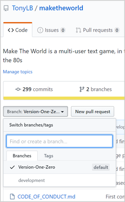
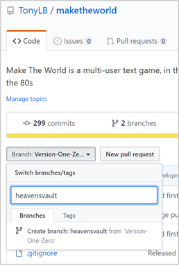
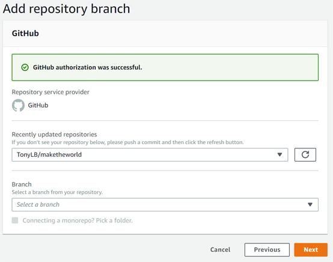
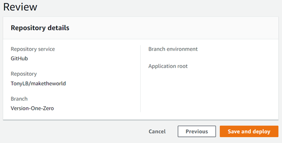
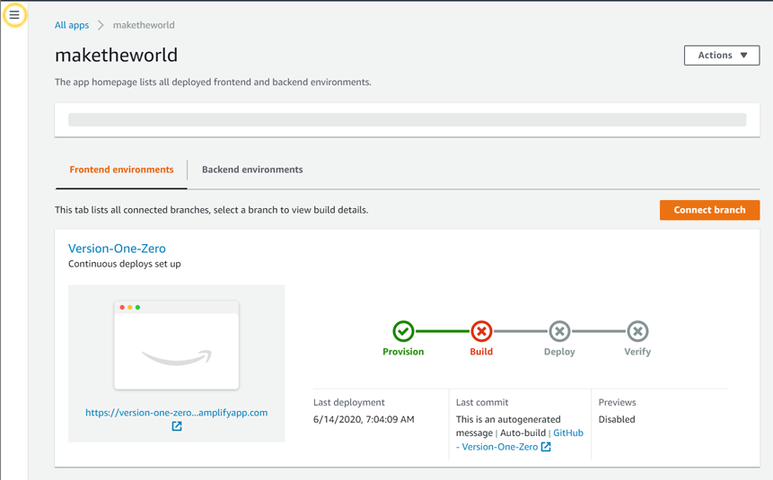
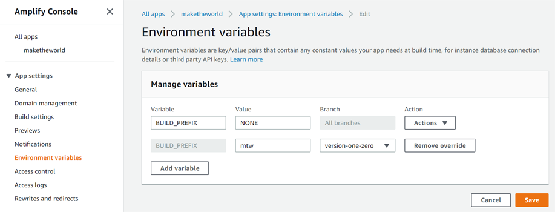
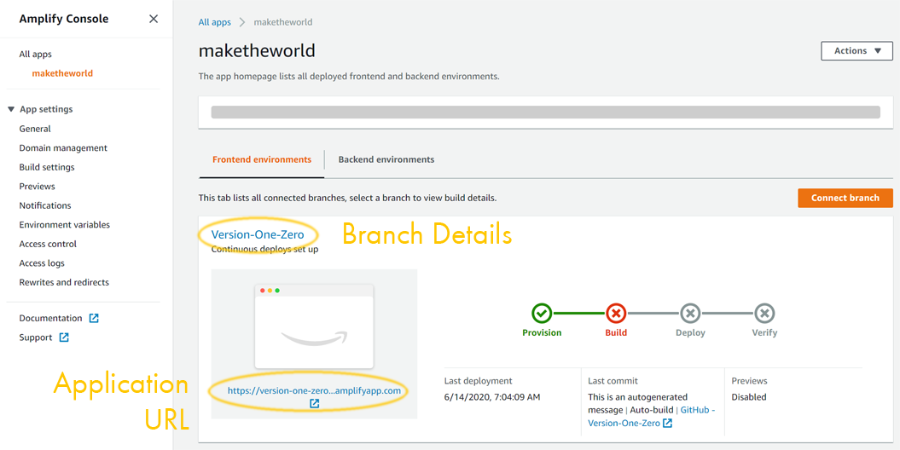
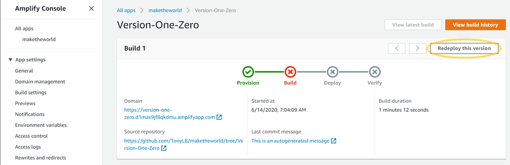

You're going to create a new branch off of your existing code-base, and then tell Amplify to point an appliction to that new code-base.

1. Go to your GitHub repository:  Find the branch button, and click it, making sure to select the codebase that you want to branch off of (either Version-One-Zero
or some other version).

2. Branching off of an existing branch will not change the existing branch in any way, it will just create a *new* branch pointing at the same code
and history.  Click the branch button again, and this time instead of selecting an existing branch, type your desired name into the text field.  The
bottom of the popup should present you with the option to create a new branch based on your old one.  Click that.  You now have a new branch.

3. Go to [Amplify](https://console.aws.amazon.com/amplify/).  Click into your MTW application, and click "Connect Branch".

4. You will be presented with a new list where you can select the branch in your repository that you want to work with.  Choose the branch you created
in the previous section, and click "Next".

5. The next step reviews what you've set.  You are ready to deploy.  As before, it's going to fail (this time because you haven't specified the BUILD_PREFIX).
Click the "Save and deploy" button.

6. Amplify will take you to the main console for your new application, and show you the branch you have connected, with its progress as it tries to
deploy.  It should fail at the Build stage, with a screen like that below.  But now you've got a second branch, and can update its settings.  Start by finding
the menu-button (highlighted below with an orange circle, to help pick it out) and click it to open the Amplify sidebar.

7.  Now we need to make Amplify aware of the variable we will use to differentiate the resources of different branches (so it can store its data somewhere
different from the data of the first instance).  In the menu panel at left, select Environment Variables, and then click the "Manage Variables" button
at upper right (highlighted below).

8. We need to set an internal prefix for this new branch.  Find the "BUILD-PREFIX" / "NONE" variable, and click the Action button at right (highlighted below)
and select "Add Variable Override" to give yourself the opportunity to set a value for the new branch.  In the new line just created, you will note that the
Variable field is already filled in with BUILD_PREFIX (and disabled).  Select your new branch in the Branch field, and enter a prefix in the Value field.
The prefix must be all lower-case letters:  No spaces, no special characters, no  numbers, no capitals.  So you can enter "maketheworldonetwothree" but not
"MTW123".  And, importantly, it must be different from any other prefix you have set on another branch.  Click Save.

9. You're now ready for your second (hopefully successful) deploy:  In the menu at left, underneath "All Apps", select your Make The World application.  This will
take you to the application home page.  You will see an overview that includes a list of branches you have connected (as well as their status).  You should see your
new branch, which failed its attempt to build.  Each branch here presents two important links (highlighted below):  At top, there is a link you can click to go to a
console that lets you adjust branch details.  At bottom, there is an application URL, that you can click to go to the application once it is deployed.  Click the
branch details link.

10. On the page the opens, click the "Redeploy this version" button in upper right (highlighted below).  This will kick off a job to try to rebuild your
application (with its new settings).  In the menu at left, underneath "All Apps", select your Make The World application to return to the application home
page, and you should be able to watch the progress of the job.  It should successfully complete this time.  Be warned:  Succeeding takes *even longer* than
failing, since the system has a create a bunch of resources that will sustain your instance.  Be patient.

11. When all four circles fill green, you *have a second, independent, MTW instance installed*.  Go and protect those resources from termination, create a character,
and give them admin grants in MTW, as you did previously.
