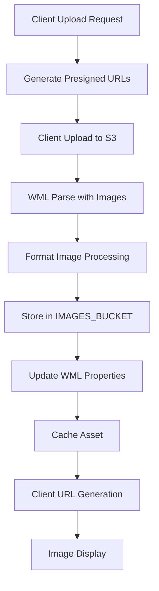

# Image Storage System Architecture

## Overview

The Image Storage System manages the upload, processing, storage, and serving of images for Make The World assets. The current system uses UUID-based naming with separate property associations, but is planned for migration to a universalKey-based system for improved elegance and maintainability.

## Current System Architecture

### System Components

#### 1. Upload System (`lambda/assets/upload/`)
- **Purpose**: Generates presigned URLs for direct client upload
- **Current Naming**: `IMAGE-${uuidv4()}.${fileExtension}`
- **Process**: Creates unique S3 object names using UUID

#### 2. Image Processing (`lambda/wml/formatImage/`)
- **Purpose**: Processes uploaded images into standardized formats
- **Current Naming**: `IMAGE-${uuidv4()}.png`
- **Process**: Resizes to 1200x800, converts to PNG, stores in `IMAGES_BUCKET`

#### 3. WML Integration (`lambda/wml/parseWML/`)
- **Purpose**: Associates processed images with WML components
- **Current Process**: Updates `fileName` properties in asset JSON
- **Integration**: Links processed filenames to StandardImage components

#### 4. Client Serving (`charcoal-client/src/components/Library/Edit/`)
- **Purpose**: Generates image URLs for client display
- **Current URLs**: `${appBaseURL}/images/${properties[key].fileName}.png`
- **Fallback**: Synthetic object URLs for loaded images

### Current Data Flow



### Current Issues

1. **Brittle File Management**: UUID-based naming makes file tracking complex
2. **Complex Association**: Images linked via `fileName` properties in JSON
3. **No Universal Key Integration**: Doesn't leverage the universalKey system
4. **Maintenance Overhead**: Requires separate tracking of file associations
5. **Orphaned Files**: Files without associated components
6. **Property Mismatches**: fileName properties pointing to non-existent files

## Proposed Universal Key Solution

### Architecture Overview

The system can be simplified by using `universalKey` as the S3 object name:

```typescript
// Current: IMAGE-${uuidv4()}.png
// Proposed: ${universalKey}.png
// Or: ${sanitizedUniversalKey}.png (for URL safety)
```

### Benefits

1. **Simplified Storage**: Direct mapping between component and file
2. **Eliminated Association**: No need for separate fileName properties
3. **Automatic Cleanup**: File deletion when component is removed
4. **Predictable URLs**: URLs based on component identity
5. **Reduced Complexity**: Single source of truth for image location
6. **Self-Maintaining**: System automatically manages file associations

### Implementation Plan

#### Phase 1: Universal Key Integration
1. **Modify Upload Process**: Use universalKey instead of UUID
2. **Update Format Image**: Generate filenames from universalKey
3. **Client URL Generation**: Direct URL construction from universalKey
4. **Backward Compatibility**: Support both systems during transition

#### Phase 2: Property Elimination
1. **Remove fileName Properties**: Eliminate JSON property storage
2. **Direct Component Access**: Access images via universalKey
3. **Cleanup Tools**: Remove orphaned files and properties

#### Phase 3: System Simplification
1. **Streamlined Upload**: Simplified upload process
2. **Automatic Cleanup**: File deletion with component removal
3. **Performance Optimization**: Reduced database operations

## Technical Implementation

### Upload URL Generation

#### Current Implementation
```typescript
const s3Object = `IMAGE-${uuidv4()}.${fileExtension}`
```

#### Proposed Implementation
```typescript
const s3Object = `${universalKey}.${fileExtension}`
```

### Image Processing

#### Current Implementation
```typescript
const toFileName = `IMAGE-${uuidv4()}`
```

#### Proposed Implementation
```typescript
const toFileName = universalKey
```

### Client URL Generation

#### Current Implementation
```typescript
return `${appBaseURL}/images/${properties[key].fileName}.png`
```

#### Proposed Implementation
```typescript
return `${appBaseURL}/images/${universalKey}.png`
```

### WML Integration

#### Current Implementation
```typescript
// Update WML component with processed filename
imageFiles.forEach(({ key, fileName }) => {
    const imageComponent = newStandard.byId[key]
    if (imageComponent instanceof StandardImage) {
        newStandard.byUniversalId[key] = imageComponent.withFileName(fileName)
    }
})
```

#### Proposed Implementation
```typescript
// No property update needed - image accessible via universalKey
const imageComponent = newStandard.byId[key]
if (imageComponent instanceof StandardImage) {
    // Image automatically accessible via universalKey
    newStandard.byUniversalId[key] = imageComponent
}
```

## Migration Strategy

### Phase 1: Dual System Support
1. **Backward Compatibility**: Support both UUID and universalKey systems
2. **Gradual Migration**: Migrate assets one by one
3. **Testing**: Comprehensive testing of both systems
4. **Monitoring**: Track migration progress and issues

### Phase 2: Universal Key Migration
1. **Component Migration**: Migrate components to use universalKey
2. **File Migration**: Move existing files to universalKey naming
3. **Property Cleanup**: Remove fileName properties
4. **Validation**: Ensure all images accessible via universalKey

### Phase 3: System Cleanup
1. **Remove UUID System**: Eliminate UUID-based naming
2. **Cleanup Tools**: Remove orphaned files and properties
3. **Performance Optimization**: Optimize for universalKey system
4. **Documentation Update**: Update all documentation

## Integration Points

### Dependencies
- **S3**: File storage for uploaded and processed images
- **WML System**: Component universalKey generation
- **Client**: Image URL generation and display
- **Asset Cache**: Component data storage
- **CloudFront**: Image serving infrastructure

### Cross-References
- **[Upload System](upload/)**: Image upload process
- **[Format Image](../../wml/formatImage/)**: Image processing function
- **[Client Display](../../../charcoal-client/src/components/Library/Edit/)**: Image serving
- **[Asset Properties](README.images.md)**: Current image association system
- **[WML Parse](../../wml/parseWML.ts)**: WML integration

## Error Handling

### Current Issues
- **Orphaned Files**: Files without associated components
- **Property Mismatches**: fileName properties pointing to non-existent files
- **UUID Collisions**: Rare but possible UUID conflicts
- **Memory Leaks**: Synthetic URL cleanup issues

### Proposed Improvements
- **Automatic Cleanup**: File deletion with component removal
- **Validation**: Universal key validation before upload
- **Conflict Resolution**: Clear strategy for universal key conflicts
- **Error Recovery**: Better error handling and recovery mechanisms

## Development Notes

### Current State
- **UUID-Based System**: Functional but complex
- **Property Associations**: Separate tracking required
- **Manual Cleanup**: Orphaned file cleanup needed
- **Dual URL System**: Complex client URL generation

### Future State
- **Universal Key System**: Simplified and elegant
- **Direct Associations**: No separate property tracking
- **Automatic Management**: Self-maintaining system
- **Single URL Strategy**: Simplified client URL generation

### Migration Checklist
- [ ] Update upload URL generation
- [ ] Modify format image processing
- [ ] Update client URL generation
- [ ] Implement dual system support
- [ ] Create migration tools
- [ ] Update documentation
- [ ] Test backward compatibility
- [ ] Deploy gradual migration
- [ ] Remove old system

## Navigation Tips

### Key Files
- `upload/index.ts`: Upload implementation
- `formatImage/index.ts`: Image processing
- `parseWML.ts`: WML integration
- `LibraryAsset.tsx`: Client image handling

### Related Systems
- **[WML System](../../wml/)**: Component processing
- **[Client Display](../../../charcoal-client/)**: Image serving
- **[Asset Cache](cacheAsset/)**: Component storage
- **[Upload System](upload/)**: Image upload process

## Usage Patterns

### Current Upload Process
```typescript
// Generate presigned URLs
const uploadResult = await uploadURLMessage({
    payloads: [{
        assetType: 'Asset',
        images: [{ key: 'imageKey', contentType: 'image/png' }]
    }],
    messageBus
})

// Client uploads to presigned URL
// WML parse processes images
// Format image creates processed version
// Properties updated with fileName
```

### Proposed Upload Process
```typescript
// Generate presigned URLs with universalKey
const uploadResult = await uploadURLMessage({
    payloads: [{
        assetType: 'Asset',
        images: [{ 
            key: 'imageKey', 
            universalKey: 'component-uuid',
            contentType: 'image/png' 
        }]
    }],
    messageBus
})

// Direct file storage and URL generation
// No property updates needed
```

## Future Enhancements

### Advanced Features
1. **Image Variants**: Multiple sizes/resolutions per component
2. **Format Optimization**: Automatic format selection based on content
3. **CDN Integration**: Enhanced CloudFront integration
4. **Compression Optimization**: Advanced compression algorithms

### Performance Optimizations
1. **Lazy Loading**: Load images on demand
2. **Caching Strategy**: Enhanced client-side caching
3. **Batch Processing**: Process multiple images together
4. **Parallel Processing**: Concurrent image processing

### Monitoring and Analytics
1. **Usage Tracking**: Monitor image usage patterns
2. **Performance Metrics**: Track loading times and errors
3. **Storage Analytics**: Monitor storage usage and costs
4. **Error Reporting**: Comprehensive error tracking
