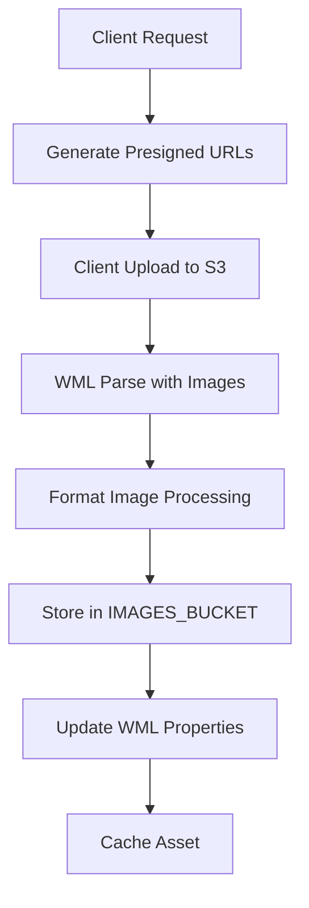

# Image Upload System

## Overview

The Image Upload system handles the upload and processing of images for Make The World assets. It currently uses a UUID-based naming system but is planned for migration to a universalKey-based system for improved maintainability and elegance.

## Current Architecture

### Upload Process

The upload system operates in two phases:

1. **Presigned URL Generation** (`lambda/assets/upload/index.ts`):
   ```typescript
   const s3Object = `${prefix}-${uuidv4()}.${fileExtension}`
   ```
   - Generates unique S3 object names using UUID
   - Creates presigned URLs for direct client upload
   - Supports multiple image formats (JPEG, PNG, GIF, etc.)

2. **Image Processing** (`lambda/wml/formatImage/index.ts`) - **DEPRECATED**:
   ```typescript
   const toFileName = `IMAGE-${uuidv4()}`
   ```
   - **DEPRECATED**: This system has been replaced by the new `imageProcessor` lambda
   - **Old System**: Processed uploaded images with Jimp library, resized to 1200x800 and converted to PNG
   - **New System**: The `lambda/imageProcessor/` lambda provides the new image processing pipeline
   - **Migration**: See `lambda/imageProcessor/AGENT.md` for the current and future image processing architecture

### Current Flow



### Current Issues

1. **Brittle File Management**: UUID-based naming makes file tracking complex
2. **Complex Association**: Images linked via `fileName` properties in JSON
3. **No Universal Key Integration**: Doesn't leverage the universalKey system
4. **Maintenance Overhead**: Requires separate tracking of file associations

## Proposed Universal Key Solution

### Architecture Overview

The system can be simplified by using `universalKey` as the S3 object name:

```typescript
// Current: IMAGE-${uuidv4()}.png
// Proposed: ${universalKey}.png
// Or: ${sanitizedUniversalKey}.png (for URL safety)
```

### Benefits

1. **Simplified Storage**: Direct mapping between component and file
2. **Eliminated Association**: No need for separate fileName properties
3. **Automatic Cleanup**: File deletion when component is removed
4. **Predictable URLs**: URLs based on component identity
5. **Reduced Complexity**: Single source of truth for image location

### Implementation Plan

#### Phase 1: Universal Key Integration
1. **Modify Upload Process**: Use universalKey instead of UUID
2. **Update Format Image**: Generate filenames from universalKey
3. **Client URL Generation**: Direct URL construction from universalKey
4. **Backward Compatibility**: Support both systems during transition

#### Phase 2: Property Elimination
1. **Remove fileName Properties**: Eliminate JSON property storage
2. **Direct Component Access**: Access images via universalKey
3. **Cleanup Tools**: Remove orphaned files and properties

#### Phase 3: System Simplification
1. **Streamlined Upload**: Simplified upload process
2. **Automatic Cleanup**: File deletion with component removal
3. **Performance Optimization**: Reduced database operations

### Technical Implementation

#### Upload URL Generation
```typescript
// Current
const s3Object = `IMAGE-${uuidv4()}.${fileExtension}`

// Proposed
const s3Object = `${universalKey}.${fileExtension}`
```

#### Image Processing
```typescript
// Current
const toFileName = `IMAGE-${uuidv4()}`

// Proposed
const toFileName = universalKey
```

#### Client URL Generation
```typescript
// Current
return `${appBaseURL}/images/${properties[key].fileName}.png`

// Proposed
return `${appBaseURL}/images/${universalKey}.png`
```

### Migration Strategy

1. **Dual System Support**: Support both UUID and universalKey systems
2. **Gradual Migration**: Migrate assets one by one
3. **Backward Compatibility**: Maintain existing functionality
4. **Cleanup Phase**: Remove old system after migration

## Integration Points

### Dependencies
- **S3**: File storage for uploaded and processed images
- **WML System**: Component universalKey generation
- **Client**: Image URL generation and display
- **Asset Cache**: Component data storage

### Cross-References
- **[WML Parse System](../../wml/parseWML.ts)**: Image processing integration (deprecated - now uses applyEdit)
- **[Format Image](../../wml/formatImage/)**: **DEPRECATED** - Old image processing function, replaced by `lambda/imageProcessor/`
- **[Client Image Display](../../charcoal-client/src/components/Library/Edit/LibraryAsset.tsx)**: Image serving
- **[Asset Properties](../README.images.md)**: Current image association system

## Usage Patterns

### Current Upload Process
```typescript
// Generate presigned URLs
const uploadResult = await uploadURLMessage({
    payloads: [{
        assetType: 'Asset',
        images: [{ key: 'imageKey', contentType: 'image/png' }]
    }],
    messageBus
})

// Client uploads to presigned URL
// **DEPRECATED**: Old WML parse + formatImage pipeline
// **NEW**: imageProcessor lambda handles image processing automatically via S3 events
// Properties updated with fileName
```

### Proposed Upload Process
```typescript
// Generate presigned URLs with universalKey
const uploadResult = await uploadURLMessage({
    payloads: [{
        assetType: 'Asset',
        images: [{ 
            key: 'imageKey', 
            universalKey: 'component-uuid',
            contentType: 'image/png' 
        }]
    }],
    messageBus
})

// Direct file storage and URL generation
// No property updates needed
```

## Error Handling

### Current Issues
- **Orphaned Files**: Files without associated components
- **Property Mismatches**: fileName properties pointing to non-existent files
- **UUID Collisions**: Rare but possible UUID conflicts

### Proposed Improvements
- **Automatic Cleanup**: File deletion with component removal
- **Validation**: Universal key validation before upload
- **Conflict Resolution**: Clear strategy for universal key conflicts

## Development Notes

### Current State
- **UUID-Based System**: Functional but complex
- **Property Associations**: Separate tracking required
- **Manual Cleanup**: Orphaned file cleanup needed

### Future State
- **Universal Key System**: Simplified and elegant
- **Direct Associations**: No separate property tracking
- **Automatic Management**: Self-maintaining system

### Migration Checklist
- [ ] Update upload URL generation
- [ ] Modify format image processing
- [ ] Update client URL generation
- [ ] Implement dual system support
- [ ] Create migration tools
- [ ] Update documentation
- [ ] Test backward compatibility
- [ ] Deploy gradual migration
- [ ] Remove old system

## Navigation Tips

### Key Files
- `index.ts`: Main upload implementation
- `README.images.md`: Current image documentation
- `formatImage/index.ts`: **DEPRECATED** - Old image processing function
- `parseWML.ts`: **DEPRECATED** - Old WML integration, replaced by applyEdit flow
- **NEW**: `lambda/imageProcessor/` - Current image processing pipeline

### Related Systems
- **[WML System](../../wml/)**: Component processing
- **[Client Display](../../charcoal-client/)**: Image serving
- **[Asset Cache](../cacheAsset/)**: Component storage
