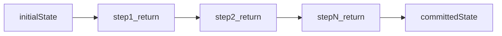

# Ephemera LLM pipeline (linear reducers)

`lambda/ephemera/llm/pipeline/` is a **small sequential runner** for multi-step flows that share one evolving **pipeline state** object. Steps are **ordered**; each step reads prior slots and returns the next full state.

At a high level:

- **Pipeline input** is written once (for example priming a room snapshot or other context slot).
- **LLM steps** read named inputs from state, invoke existing **`invokeBedrock*`** helpers (prompt assembly and cache points stay in the feature), then validate and write named outputs and optional **`meta*`** back onto state.
- **Orchestration steps** read prior slots and derive the next step's inputs (for example parsed seam plus snapshot to combined Markdown for the next model call).

The goal is to **deduplicate glue** (invoke wiring, extract/validate, metrics, failure handling) across Coyote and other multi-call LLM flows **without** building a generic workflow engine.

Parent scope (transport, parsers, and where this fits): [`../AGENT.md`](../AGENT.md).

## Non-goals

This framework is **in-process** within Ephemera Lambda handlers unless a future task explicitly adds cross-Lambda orchestration.

It does **not** provide:

- **DAGs**, parallel fan-out, dynamic branching, or visual workflow definitions.
- **Domain validation** for a feature (Coyote seam combine, Acme merge rules, etc.) --- that stays next to the domain; steps call existing parsers and validators.
- A replacement for **Step Functions**, **SQS**, or other cross-Lambda orchestration by default.

## PipelineState

- **`AnyPipelineState`** ([`pipelineSteps.ts`](pipelineSteps.ts)) constrains feature state to `Record<string, unknown>`.
- Each use case defines a concrete **`S`** with **shallow top-level keys** (for example `inputA`, `outputA`, `metaStageOne`). Distinct pipelines use **different slot maps and types**; there is no shared nominal brand on `S`.
- Per LLM call, **token usage and invoke diagnostics** should live on optional **`meta*`-style slots** on the same `S`, not in a parallel untyped bag.
- We intentionally avoid **nominal branding** of `S` (no `unique symbol` phantom fields). Features distinguish pipelines by **slot names and value types**.

## Design principles (material decisions)

- **Return-state steps:** Each step receives **read-only committed `S`** and returns **`PipelineStepRunResult<S>`** --- typically **`{ state: nextS }`**, or **`{ state: nextS, abort: true }`** for expected product failure. The runner folds returned state sequentially; it does **not** use Immer.
- **Immer inside steps (optional):** When nested slot updates are clearer as a sync draft recipe, a step may call **`produce`** **after** all **`await`s**, using values gathered in locals. Never hold or export draft references past that sync return. Prefer **shallow top-level keys** on `S` so spread updates are often enough.
- **Generic factory:** **`createPipelineContext<S>()`** fixes a single **`S`** and returns step constructors plus **`runPipeline`** so reads and writes are tied to that state type; there is no shared concrete pipeline state type for every feature.
- **LLM boundary:** **Thin** integration with existing **`invokeBedrock*`** --- message shape, cache points, and model options remain **feature-owned**. Optional **`defineLlmInvokeStep`** targets **`invokeBedrockConverseText`**-shaped calls; custom wrappers (for example Coyote cache-point user messages) use **`defineLlmStep`** and call the feature helper inside **`run`**.
- **Telemetry:** Prefer **`PipelineRunOptions`** **`onStepStart` / `onStepEnd`** for step names in logs or spans. Put **per-call token usage** and related invoke fields in **`meta*`** on **`S`**, not a parallel untyped bag.
- **Failure policy:** **`PipelineRunResult`** exposes success, product abort (`abort: true` with returned partial state), or unexpected failure (`throw` with last committed state). **Stub paths**, player-visible **all-or-nothing** rules, and when to rethrow are **caller-defined** in the feature.

## Step kinds

Discriminated in [`pipelineSteps.ts`](pipelineSteps.ts); both kinds implement **`run(state) => Promise<PipelineStepRunResult<S>>`**.

| Kind | Role |
| --- | --- |
| **Orchestration** (`defineOrchestrationStep`) | Async TypeScript only: derive the next inputs, parse domain JSON, combine DTOs, etc. |
| **LLM** (`defineLlmStep`) | Feature-owned Bedrock glue: prompt assembly stays next to the feature; the step calls existing **`invokeBedrock*`** wrappers and returns the next `S`. |

The **`kind`** field (`orchestration` vs `llm`) is for structure and logging; behavior is defined by **`name`** and **`run`**.

## Runner and factory

1. **`createPipelineContext<S>()`** ([`pipelineContext.ts`](pipelineContext.ts)) fixes **`S`** and returns **`defineOrchestrationStep`**, **`defineLlmStep`**, and **`runPipeline`** typed to that **`S`**.
2. **`runPipeline(initialState, steps, options?)`** ([`pipelineRunner.ts`](pipelineRunner.ts)) runs steps in order. Each step receives committed state from the prior step and returns the next full **`S`**. Side effects (for example thinking-result emit) should use **plain returned state**, not draft proxies.

**Results:** **`PipelineRunResult<S>`** is either **`{ ok: true, state }`** or **`{ ok: false, state, failedStepName, failedStepIndex, ... }`**.

| Failure kind | Shape |
| --- | --- |
| Product abort | **`{ ok: false, abort: true, state }`** --- `state` is the aborting step's returned `S`; no `error` |
| Unexpected throw | **`{ ok: false, abort: false, state, error }`** --- `state` is last **committed** state (no partial writes from the throwing step) |

**Failure policy** (stub vs rethrow vs all-or-nothing) is **caller-defined** in the feature layer.

**Telemetry:** Optional **`PipelineRunOptions`** hooks **`onStepStart` / `onStepEnd`** (step name and index). Hooks are for spans or logs; **usage** stays on **`meta*`** slots on **`S`**.

## Optional Bedrock-shaped helper

**[`defineLlmInvokeStep`](llmInvokeStep.ts)** wraps calls that match **`invokeBedrockConverseText`** ( **`InvokeBedrockConverseTextParams`** in / out). Use it when the feature already builds **Converse** messages directly. Features that wrap Bedrock with **custom user content** (for example cache points in [`invokeBedrockHypothesis`](../../dataSource/coyoteGame/generators/pipelines/hypothesis/invokeBedrockHypothesis.ts)) often use **`defineLlmStep`** with a **`run`** that calls those wrappers instead.

**[`LlmInvokeDiagnostics`](llmInvokeStep.ts)** is the suggested shape for **`meta*`** fields after an invoke. Invoke transport failure uses **`throw`**; diagnostics are not committed on the failure path.

## Public exports

[`index.ts`](index.ts) is the barrel surface (`runPipeline`, `createPipelineContext`, types, `defineLlmInvokeStep`). Feature code often imports from **`../../llm/pipeline`** relative to `dataSource/` modules.

| Type / value | Role |
| --- | --- |
| [`AnyPipelineState`](pipelineSteps.ts), [`PipelineStep`](pipelineSteps.ts), [`OrchestrationStepDefinition`](pipelineSteps.ts), [`LlmAdapterStepDefinition`](pipelineSteps.ts), [`PipelineStepRunFn`](pipelineSteps.ts), [`PipelineStepRunResult`](pipelineSteps.ts) | State constraint and step contracts; steps carry **`name`** for logs and tests. |
| [`RunPipelineFn`](pipelineRunner.ts), [`PipelineRunResult`](pipelineRunner.ts), [`PipelineRunOptions`](pipelineRunner.ts), [`PipelineTelemetryHooks`](pipelineRunner.ts) | Runner types; hooks for spans; usage on state **`meta*`**. |
| [`runPipeline`](pipelineRunner.ts) | Sequential runner. |
| [`PipelineContext`](pipelineContext.ts), [`createPipelineContext`](pipelineContext.ts) | Factory bundle fixing **`S`**. |
| [`defineLlmInvokeStep`](llmInvokeStep.ts), [`LlmInvokeDiagnostics`](llmInvokeStep.ts) | Optional helper for **`invokeBedrockConverseText`**-compatible invokes; diagnostics shape for **`meta*`** slots. |

## Feature consumer (example)

Coyote hypothesis (stage one → combine → plan-selection hop → narrative beat hop → parse) runs on this runner in [`../../dataSource/coyoteGame/generators/pipelines/hypothesis/coyoteHypothesisPipeline.ts`](../../dataSource/coyoteGame/generators/pipelines/hypothesis/coyoteHypothesisPipeline.ts); entry points remain [`../../dataSource/coyoteGame/generators/pipelines/hypothesis/generateHypothesis.ts`](../../dataSource/coyoteGame/generators/pipelines/hypothesis/generateHypothesis.ts). Broader Coyote context: [`../../dataSource/coyoteGame/AGENT.md`](../../dataSource/coyoteGame/AGENT.md). Thinking success emits use plain committed **`nextState`** before step return; see [`hypothesis/AGENT.md`](../../dataSource/coyoteGame/generators/pipelines/hypothesis/AGENT.md).

Other multi-step flows that are still **ad hoc** (for example [`parseCommand`](../../dataSource/actions/parseCommand.ts) enrich paths) may migrate incrementally; **`dataSource/actions/AGENT.md`** and feature docs remain the source of truth for those products.

## Tests and verification

- **Unit tests:** [`runPipeline.test.ts`](runPipeline.test.ts) (ordering, abort discriminant, unexpected throw, hooks). Feature pipeline tests live next to the feature (for example [`../../dataSource/coyoteGame/generators/pipelines/hypothesis/generateHypothesis.test.ts`](../../dataSource/coyoteGame/generators/pipelines/hypothesis/generateHypothesis.test.ts), [`../../dataSource/coyoteGame/generators/pipelines/hypothesis/coyoteHypothesisPipeline.test.ts`](../../dataSource/coyoteGame/generators/pipelines/hypothesis/coyoteHypothesisPipeline.test.ts)). Coyote **`pipeline thinking async persist (marshall guard)`** exercises side effects on plain returned state through async bus drain + Dynamo **`marshall`**.
- From [`lambda/ephemera`](../../), run **`npm run build`**, then Jest as needed, for example **`npm run test -- --runInBand llm/pipeline/`** plus targeted paths for touched features.
- Confirm **ReadLints** clean on edited TypeScript in the workspace after substantive changes.

## Navigation

- Add **new pipeline mechanics** here; keep **prompts, domain validation, and feature types** under `dataSource/` or other feature folders.
- **Parent:** [`../AGENT.md`](../AGENT.md) (this `llm/` scope), [`../../AGENT.md`](../../AGENT.md) (ephemera lambda), [`../../../../AGENT.md`](../../../../AGENT.md) (repo root documentation standards).
