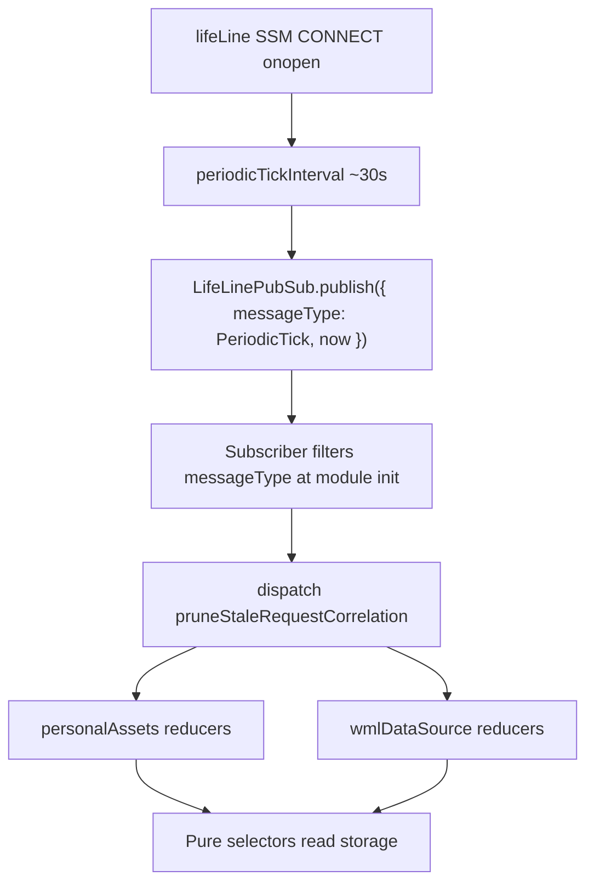

# Periodic dispatched cleanup (pending / confirmed correlation) - planning

**Status:** Not started. **Next:** Phase 0 -- extend `LifeLinePubSub` with a client-local `PeriodicTick` message, activated from lifeLine SSM (`establishWebSocket` / `disconnectWebSocket`, ~30s interval).

This document follows [`taskPlanning/AGENT.md`](../../../AGENT.md) (durability, what belongs here vs in package docs). **Dispose** after the initiative ships and lasting notes live in slice `AGENT.md` files (especially [`charcoal-client/src/slices/AGENT.client-sync-invariants.md`](../../../../charcoal-client/src/slices/AGENT.client-sync-invariants.md), [`charcoal-client/src/slices/dataSource/AGENT.implementation.md`](../../../../charcoal-client/src/slices/dataSource/AGENT.implementation.md), [`charcoal-client/src/slices/personalAssets/AGENT.md`](../../../../charcoal-client/src/slices/personalAssets/AGENT.md)).

---

## Goal

Move **time-based eviction** for optimistic `pendingEdits` and `confirmedRequestIds` out of **impure selectors** and into **dispatched Redux actions** triggered on a **fixed periodic schedule**.

The real problem being solved is a **millisecond-scale race** between optimistic `saveEdit` enqueue and `mtw.wml` stream confirmation --- not sub-minute UI refresh synchronization. Selector-time `Date.now()` TTL was over-architected for that need and introduced **referential churn** upstream of Workbench editors, forcing load-bearing `.equals()` band-aids for confirmed-id noise (a problem distinct from merge/allocation churn elsewhere in the derivation graph).

**Target steady state:**

| Concern | Owner |
| --- | --- |
| Suppress pending overlay while stream confirms | **Event-driven** (`pendingHygieneCheck` via `afterProcessEnvelope`) + **pure** id-based selector filter on **storage** |
| Drop zombie rows (failed WS, missed hygiene, idle tab) | **Periodic dispatched cleanup** (~30s cadence) |
| Referential stability (I1) at derived selectors | **Pure** Reselect chains over stored state; no read-time clock |

**Non-goals:**

- Replacing downstream `.equals()` guards for **merge/allocation churn** (`merge().toJSON()`, collaborative reconcile, Slate session boundaries). Those remain load-bearing for **other** reasons; see [`AGENT.client-sync-invariants.md`](../../../../charcoal-client/src/slices/AGENT.client-sync-invariants.md) **Memoization-plus**.
- Timer-based eviction **inside selectors** (remove, do not refine).

---

## Background (what we are undoing)

Today (2026-06-05 Phase 3):

- [`selectConfirmedRequestIdStrings`](../../../../charcoal-client/src/slices/dataSource/requestIdTracking.ts) filters `confirmedRequestIds` storage at read time (`Date.now()`, WeakMap cache keyed on exact `now`).
- [`getEffectivePendingEdits`](../../../../charcoal-client/src/slices/personalAssets/selectors.ts) calls `Date.now()` inside a Reselect combiner and filters by confirmed ids **and** pending age.
- [`augmentPublicDataForSelect`](../../../../charcoal-client/src/slices/personalAssets/index.ts) injects TTL-derived `confirmedRequestIds` before every wrapped selector read.

Secondary hygiene already exists but was documented as non-primary: [`pendingHygieneCheck`](../../../../charcoal-client/src/slices/personalAssets/index.ts), [`trimStalePendingEdits`](../../../../charcoal-client/src/slices/personalAssets/reducers.ts), lazy trim on [`saveEdit`](../../../../charcoal-client/src/slices/personalAssets/reducers.ts).

**Keep** the optimistic enqueue + same-tick `afterProcessEnvelope` hygiene path; **retire** selector-time TTL as a correctness backstop.

---

## Oscillation invariant (cleanup design rule)

Physical cleanup must **never** prune a `confirmedRequestId` while a `pendingEdit` with the same `meta.key` still exists in storage. Otherwise a pure id-based selector filter could lose suppression and re-expose a pending overlay (the pop-out / pop-back failure mode).

**Per-asset cleanup order (draft):**

1. Clear pending rows whose `meta.key` is in confirmed storage (belt-and-suspenders for missed `pendingHygieneCheck`).
2. Trim pending rows older than `PENDING_MAX_AGE_MS`.
3. Trim confirmed rows older than `CONFIRMED_MAX_AGE_MS`, skipping any id that still has a matching pending row.

Constants can stay asymmetric (confirmed >= pending) or collapse to one generous cap (e.g. 60s); exact values are a Phase 2 decision. The interlude is usually double-digit milliseconds; **one minute** is already extreme headroom.

---

## Getting Started

1. Skim [`taskPlanning/AGENT.md`](../../../AGENT.md) once for task-plan conventions (checkboxes, verification, durable vs transient content).
2. Read client sync invariants and the collaboration derivation chain:
   - [`charcoal-client/src/slices/AGENT.client-sync-invariants.md`](../../../../charcoal-client/src/slices/AGENT.client-sync-invariants.md) (I1-I5, layer ordering, what stays load-bearing after this task)
   - [`charcoal-client/src/slices/personalAssets/AGENT.md`](../../../../charcoal-client/src/slices/personalAssets/AGENT.md) (optimistic persist flow, raw vs effective pending)
   - [`charcoal-client/src/slices/dataSource/AGENT.implementation.md`](../../../../charcoal-client/src/slices/dataSource/AGENT.implementation.md) (**requestIdTracking**, **Selector-time TTL** --- sections to revise on completion)
   - [`charcoal-client/src/slices/wmlDataSource/AGENT.md`](../../../../charcoal-client/src/slices/wmlDataSource/AGENT.md)
3. Read the **common client bus** (periodic ticks publish here; no dedicated PubSub):
   - [`charcoal-client/src/slices/lifeLine/index.api.ts`](../../../../charcoal-client/src/slices/lifeLine/index.api.ts) (`LifeLinePubSub` singleton, existing `messageType` subscribers)
   - [`charcoal-client/src/slices/lifeLine/lifeLine.d.ts`](../../../../charcoal-client/src/slices/lifeLine/lifeLine.d.ts) (`LifeLinePubSubData` union --- extend with client-local variant)
   - [`charcoal-client/src/slices/lifeLine/AGENT.md`](../../../../charcoal-client/src/slices/lifeLine/AGENT.md)
   - [`charcoal-client/src/slices/dataSource/streamEventPubSub/index.ts`](../../../../charcoal-client/src/slices/dataSource/streamEventPubSub/index.ts) (reference: derived subscriber on `LifeLinePubSub`, not a second bus)
4. Read **lifeLine SSM lifecycle** (home for periodic tick **activation** --- not app root):
   - [`charcoal-client/src/slices/lifeLine/index.ts`](../../../../charcoal-client/src/slices/lifeLine/index.ts) (`INITIAL` -> `SUBSCRIBE` -> `CONNECT` -> `CONNECTED`; `disconnectWebSocket` / `unsubscribeMessages` teardown)
   - [`charcoal-client/src/slices/lifeLine/index.api.ts`](../../../../charcoal-client/src/slices/lifeLine/index.api.ts) (`subscribeMessages`, `establishWebSocket` `onopen` + `pingInterval`, `disconnectWebSocket`)
   - [`charcoal-client/src/slices/lifeLine/baseClasses.ts`](../../../../charcoal-client/src/slices/lifeLine/baseClasses.ts) (`LifeLineInternal` interval handles)
   - [`charcoal-client/src/slices/player/playerDataSource.ts`](../../../../charcoal-client/src/slices/player/playerDataSource.ts) (`playerNameHoldCondition`, `onReady` --- unblocks after `SessionInitialized` on the same `LifeLinePubSub` coordination path)
   - [`charcoal-client/src/components/Message/CheckpointOverlay.tsx`](../../../../charcoal-client/src/components/Message/CheckpointOverlay.tsx) (documents the lifeLine + playerDataSource boot sequence)
5. **Command authority:** [`taskPlanning/charcoal-client/AGENT.development.md`](../../AGENT.development.md) and [`charcoal-client/AGENT.testing.md`](../../../../charcoal-client/AGENT.testing.md). Run tests from `charcoal-client/`.
6. **Baseline (before edits):** `cd charcoal-client && npm run test:single -- src/slices/personalAssets/selectors.test.ts src/slices/wmlDataSource/index.test.ts src/slices/personalAssets/pendingHygiene.test.ts`

---

## Proposed architecture



**Phase 0 (first deliverable):** `PeriodicTick` as a **client-local** `LifeLinePubSub` message + publisher + tests. No slice migration yet beyond a noop subscriber proving wiring.

**Phase 1+:** Cleanup thunk/reducers; subscribe handler; remove selector impurity; update docs and regression tests.

### `PeriodicTick` on `LifeLinePubSub` (draft contract)

Reuse the existing common bus ([`LifeLinePubSub`](../../../../charcoal-client/src/slices/lifeLine/index.api.ts)); do **not** add a dedicated `PeriodicTickPubSub`.

| Item | Draft choice |
| --- | --- |
| Payload shape | `{ messageType: 'PeriodicTick'; now: number }` --- client-local synthetic message (not from WebSocket) |
| Type union | Extend [`LifeLinePubSubData`](../../../../charcoal-client/src/slices/lifeLine/lifeLine.d.ts) with `PeriodicTickLifeLineMessage` (or equivalent name) |
| Type guard | `isPeriodicTickLifeLineMessage(payload)` --- subscribers **must** narrow before handling (same discipline as `receiveMessages` / `receiveCoordinationMessages`) |
| Module home | Small helper module under [`charcoal-client/src/slices/lifeLine/`](../../../../charcoal-client/src/slices/lifeLine/) (e.g. `periodicTick.ts`) for payload type, guard, publisher start/stop --- **not** a new `PubSub` instance |
| Publisher helpers | `startPeriodicTickPublisher({ intervalMs?, getNow? })` / `stopPeriodicTickPublisher()` --- `setInterval` calls `LifeLinePubSub.publish({ messageType: 'PeriodicTick', now: getNow() })`; default interval **30_000** ms; idempotent start/stop for tests |
| SSM activation | **lifeLine slice only** --- not [`useSSM.ts`](../../../../charcoal-client/src/components/useSSM.ts) / app root. Store handle on `LifeLineInternal` as `periodicTickInterval` (parallel to existing `pingInterval`) |
| Start | [`establishWebSocket`](../../../../charcoal-client/src/slices/lifeLine/index.api.ts) `onopen` --- start publisher in the same resolve block that today sets `pingInterval` and transitions to `CONNECTED` |
| Stop | [`disconnectWebSocket`](../../../../charcoal-client/src/slices/lifeLine/index.api.ts) --- `clearInterval(periodicTickInterval)` alongside `pingInterval` / `refreshTimeout` |
| Player / session coupling | Ticks run during the **live connected session** window: `SUBSCRIBE` has already wired `LifeLinePubSub` (including `SessionInitialized` -> settings -> [`playerDataSource`](../../../../charcoal-client/src/slices/player/playerDataSource.ts) hold clear); `CONNECT` `onopen` is when stream-backed authoring and periodic GC are meaningful. No separate activation in `playerDataSource` --- player boot is the downstream effect of the same lifeLine evolution |
| WebSocket bridge | **No change** to `onmessage` --- ticks are client-published only, never parsed from socket JSON |
| Subscribers | Long-lived `LifeLinePubSub.subscribe` with `messageType === 'PeriodicTick'` guard; cleanup handler registers in Phase 2 |

**Why `LifeLinePubSub` instead of a dedicated bus:** The client already treats `LifeLinePubSub` as the shared in-process event surface (socket payloads, coordination, and derived bridges like `StreamEventPubSub`). A periodic tick is the same class of signal --- internal timing, not wire traffic --- and does not justify a parallel PubSub.

**Why SSM activation instead of app root:** Matches existing lifeLine precedent (`pingInterval` / `refreshTimeout` tied to `establishWebSocket` / `disconnectWebSocket`). Periodic GC should exist only while the client session the lifeLine SSM considers connected --- the same evolution that delivers `SessionInitialized` and unblocks player snapshot subscription.

**Why publish instead of dispatching cleanup directly from the interval:** Decouples the clock from slice imports and allows multiple subscribers (other TTL hygiene) without coupling cleanup reducers into `index.api.ts`.

---

## What changes in selectors (Phase 3)

| Before | After |
| --- | --- |
| `selectConfirmedRequestIdStrings(rows, now, ttl)` with WeakMap | Map storage rows to `string[]` (all stored ids, or ids not yet pruned by reducer) --- **no `Date.now()`** |
| `getEffectivePendingEdits` filters age + confirmed at read time | Pure filter: `pendingEdits.filter(row => !confirmedSet.has(row.meta.key))` |
| `getWMLConfirmedRequestIds(state, assetId, now?)` with TTL default | Read storage ids only; drop injectable `now` from public API (or keep only on cleanup helpers) |
| `augmentPublicDataForSelect` injects TTL-derived confirmed ids | Inject **storage-derived** id list (or remove augment field and use cross-slice input selector --- pick one approach in Phase 3) |

Remove module-scoped WeakMap / `STABLE_EMPTY_CONFIRMED_IDS` as load-bearing I1 shims once selectors are pure (empty sentinel may remain as a micro-optimization).

Thunks (`saveEdit` revert guard, `pendingHygieneCheck`) should read **storage** confirmed ids, not TTL-filtered effective ids.

---

## Recommended order

Pending work uses `[ ]`; completed work uses `[X]`. Apply the same rule to nested bullets.

**Phase 0 -- `PeriodicTick` on `LifeLinePubSub` (do this first)**

- [ ] **Design:** Agree payload shape (`{ messageType: 'PeriodicTick'; now: number }`), default interval (30s), module path under `lifeLine/`, and **SSM-gated** lifecycle (`periodicTickInterval` on `LifeLineInternal`; start/stop with connect/disconnect).
- [ ] **Extend `LifeLinePubSubData`:** Add client-local `PeriodicTick` variant to [`lifeLine.d.ts`](../../../../charcoal-client/src/slices/lifeLine/lifeLine.d.ts); export payload type and `isPeriodicTickLifeLineMessage` guard from `lifeLine/periodicTick.ts` (name TBD).
- [ ] **Implement publisher helpers:** `startPeriodicTickPublisher({ intervalMs?, getNow? })` and `stopPeriodicTickPublisher()` publish via `LifeLinePubSub.publish(...)`; idempotent start and test teardown support.
- [ ] **Extend `LifeLineInternal`:** Add `periodicTickInterval` handle (nullable); initialize in [`lifeLine/index.ts`](../../../../charcoal-client/src/slices/lifeLine/index.ts) `initialData` alongside `pingInterval`.
- [ ] **Wire publisher in lifeLine SSM actions:** Start in [`establishWebSocket`](../../../../charcoal-client/src/slices/lifeLine/index.api.ts) `onopen` (with `pingInterval`); stop in [`disconnectWebSocket`](../../../../charcoal-client/src/slices/lifeLine/index.api.ts). **Do not** add activation to [`useSSM.ts`](../../../../charcoal-client/src/components/useSSM.ts) or other app-root hooks.
- [ ] **Tests:** Vitest coverage for guard, publish/subscribe on `LifeLinePubSub`, and publisher interval (fake timers); file under `src/slices/lifeLine/periodicTick.test.ts` (or adjacent to helper module).
- [ ] **Smoke subscriber (optional but recommended):** Module-init `LifeLinePubSub.subscribe` that ignores non-`PeriodicTick` payloads --- prove cross-module subscription before cleanup lands.

**Phase 1 -- Dispatched cleanup reducers**

- [ ] **Confirmed prune reducer:** Add `pruneStaleConfirmedRequestIds` (name TBD) on `wmlDataSource` / `dataSource` stream state --- respects **oscillation invariant** (skip ids with live pending row).
- [ ] **Pending prune reducer:** Reuse or extend [`trimStalePendingEdits`](../../../../charcoal-client/src/slices/personalAssets/reducers.ts); add step to clear pending by confirmed ids before age trim.
- [ ] **Orchestration thunk:** `pruneStaleRequestCorrelation(getState, dispatch, { now })` walking open `personalAssets` keys and subscribed wml streams (or only assets with pending/confirmed rows).
- [ ] **Reducer/thunk tests:** Characterization tests with injectable `now`; cover oscillation invariant explicitly.

**Phase 2 -- Subscribe cleanup handler**

- [ ] **Register subscriber:** On module init (e.g. `personalAssets/index.ts` or a small `registerPeriodicCleanupSubscriber` beside wml `afterProcessEnvelope` registration), `LifeLinePubSub.subscribe` with `isPeriodicTickLifeLineMessage` guard dispatches `pruneStaleRequestCorrelation`.
- [ ] **Integration test:** Fake timer advances 30s (or manual `LifeLinePubSub.publish`); assert storage pruned, selectors unchanged semantics for active rows.

**Phase 3 -- Remove selector-time TTL**

- [ ] **Pure confirmed ids:** Replace TTL in [`requestIdTracking.ts`](../../../../charcoal-client/src/slices/dataSource/requestIdTracking.ts) / [`getConfirmedRequestIds`](../../../../charcoal-client/src/slices/dataSource/index.ts) with storage map; remove WeakMap cache.
- [ ] **Pure effective pending:** Remove `Date.now()` from [`personalAssets/selectors.ts`](../../../../charcoal-client/src/slices/personalAssets/selectors.ts) `getEffectivePendingEdits`.
- [ ] **Thunk call sites:** Update [`saveEdit`](../../../../charcoal-client/src/slices/personalAssets/index.ts) revert guard and [`pendingHygieneCheck`](../../../../charcoal-client/src/slices/personalAssets/index.ts) to use storage confirmed ids.
- [ ] **Tests:** Update [`selectors.test.ts`](../../../../charcoal-client/src/slices/personalAssets/selectors.test.ts), [`wmlDataSource/index.test.ts`](../../../../charcoal-client/src/slices/wmlDataSource/index.test.ts), [`reducers.test.ts`](../../../../charcoal-client/src/slices/dataSource/reducers.test.ts) --- remove TTL-at-select assertions; add cleanup-thunk TTL assertions.
- [ ] **I1 tests:** Keep referential stability tests; they should pass without frozen `now` in augment path once selectors are pure.

**Phase 4 -- Docs and retirement**

- [ ] **Update durable docs:** Revise **Selector-time TTL** sections in [`dataSource/AGENT.implementation.md`](../../../../charcoal-client/src/slices/dataSource/AGENT.implementation.md), [`dataSource/AGENT.md`](../../../../charcoal-client/src/slices/dataSource/AGENT.md), [`personalAssets/AGENT.md`](../../../../charcoal-client/src/slices/personalAssets/AGENT.md), [`wmlDataSource/AGENT.md`](../../../../charcoal-client/src/slices/wmlDataSource/AGENT.md), [`AGENT.client-sync-invariants.md`](../../../../charcoal-client/src/slices/AGENT.client-sync-invariants.md) (Phase 3 fixes table, carve-out section).
- [ ] **Delete or archive this task plan** per [`taskPlanning/AGENT.md`](../../../AGENT.md).

---

## Progress

| Milestone | Phase | Status |
| --- | --- | --- |
| Problem framing + architecture direction | n/a | Done (this doc) |
| `PeriodicTick` on `LifeLinePubSub` + publisher + tests | 0 | Not started |
| Cleanup reducers + orchestration thunk | 1 | Not started |
| Subscriber dispatches cleanup on tick | 2 | Not started |
| Selector-time TTL removed; pure derivation | 3 | Not started |
| Durable docs updated; task plan disposed | 4 | Not started |

---

## Verification

Run from `charcoal-client/` ([`AGENT.development.md`](../../AGENT.development.md)).

**Baseline (pre-change)**

```bash
cd charcoal-client
npm run test:single -- src/slices/personalAssets/selectors.test.ts
npm run test:single -- src/slices/wmlDataSource/index.test.ts
npm run test:single -- src/slices/personalAssets/pendingHygiene.test.ts
```

**Phase 0**

```bash
cd charcoal-client
npm run test:single -- src/slices/lifeLine/periodicTick.test.ts
```

**Phase 1-2**

```bash
cd charcoal-client
npm run test:single -- src/slices/personalAssets/pendingHygiene.test.ts
npm run test:single -- src/slices/personalAssets/reducers.test.ts
npm run test:single -- src/slices/dataSource/reducers.test.ts
# Add path for new prune/correlation tests when files exist
```

**Phase 3 (regression suite from client-sync invariants)**

```bash
cd charcoal-client
npm run test:single -- src/slices/personalAssets/selectors.test.ts
npm run test:single -- src/slices/wmlDataSource/index.test.ts
npm run test:single -- src/slices/personalAssets/pendingHygiene.test.ts
npm run test:single -- src/components/Workbench/foundations/StandardRender/StandardRenderEditor.test.tsx
npm run test:single -- src/components/Workbench/foundations/DefaultRenderEditor.test.tsx
npm run test:single -- src/components/Workbench/foundations/WorkbenchComponent/useWorkbenchComponent.test.tsx
```

**Grep checks (Phase 3 complete)**

```bash
# No Date.now() in personalAssets/dataSource selector combinators for TTL
rg "Date\\.now\\(\\)" charcoal-client/src/slices/personalAssets/selectors.ts
rg "selectConfirmedRequestIdStrings" charcoal-client/src/slices --glob "*.ts"

# Selector-time TTL doc carve-out should be gone or rewritten
rg "Selector-time TTL" charcoal-client/src/slices
```

**Manual (Phase 3)**

- Draft asset: edit -> flush -> stream confirm --- no doubled overlay (existing manual check).
- Area -> Room navigation with `debounce={false}` --- bounded render work (I5 class).

---

## Links

| Doc | Role |
| --- | --- |
| [`taskPlanning/AGENT.md`](../../../AGENT.md) | Task plan framework |
| [`taskPlanning/charcoal-client/AGENT.development.md`](../../AGENT.development.md) | Vitest commands for this package |
| [`charcoal-client/src/slices/AGENT.client-sync-invariants.md`](../../../../charcoal-client/src/slices/AGENT.client-sync-invariants.md) | I1-I5; what remains load-bearing after this task |
| [`charcoal-client/src/slices/dataSource/AGENT.implementation.md`](../../../../charcoal-client/src/slices/dataSource/AGENT.implementation.md) | `requestIdTracking`, current TTL carve-out (to revise) |
| [`charcoal-client/src/slices/personalAssets/AGENT.md`](../../../../charcoal-client/src/slices/personalAssets/AGENT.md) | Optimistic persist flow, hygiene |
| [`charcoal-client/src/slices/lifeLine/index.api.ts`](../../../../charcoal-client/src/slices/lifeLine/index.api.ts) | `LifeLinePubSub` --- common client bus for `PeriodicTick` |
| [`charcoal-client/src/slices/lifeLine/AGENT.md`](../../../../charcoal-client/src/slices/lifeLine/AGENT.md) | LifeLine patterns (update on completion with `PeriodicTick` contract) |
| [`charcoal-client/src/slices/dataSource/streamEventPubSub/index.ts`](../../../../charcoal-client/src/slices/dataSource/streamEventPubSub/index.ts) | Reference: derived subscriber on `LifeLinePubSub` |

---

## Notes

- Prefer **ASCII punctuation** in edits to this file (project convention).
- **Event-driven hygiene stays:** Do not weaken `pendingHygieneCheck` / optimistic enqueue; periodic cleanup is **GC**, not the primary confirm path.
- **Downstream `.equals()`:** Demote only as a fix for confirmed-id churn; do not remove reconcile/Slate domain guards without separate Memoization-plus work.
