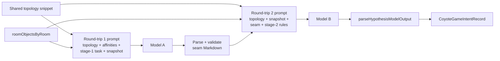

# Coyote hypothesis generation: two Bedrock round-trips (plan)

**Status:** Planning. This document captures goals, seams, unknowns, and an implementation order before refactoring the live pipeline.

## Getting Started

Follow the ordered **categories** below (see [Getting Started pattern for complex tasks](../../../../../AGENT.md#getting-started-pattern-for-complex-tasks) in root [`AGENT.md`](../../../../../AGENT.md)). A category can be light if it does not apply yet; keep **Why** / **Focus** so the next reader knows what to skim vs study.

1. **Understand task-plan conventions**
   - **Why:** Task plans under [`taskPlanning/`](../../../../) are semi-durable process docs; know what belongs here vs durable `AGENT.md` next to code.
   - **Read:** [`taskPlanning/AGENT.md`](../../../../AGENT.md) (durability, **Recommended order** checkbox rules, verification). Root [`AGENT.md`](../../../../../AGENT.md) for repo navigation and the Getting Started pattern.

2. **Read this document**
   - **Why:** Scope and decisions live in **Purpose** through **Unknowns and decisions**; implementation tracking is **Recommended order** and **Verification**.
   - **Focus:** Two-call architecture, **seam contract** between calls, preserving [`CoyoteGameIntentRecord`](../../../../../lambda/ephemera/internalCache/coyoteGame.ts), prompt-caching splits, latency/cost/harness implications.

3. **Understand current single-call hypothesis flow**
   - **Why:** Refactor starts from today's wiring and tests.
   - **Read:** [`lambda/ephemera/dataSource/coyoteGame/AGENT.md`](../../../../../lambda/ephemera/dataSource/coyoteGame/AGENT.md). Primary files:
     - [`buildHypothesisPrompt.ts`](../../../../../lambda/ephemera/dataSource/coyoteGame/buildHypothesisPrompt.ts) — template partitions into cache-friendly [`CoyotePromptParts`](../../../../../lambda/ephemera/dataSource/coyoteGame/buildHypothesisPrompt.ts) (`invariantPrefix` / `dynamicSuffix`); dynamic tail is the staged-objects snapshot.
     - [`generateHypothesis.ts`](../../../../../lambda/ephemera/dataSource/coyoteGame/generateHypothesis.ts) — loads objects (or override), one [`invokeBedrockHypothesis`](../../../../../lambda/ephemera/dataSource/coyoteGame/invokeBedrockHypothesis.ts), [`parseHypothesisModelOutput`](../../../../../lambda/ephemera/dataSource/coyoteGame/parseHypothesisModelOutput.ts).
     - [`invokeBedrockHypothesis.ts`](../../../../../lambda/ephemera/dataSource/coyoteGame/invokeBedrockHypothesis.ts) — single user message: text, cache point, text ([`invokeBedrockConverseText`](../../../../../lambda/ephemera/generateExample/invokeBedrockConverseText.ts)).

4. **Related planning and harness context**
   - **Why:** Engine test harness assumes one hypothesis Bedrock call per fixture today; doubling calls affects timeouts, metrics, and grading copy.
   - **Read:** [`lambda/ephemera/dataSource/coyoteGame/AGENT.md`](../../../../../lambda/ephemera/dataSource/coyoteGame/AGENT.md) **Engine testing harness (dev)** (`runCoyoteEngineTestHarness`, fixtures, Converse usage metadata).

5. **Testing**
   - **Why:** Ephemera uses **Jest** from `lambda/ephemera`; see [`lambda/ephemera/AGENT.testing.md`](../../../../../lambda/ephemera/AGENT.testing.md).
   - **Commands:** From **Verification** below.

6. **Identify next task**
   - **Why:** Progress lives in **Recommended order**; readers often open only unchecked items.
   - **Focus:** First unchecked line in **Recommended order** and any nested bullets.

## Purpose

Today one model completion performs both:

1. **Upstream reasoning** aligned with the prompt's scene-analysis instructions (per-object notes, clusters, Coyote vs trap affinity).
2. **Downstream product**: a single `Hypothesis:` line plus optional markdown under `## Scene analysis` ([`parseHypothesisModelOutput`](../../../../../lambda/ephemera/dataSource/coyoteGame/parseHypothesisModelOutput.ts)).

That arrangement works well in practice, but **everything lives in one forward pass**: the tokens produced while satisfying the long instruction block (topology, affinities, interpretation rules, scene-analysis instructions, and snapshot) all sit in one context when the model writes the scene analysis and hypothesis.

**Architectural goal:** Split generation into **two structured Bedrock round-trips** separated by an explicit **seam**:

- **Round-trip 1** produces a **bounded intermediate** — the same logical content we already steer the single prompt to develop first (object-level reading, affinities, clusters / "role" grouping). This is the **formulaic seam** already implied by the current prompt structure and covered by [`buildHypothesisPrompt.test.ts`](../../../../../lambda/ephemera/dataSource/coyoteGame/buildHypothesisPrompt.test.ts) / [`parseHypothesisModelOutput.test.ts`](../../../../../lambda/ephemera/dataSource/coyoteGame/parseHypothesisModelOutput.test.ts).

- **Round-trip 2** consumes:
  - the **same reusable world-context snippets as round-trip 1**, notably the **full world topology** (and, when refactoring, other fixed geography cues such as **Cartoon opportunity points** extracted alongside it from [`buildHypothesisPrompt.ts`](../../../../../lambda/ephemera/dataSource/coyoteGame/buildHypothesisPrompt.ts)) — **one shared source string** included in **both** prompts so stage 2 keeps full spatial grounding,
  - the **room snapshot** (same shape as today: `Record<EphemeraRoomId, string[]>` serialized consistently with [`formatCoyoteStagedObjectsByRoom`](../../../../../lambda/ephemera/dataSource/coyoteGame/coyoteRoomObjectSnapshot.ts)) — **same staged-object serialization as stage 1**, not a paraphrase,
  - and the **structured Markdown seam** from round-trip 1 (the only **model-produced** carryover from stage 1).

What stage 2 must **not** include is the **stage-1-only instruction and reasoning preamble** used to *produce* the seam (role/affinity rules, seam formatting contract, chain-of-thought beyond the validated Markdown). Inference for the clustering pass does not cross as raw prompt text; only the **agreed seam document** plus **shared constants** (topology, snapshot) does.

External behavior for the rest of the system stays **stable**: [`generateHypothesis`](../../../../../lambda/ephemera/dataSource/coyoteGame/generateHypothesis.ts) still returns [`CoyoteGameIntentRecord`](../../../../../lambda/ephemera/internalCache/coyoteGame.ts) (`intent`, optional `sceneAnalysis`). Consumers ([`handleObjectsChangedForHypothesis`](../../../../../lambda/ephemera/dataSource/coyoteGame/handleObjectsChangedForHypothesis.ts), cache, harness) should require **no semantic contract change** beyond accepting longer wall-clock time and different token accounting unless we intentionally expose per-stage metadata.

## Success criteria (draft)

- **Two** Bedrock `Converse` invocations per hypothesis generation; **no** feature flag and **no** single-call emergency fallback (see **Unknowns**).
- **Seam contract** is explicit and unit-tested: parser round-trips and rejects/fixtures for malformed stage-1 output (see **Stage 1 seam contract** under **Proposed architecture**).
- **Round-trip 2** prompt text **does not include** the stage-1-only *instruction* block used to author the seam; it includes **shared topology (full) + snapshot + validated seam +** stage-2-only instructions for emitting `## Scene analysis` and `Hypothesis:` (matching [`parseHypothesisModelOutput`](../../../../../lambda/ephemera/dataSource/coyoteGame/parseHypothesisModelOutput.ts) expectations).
- **`CoyoteGameIntentRecord`** shape unchanged for persisted intent and UI render tree ([`coyoteRenderTree`](../../../../../lambda/ephemera/dataSource/coyoteGame/coyoteRenderTree.ts)).
- **Prompt caching** remains valid per stage: each stage defines its own `invariantPrefix` / `dynamicSuffix` split (snapshot and/or seam payload in the dynamic tail as appropriate).
- **Tests:** prompt builders, parsers, `generateHypothesis` integration with mocked Bedrock (two sequential responses), and harness expectations updated for **two** calls per fixture where relevant.

## Constraints and non-goals

- **Latency and cost** roughly **double** best-case Bedrock calls per hypothesis (plus cold-start variance). Re-evaluate Lambda timeouts anywhere `generateHypothesis` runs in a chain (including [`runCoyoteEngineTestHarness`](../../../../../lambda/ephemera/dataSource/coyoteGame/runCoyoteEngineTestHarness.ts) x10 fixtures).
- **Non-goal (initially):** Changing [`generatePlanOutcome`](../../../../../lambda/ephemera/dataSource/coyoteGame/generatePlanOutcome.ts) or outcome prompting unless a dependency appears.
- **Non-goal:** Product UX copy beyond what falls out of the same `intent` / `sceneAnalysis` fields.

## Current integration points (baseline)

| Piece | Role today |
| --- | --- |
| [`buildHypothesisPromptParts`](../../../../../lambda/ephemera/dataSource/coyoteGame/buildHypothesisPrompt.ts) | One full template; cache split immediately before [`SNAPSHOT_SECTION_HEADER`](../../../../../lambda/ephemera/dataSource/coyoteGame/buildHypothesisPrompt.ts) (`## Current staged objects by room`). |
| [`invokeBedrockHypothesis`](../../../../../lambda/ephemera/dataSource/coyoteGame/invokeBedrockHypothesis.ts) | One converse call; `BEDROCK_HYPOTHESIS_MAX_TOKENS` sized for scene analysis + hypothesis. |
| [`parseHypothesisModelOutput`](../../../../../lambda/ephemera/dataSource/coyoteGame/parseHypothesisModelOutput.ts) | Splits on first well-formed `Hypothesis:` line; preceding text → `sceneAnalysis`. |

## Proposed architecture



**Design rule:** `p2` must **not** embed the stage-1 *instruction* preamble verbatim. It **must** include the **same** reusable **topology** snippet(s) and **snapshot** serialization as `p1`, then add **`seam`** plus stage-2-only instructions for narrative + `Hypothesis:` output.

### Stage 1 seam contract (structured Markdown)

**Locked:** Round-trip 1 emits **only** this structured Markdown body (trim whitespace; if the model wraps the body in an outer Markdown code fence, strip that fence). **No separate seam version field:** stage 1 and stage 2 prompts evolve **in lockstep** when the shape changes.

**Semantics** (same logical content as today's scene-analysis scaffolding in [`buildHypothesisPrompt.ts`](../../../../../lambda/ephemera/dataSource/coyoteGame/buildHypothesisPrompt.ts)): for **each** staged object, **likely function** and **actor affinity** (Coyote-operated vs Road-Runner-trap vs ambiguous). Then **one or two clusters**: objects that share affinity, co-locate, or plausibly support a common activity; each cluster states what it suggests about the Coyote's role (**participant** vs **trap-setter**, or ambiguous).

**Heading outline** (fixed section order):

1. **`## Notes`** — Optional. At most one short paragraph for spatial or cross-room context. Omit the section entirely, or include it with an empty body, if there is nothing to add.

2. **`## Objects`** — Required. **One** `###` block per staged object, in **any order** within the section:

   `### {shortSeamRoomLabel} · {shortName}`

   - `{shortSeamRoomLabel}` is the **Seam room labels** mapping in the prompt (currently `ROOM#…` with the `ROOM#` prefix stripped — e.g. `STRAIGHTAWAY`). Using full `ROOM#STRAIGHTAWAY` is still accepted; the parser normalizes to the short label.  
   - `{shortName}` must match the snapshot string **exactly** (same spelling, spacing, and casing as in `roomObjectsByRoom`).  
   - Separator between room label and name is **` · `** (space, middle dot, space).

   Under each object heading, **exactly** these two bullet lines (order fixed):

   - `- **Function:** …` — Brief prose (one line or short paragraph).
   - `- **Affinity:** …` — Exactly one machine token: `coyoteOperated`, `roadRunnerTrap`, or `ambiguous`.

3. **`## Clusters`** — Required. **Exactly one or two** cluster subsections:

   `### {Cluster label}` — Short human-readable title (not necessarily unique across time, but unique within the document).

   Under each cluster, **exactly** these three bullet lines (order fixed):

   - `- **Members:**` — Semicolon-separated list of object references, each in the **same** `{shortSeamRoomLabel} · shortName` form as the object headings (optional `ROOM#` prefix on the room token). No other copy on this line.
   - `- **Coyote role:**` — One token: `participant`, `trapSetter`, or `ambiguous`.
   - `- **Summary:**` — One short sentence.

**Validation (implementation):** The multiset of object headings must **equal** the multiset of staged objects when each canonical `ROOM#…` id is mapped to its **short seam label** (`seamRoomLabelFromEphemeraRoomId`). Every member in every `Members` line must reference an object heading that exists in `## Objects`. **`## Clusters`** must contain **1 or 2** `###` subsections.

**Example:**

```markdown
## Notes

## Objects

### STRAIGHTAWAY · roller skates
- **Function:** Build speed on the highway for a chase or intercept.
- **Affinity:** coyoteOperated

### STRAIGHTAWAY · rocket
- **Function:** Late-stage trap tied to the straightaway run.
- **Affinity:** coyoteOperated

## Clusters

### Straightaway chase setup
- **Members:** STRAIGHTAWAY · roller skates; STRAIGHTAWAY · rocket
- **Coyote role:** participant
- **Summary:** Coyote uses speed and a staged prop on the same run before triggering the trap.
```

**Implementation note:** **`parseHypothesisStageOneOutput`** parses this Markdown into an in-memory DTO for tests and optional stage-2 assembly, or the validated Markdown string may be pasted into the stage-2 prompt verbatim; invalid seam → failure / stub behavior per **Unknowns and decisions** (failure policy).

### Suggested module layout (implementation detail, TBD)

- **`buildHypothesisStageOnePromptParts`** / **`buildHypothesisStageTwoPromptParts`** (names TBD): each returns `CoyotePromptParts`-shaped splits; Bedrock entry is two thin wrappers in [`invokeBedrockHypothesis.ts`](../../../../../lambda/ephemera/dataSource/coyoteGame/invokeBedrockHypothesis.ts) (e.g. **`invokeBedrockHypothesisStageOne`** / **`invokeBedrockHypothesisStageTwo`**) that delegate to shared **`invokeBedrockHypothesis`** with stage-appropriate **`maxTokens`** / options.
- **`parseHypothesisStageOneOutput`**: parses and validates the **structured Markdown seam** above; produces a DTO for stage 2 or signals parse failure.
- **`generateHypothesis`**: orchestrates load snapshot → call 1 → parse → call 2 → `parseHypothesisModelOutput`; centralize failure stubs (`Hypothesis: Stubbed`) at appropriate stages.

## Recommended order

Pending work uses `[ ]` and completed work uses `[X]`. Apply checkboxes to each actionable line and nested bullets as they complete.

- [X] **Lock seam contract:** Structured Markdown seam documented in **Stage 1 seam contract (structured Markdown)** above; no standalone version field (prompts evolve in lockstep). Seam visibility for debugging: see **Observability / seam persistence** in **Unknowns**.
- [X] **Stage 1 prompts + cache split:** [`buildHypothesisStageOnePrompt.ts`](../../../../../lambda/ephemera/dataSource/coyoteGame/buildHypothesisStageOnePrompt.ts) + [`buildHypothesisStageOnePrompt.test.ts`](../../../../../lambda/ephemera/dataSource/coyoteGame/buildHypothesisStageOnePrompt.test.ts).
- [X] **Stage 1 parser + tests:** [`parseHypothesisStageOneOutput.ts`](../../../../../lambda/ephemera/dataSource/coyoteGame/parseHypothesisStageOneOutput.ts) + tests; invalid seam → stub (see **Failure policy** in **Unknowns**).
- [X] **Stage 2 prompts + cache split:** [`buildHypothesisStageTwoPrompt.ts`](../../../../../lambda/ephemera/dataSource/coyoteGame/buildHypothesisStageTwoPrompt.ts) + tests.
- [X] **Bedrock orchestration:** [`invokeBedrockHypothesisStageOne`](../../../../../lambda/ephemera/dataSource/coyoteGame/invokeBedrockHypothesis.ts) / [`invokeBedrockHypothesisStageTwo`](../../../../../lambda/ephemera/dataSource/coyoteGame/invokeBedrockHypothesis.ts) + [`BEDROCK_HYPOTHESIS_STAGE_ONE_MAX_TOKENS`](../../../../../lambda/ephemera/dataSource/coyoteGame/invokeBedrockHypothesis.ts) / `_STAGE_TWO_`.
- [X] **Wire `generateHypothesis`:** [`generateHypothesis.ts`](../../../../../lambda/ephemera/dataSource/coyoteGame/generateHypothesis.ts) + [`generateHypothesisWithStageResults`](../../../../../lambda/ephemera/dataSource/coyoteGame/generateHypothesis.ts).
- [X] **Harness + metrics:** [`runCoyoteEngineTestHarness.ts`](../../../../../lambda/ephemera/dataSource/coyoteGame/runCoyoteEngineTestHarness.ts) uses **`generateHypothesisWithStageResults`**; **`usageStage1`** / **`usageStage2`** lines.
- [X] **Lambda / timeout review:** Ephemera Lambda **`Timeout: 60`** (`EphemeraFunction` in repo [`template.yaml`](../../../../../template.yaml)). Each Coyote Bedrock round-trip uses **`BEDROCK_HYPOTHESIS_TIMEOUT_MS`** (30s) per [`invokeBedrockHypothesis.ts`](../../../../../lambda/ephemera/dataSource/coyoteGame/invokeBedrockHypothesis.ts), so **two sequential calls worst-case equal** that budget (no slack if both calls hit the full 30s). **Expected case remains acceptable:** the pipeline **splits work** — stage 1 emits a compact seam with a **lower maxTokens** cap than stage 2 — so each call often finishes faster than a single monolithic hypothesis generation, and **replacing “full attended” context with the seam** keeps the second pass’s reasoning narrower. **Harness ×10** runs in dev/tests (not one 20-call Lambda invocation); production still does **two Bedrock calls per hypothesis** inside the same 60s envelope. Revisit only if telemetry shows frequent timeouts or if stage caps move much higher.
- [X] **Durable docs:** [`lambda/ephemera/dataSource/coyoteGame/AGENT.md`](../../../../../lambda/ephemera/dataSource/coyoteGame/AGENT.md) updated for two-call hypothesis + harness.

## Unknowns and decisions

0. **Stage-1 format (resolved):** **Structured Markdown** per **Stage 1 seam contract (structured Markdown)** under **Proposed architecture**.
1. **World topology in stage 2 (resolved):** Include the **full world topology** in stage 2 (same content as stage 1). Implement as a **reusable snippet** imported by both prompt builders, alongside the **same** staged-object snapshot serialization used in both rounds — analogous to sharing invariant prompt text for caching and consistency. This is **not** stage-1 prompt leakage; it is **shared constant** material, distinct from the seam.
2. **Max tokens / temperature per stage:** Stage 1 may skew shorter; stage 2 owns most of the narrative + `Hypothesis:` line — sizes need tuning after first implementation.
3. **Failure policy (resolved):** **Stub-only** — any Bedrock failure, invalid stage-1 seam parse, or stage-2 parse edge case yields **`Hypothesis: Stubbed`** as the durable intent ([`generateHypothesis.ts`](../../../../../lambda/ephemera/dataSource/coyoteGame/generateHypothesis.ts)); no partial hypothesis text to players.
4. **Kill-switch / single-call fallback (resolved):** **Not** shipping a feature flag or env-gated single-call path. The two-round pipeline is the only production path; keep the surface area testable and avoid emergency fallbacks.
5. **Observability / seam persistence (resolved):** Surface the seam **as output during the test phase** (unit tests, harness, local runs). **No** upfront Dynamo row or prod logging requirement; if debugging needs appear later, add persistence or structured logs **then**, shaped by that need.
6. **Same model for both stages (resolved):** **Yes** — use [`BEDROCK_HYPOTHESIS_MODEL_ID`](../../../../../lambda/ephemera/dataSource/coyoteGame/invokeBedrockHypothesis.ts) (or a single shared constant) for both round-trips; only **`maxTokens`** and similar per-call options differ via the stage wrappers.

## Verification

- `cd lambda/ephemera && npx jest dataSource/coyoteGame/`
- After actions or harness touch: extend with `dataSource/actions/` if parse or handler wiring changes.
- Manual: stage object change in a Coyote demo room → hypothesis message still renders; optional local harness run with flag enabled confirms two-call metrics.

## References

- Single-call baseline and bus behavior: [`lambda/ephemera/dataSource/coyoteGame/AGENT.md`](../../../../../lambda/ephemera/dataSource/coyoteGame/AGENT.md)
- Engine test harness (steady state): [`lambda/ephemera/dataSource/coyoteGame/AGENT.md`](../../../../../lambda/ephemera/dataSource/coyoteGame/AGENT.md) **Engine testing harness (dev)**
- Product context: [`AGENT.CoyoteGame.implementation.md`](../../../../../AGENT.CoyoteGame.implementation.md) (repo root)
