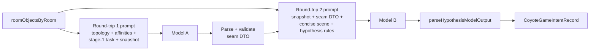

# Coyote hypothesis generation: two Bedrock round-trips (plan)

**Status:** Planning. This document captures goals, seams, unknowns, and an implementation order before refactoring the live pipeline.

## Getting Started

Follow the ordered **categories** below (see [Getting Started pattern for complex tasks](../../../../../AGENT.md#getting-started-pattern-for-complex-tasks) in root [`AGENT.md`](../../../../../AGENT.md)). A category can be light if it does not apply yet; keep **Why** / **Focus** so the next reader knows what to skim vs study.

1. **Understand task-plan conventions**
   - **Why:** Task plans under [`taskPlanning/`](../../../../) are semi-durable process docs; know what belongs here vs durable `AGENT.md` next to code.
   - **Read:** [`taskPlanning/AGENT.md`](../../../../AGENT.md) (durability, **Recommended order** checkbox rules, verification). Root [`AGENT.md`](../../../../../AGENT.md) for repo navigation and the Getting Started pattern.

2. **Read this document**
   - **Why:** Scope and decisions live in **Purpose** through **Unknowns and decisions**; implementation tracking is **Recommended order** and **Verification**.
   - **Focus:** Two-call architecture, **seam contract** between calls, preserving [`CoyoteGameIntentRecord`](../../../../../lambda/ephemera/internalCache/coyoteGame.ts), prompt-caching splits, latency/cost/harness implications.

3. **Understand current single-call hypothesis flow**
   - **Why:** Refactor starts from today's wiring and tests.
   - **Read:** [`lambda/ephemera/dataSource/coyoteGame/AGENT.md`](../../../../../lambda/ephemera/dataSource/coyoteGame/AGENT.md). Primary files:
     - [`buildHypothesisPrompt.ts`](../../../../../lambda/ephemera/dataSource/coyoteGame/buildHypothesisPrompt.ts) — template partitions into cache-friendly [`CoyotePromptParts`](../../../../../lambda/ephemera/dataSource/coyoteGame/buildHypothesisPrompt.ts) (`invariantPrefix` / `dynamicSuffix`); dynamic tail is the staged-objects snapshot.
     - [`generateHypothesis.ts`](../../../../../lambda/ephemera/dataSource/coyoteGame/generateHypothesis.ts) — loads objects (or override), one [`invokeBedrockHypothesis`](../../../../../lambda/ephemera/dataSource/coyoteGame/invokeBedrockHypothesis.ts), [`parseHypothesisModelOutput`](../../../../../lambda/ephemera/dataSource/coyoteGame/parseHypothesisModelOutput.ts).
     - [`invokeBedrockHypothesis.ts`](../../../../../lambda/ephemera/dataSource/coyoteGame/invokeBedrockHypothesis.ts) — single user message: text, cache point, text ([`invokeBedrockConverseText`](../../../../../lambda/ephemera/generateExample/invokeBedrockConverseText.ts)).

4. **Related planning and harness context**
   - **Why:** Engine test harness assumes one hypothesis Bedrock call per fixture today; doubling calls affects timeouts, metrics, and grading copy.
   - **Read:** [`lambda/ephemera/dataSource/coyoteGame/AGENT.md`](../../../../../lambda/ephemera/dataSource/coyoteGame/AGENT.md) **Engine testing harness (dev)** (`runCoyoteEngineTestHarness`, fixtures, Converse usage metadata).

5. **Testing**
   - **Why:** Ephemera uses **Jest** from `lambda/ephemera`; see [`lambda/ephemera/AGENT.testing.md`](../../../../../lambda/ephemera/AGENT.testing.md).
   - **Commands:** From **Verification** below.

6. **Identify next task**
   - **Why:** Progress lives in **Recommended order**; readers often open only unchecked items.
   - **Focus:** First unchecked line in **Recommended order** and any nested bullets.

## Purpose

Today one model completion performs both:

1. **Upstream reasoning** aligned with the prompt's scene-analysis instructions (per-object notes, clusters, Coyote vs trap affinity).
2. **Downstream product**: a single `Hypothesis:` line plus optional markdown under `## Scene analysis` ([`parseHypothesisModelOutput`](../../../../../lambda/ephemera/dataSource/coyoteGame/parseHypothesisModelOutput.ts)).

That arrangement works well in practice, but **everything lives in one forward pass**: the tokens produced while satisfying the long instruction block (topology, affinities, interpretation rules, scene-analysis instructions, and snapshot) all sit in one context when the model writes the scene analysis and hypothesis.

**Architectural goal:** Split generation into **two structured Bedrock round-trips** separated by an explicit **seam**:

- **Round-trip 1** produces a **bounded intermediate** — the same logical content we already steer the single prompt to develop first (object-level reading, affinities, clusters / "role" grouping). This is the **formulaic seam** already implied by the current prompt structure and covered by [`buildHypothesisPrompt.test.ts`](../../../../../lambda/ephemera/dataSource/coyoteGame/buildHypothesisPrompt.test.ts) / [`parseHypothesisModelOutput.test.ts`](../../../../../lambda/ephemera/dataSource/coyoteGame/parseHypothesisModelOutput.test.ts).

- **Round-trip 2** consumes **only**:
  - the **room snapshot** (same shape as today: `Record<EphemeraRoomId, string[]>` serialized consistently with [`formatCoyoteStagedObjectsByRoom`](../../../../../lambda/ephemera/dataSource/coyoteGame/coyoteRoomObjectSnapshot.ts)), and
  - the **parsed output of round-trip 1** (not the full round-trip 1 prompt, not chain-of-thought from round-trip 1 beyond what we choose to serialize in the contract).

So the second model's attention budget is intentionally **not** filled with the large instruction preamble used to *produce* the clustering artifact in round-trip 1. Inference for the **first** product (clusters / roles) does not need to flow into the second prompt as raw prompt text; only the **agreed intermediate representation** crosses the boundary.

External behavior for the rest of the system stays **stable**: [`generateHypothesis`](../../../../../lambda/ephemera/dataSource/coyoteGame/generateHypothesis.ts) still returns [`CoyoteGameIntentRecord`](../../../../../lambda/ephemera/internalCache/coyoteGame.ts) (`intent`, optional `sceneAnalysis`). Consumers ([`handleObjectsChangedForHypothesis`](../../../../../lambda/ephemera/dataSource/coyoteGame/handleObjectsChangedForHypothesis.ts), cache, harness) should require **no semantic contract change** beyond accepting longer wall-clock time and different token accounting unless we intentionally expose per-stage metadata.

## Success criteria (draft)

- **Two** Bedrock `Converse` invocations per hypothesis generation (no silent fallback to single-call in production unless explicitly decided as a kill-switch in **Unknowns**).
- **Seam contract** is explicit, versionable, and unit-tested: parser round-trips and rejects/fixtures for malformed stage-1 output.
- **Round-trip 2** prompt text **does not include** the full round-trip 1 *instruction* block; it includes **snapshot + validated stage-1 payload +** a **small** instruction set for emitting `## Scene analysis` and `Hypothesis:` (matching [`parseHypothesisModelOutput`](../../../../../lambda/ephemera/dataSource/coyoteGame/parseHypothesisModelOutput.ts) expectations).
- **`CoyoteGameIntentRecord`** shape unchanged for persisted intent and UI render tree ([`coyoteRenderTree`](../../../../../lambda/ephemera/dataSource/coyoteGame/coyoteRenderTree.ts)).
- **Prompt caching** remains valid per stage: each stage defines its own `invariantPrefix` / `dynamicSuffix` split (snapshot and/or seam payload in the dynamic tail as appropriate).
- **Tests:** prompt builders, parsers, `generateHypothesis` integration with mocked Bedrock (two sequential responses), and harness expectations updated for **two** calls per fixture where relevant.

## Constraints and non-goals

- **Latency and cost** roughly **double** best-case Bedrock calls per hypothesis (plus cold-start variance). Re-evaluate Lambda timeouts anywhere `generateHypothesis` runs in a chain (including [`runCoyoteEngineTestHarness`](../../../../../lambda/ephemera/dataSource/coyoteGame/runCoyoteEngineTestHarness.ts) x10 fixtures).
- **Non-goal (initially):** Changing [`generatePlanOutcome`](../../../../../lambda/ephemera/dataSource/coyoteGame/generatePlanOutcome.ts) or outcome prompting unless a dependency appears.
- **Non-goal:** Product UX copy beyond what falls out of the same `intent` / `sceneAnalysis` fields.

## Current integration points (baseline)

| Piece | Role today |
| --- | --- |
| [`buildHypothesisPromptParts`](../../../../../lambda/ephemera/dataSource/coyoteGame/buildHypothesisPrompt.ts) | One full template; cache split immediately before [`SNAPSHOT_SECTION_HEADER`](../../../../../lambda/ephemera/dataSource/coyoteGame/buildHypothesisPrompt.ts) (`## Current staged objects by room`). |
| [`invokeBedrockHypothesis`](../../../../../lambda/ephemera/dataSource/coyoteGame/invokeBedrockHypothesis.ts) | One converse call; `BEDROCK_HYPOTHESIS_MAX_TOKENS` sized for scene analysis + hypothesis. |
| [`parseHypothesisModelOutput`](../../../../../lambda/ephemera/dataSource/coyoteGame/parseHypothesisModelOutput.ts) | Splits on first well-formed `Hypothesis:` line; preceding text → `sceneAnalysis`. |

## Proposed architecture

**Design rule:** `p2` must be constructible from **only** `snapshot` and `seam` (plus fixed, short system-style instructions). It must not embed `p1` verbatim.

### Suggested module layout (implementation detail, TBD)

- **`buildHypothesisStageOnePromptParts`** / **`buildHypothesisStageTwoPromptParts`** (names TBD): each returns `CoyotePromptParts`-shaped splits for [`invokeBedrockHypothesis`](../../../../../lambda/ephemera/dataSource/coyoteGame/invokeBedrockHypothesis.ts)-style invocation or thin wrappers (e.g. `invokeBedrockHypothesisStageOne`).
- **`parseHypothesisStageOneOutput`** (or JSON-schema-validated equivalent): produces the seam DTO consumed by stage 2.
- **`generateHypothesis`**: orchestrates load snapshot → call 1 → parse → call 2 → `parseHypothesisModelOutput`; centralize failure stubs (`Hypothesis: Stubbed`) at appropriate stages.

Whether stage 1 uses **JSON** vs constrained **markdown** is an open decision (**Unknowns**); JSON is easier to validate but may require stronger prompting.

## Recommended order

Pending work uses `[ ]` and completed work uses `[X]`. Apply checkboxes to each actionable line and nested bullets as they complete.

- [ ] **Lock seam contract:** Decide stage-1 output schema (JSON vs markdown), required fields (objects, affinities, clusters), and versioning strategy for stored logs if any.
- [ ] **Stage 1 prompts + cache split:** Extract or rewrite the **first-pass** instructions from the current monolith so stage 1 targets only role/clustering (and whatever stage 2 must not repeat). Unit tests mirror [`buildHypothesisPrompt.test.ts`](../../../../../lambda/ephemera/dataSource/coyoteGame/buildHypothesisPrompt.test.ts) coverage style.
- [ ] **Stage 1 parser + tests:** Fuzz / fixture tests; clear error behavior when stage 1 is unusable (fail fast to stub vs retry — TBD).
- [ ] **Stage 2 prompts + cache split:** Minimal instructions + snapshot + seam; must output text compatible with [`parseHypothesisModelOutput`](../../../../../lambda/ephemera/dataSource/coyoteGame/parseHypothesisModelOutput.ts) (`## Scene analysis`, `Hypothesis:`).
- [ ] **Bedrock orchestration:** Either generalize [`invokeBedrockHypothesis`](../../../../../lambda/ephemera/dataSource/coyoteGame/invokeBedrockHypothesis.ts) with options (max tokens per stage) or add stage-specific thin wrappers; keep model id / timeout constants in one place.
- [ ] **Wire `generateHypothesis`:** Two sequential calls; preserve `roomObjectsByRoomOverride` behavior; preserve failure / stub semantics for production and tests.
- [ ] **Harness + metrics:** Update [`runCoyoteEngineTestHarness`](../../../../../lambda/ephemera/dataSource/coyoteGame/runCoyoteEngineTestHarness.ts) (and related tests) so per-fixture published text reflects **two** calls (latency, token lines, failure attribution per stage if feasible).
- [ ] **Lambda / timeout review:** Confirm ephemera Lambda budget for 2x calls per hypothesis and harness x10.
- [ ] **Durable docs:** After behavior is stable, update [`lambda/ephemera/dataSource/coyoteGame/AGENT.md`](../../../../../lambda/ephemera/dataSource/coyoteGame/AGENT.md) (two-call flow, seam); trim this plan or archive per [`taskPlanning/AGENT.md`](../../../../AGENT.md).

## Unknowns and decisions

0. **Stage-1 format (open):** Strict JSON vs markdown-with-headers vs hybrid. Tradeoffs: validator tightness vs model adherence vs token overhead.
1. **How much world topology in stage 2:** If zero, the model may lose spatial reminders; if a **short fixed blurb** is allowed, confirm it is still "not the stage-1 prompt" (likely yes if it is a shared constant snippet, not model-generated text).
2. **Max tokens / temperature per stage:** Stage 1 may skew shorter; stage 2 owns most of the narrative + `Hypothesis:` line — sizes need tuning after first implementation.
3. **Failure policy:** If stage 1 succeeds and stage 2 fails, do we expose partial data in stream events, or only stub intent? Today single-call failure collapses to [`Hypothesis: Stubbed`](../../../../../lambda/ephemera/dataSource/coyoteGame/parseHypothesisModelOutput.ts) via empty parse paths; multi-stage should define per-stage stubs and logging.
4. **Kill-switch:** Whether to keep a **feature flag** or env-gated single-call fallback for emergencies (adds code paths to test).
5. **Observability:** Whether to persist seam DTO for debugging (Dynamo row extension vs logs-only) — product decision.
6. **Same model for both stages:** Default likely yes ([`BEDROCK_HYPOTHESIS_MODEL_ID`](../../../../../lambda/ephemera/dataSource/coyoteGame/invokeBedrockHypothesis.ts)); revisit if quality or cost suggests otherwise.

## Verification

- `cd lambda/ephemera && npx jest dataSource/coyoteGame/`
- After actions or harness touch: extend with `dataSource/actions/` if parse or handler wiring changes.
- Manual: stage object change in a Coyote demo room → hypothesis message still renders; optional local harness run with flag enabled confirms two-call metrics.

## References

- Single-call baseline and bus behavior: [`lambda/ephemera/dataSource/coyoteGame/AGENT.md`](../../../../../lambda/ephemera/dataSource/coyoteGame/AGENT.md)
- Engine test harness (steady state): [`lambda/ephemera/dataSource/coyoteGame/AGENT.md`](../../../../../lambda/ephemera/dataSource/coyoteGame/AGENT.md) **Engine testing harness (dev)**
- Product context: [`AGENT.CoyoteGame.implementation.md`](../../../../../AGENT.CoyoteGame.implementation.md) (repo root)
