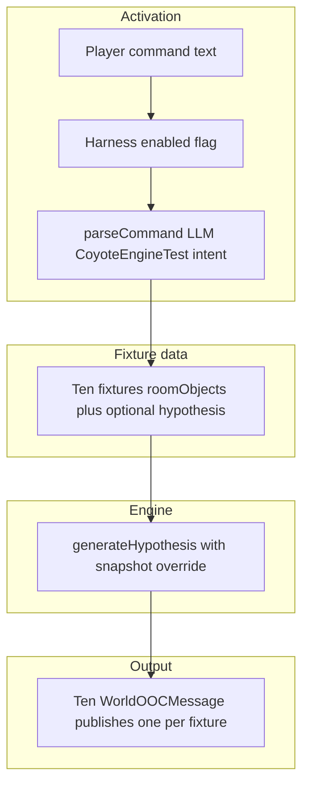

# Coyote Game engine testing harness (plan)

**Status:** Planning. No implementation yet; this document captures steps and unknowns before building.

## Getting Started

Follow the ordered **categories** below (see [Getting Started pattern for complex tasks](../../../../../AGENT.md#getting-started-pattern-for-complex-tasks) in root [`AGENT.md`](../../../../../AGENT.md)). A category can be light if it does not apply yet; keep **Why** / **Focus** so the next reader knows what to skim vs study.

1. **Understand task-plan conventions**
   - **Why:** Task plans under [`taskPlanning/`](../../../../) are disposable process docs; know what belongs here vs durable `AGENT.md` next to code.
   - **Read:** [`taskPlanning/AGENT.md`](../../../../AGENT.md) (durability, **Recommended order** checkbox rules, verification). Root [`AGENT.md`](../../../../../AGENT.md) for repo navigation and the Getting Started pattern.

2. **Read this document**
   - **Why:** Scope and decisions live in **Purpose** through **Unknowns and decisions**; implementation tracking is **Recommended order** and **Verification**.
   - **Focus:** Snapshot overrides, dedicated harness entrypoint (not `CacheCoyoteGameData`), `CoyoteEngineTest` activation, ten fixtures, **continue-on-error**, and extending [`invokeBedrockConverseText`](../../../../../lambda/ephemera/generateExample/invokeBedrockConverseText.ts) for metadata.

3. **Understand ephemera and Coyote integration**
   - **Why:** Harness code lands in `lambda/ephemera` and touches actions + Bedrock helpers.
   - **Read:** [`lambda/ephemera/AGENT.md`](../../../../../lambda/ephemera/AGENT.md) (overview). [`lambda/ephemera/dataSource/coyoteGame/AGENT.md`](../../../../../lambda/ephemera/dataSource/coyoteGame/AGENT.md) (current Coyote data source). Related parse work: [`taskPlanning/.../actions/AGENT.actionParse.plan.md`](../actions/AGENT.actionParse.plan.md).
   - **Primary files (implementation):** [`generateHypothesis.ts`](../../../../../lambda/ephemera/dataSource/coyoteGame/generateHypothesis.ts), [`invokeBedrockHypothesis.ts`](../../../../../lambda/ephemera/dataSource/coyoteGame/invokeBedrockHypothesis.ts), [`invokeBedrockConverseText.ts`](../../../../../lambda/ephemera/generateExample/invokeBedrockConverseText.ts), [`internalCache/coyoteGame.ts`](../../../../../lambda/ephemera/internalCache/coyoteGame.ts), [`dataSource/actions/index.ts`](../../../../../lambda/ephemera/dataSource/actions/index.ts), [`dataSource/actions/baseClasses.ts`](../../../../../lambda/ephemera/dataSource/actions/baseClasses.ts).

4. **Testing**
   - **Why:** Ephemera uses **Jest** from `lambda/ephemera` (not Vitest); see [`lambda/ephemera/AGENT.testing.md`](../../../../../lambda/ephemera/AGENT.testing.md) for package testing notes.
   - **Commands:** From **Verification** below; after changes, `cd lambda/ephemera && npx jest dataSource/coyoteGame/ dataSource/actions/` (extend with harness tests when added).

5. **Identify next task**
   - **Why:** Progress lives in **Recommended order**; readers often open only unchecked items.
   - **Focus:** First unchecked line in **Recommended order** and any nested bullets.

## Purpose

Ship a **repeatable way to run the Coyote hypothesis / plan-outcome engine** against a **fixed set of ten staged-object setups**, and return results as **ten separate `WorldOOCMessage` deliveries** (one per fixture) so you can:

- Grade quality and consistency across the same examples after prompt or model changes.
- Compare runs objectively without relying on live world state or manual room staging.

The harness should **not** depend on real `Meta::Room` object lists for those runs, and should **not read or write** Coyote Game intent/outcome, Dynamo, or other live game state: it is **pure testing** (see **Persistence** below).

## Success criteria (draft)

- Ten named fixtures each define enough data to build the same `roomObjectsByRoom` shape used today by [`loadCoyoteRoomObjectsByRoom`](../../../../lambda/ephemera/dataSource/coyoteGame/coyoteRoomObjectSnapshot.ts).
- **First ship:** **Hypothesis only** per fixture (`generateHypothesis` with snapshot overrides). **Plan-outcome** harness steps (`generatePlanOutcome`) are deferred until we tune the outcome prompt/architecture; fixtures may still carry optional `hypothesisLine` for that future.
- One invocation produces **ten user-visible messages** (e.g. ten `PublishMessage` / `WorldOOCMessage` lines), **one per fixture**, each clearly labeled (fixture id, index e.g. `3/10`, hypothesis text, errors/timeouts; outcome lines when outcome testing is enabled later). This avoids max-payload / truncation issues with a single giant body and keeps each result easy to scan; copying a full run for external grading may require selecting multiple messages or relying on transcript order.
- Activation path is **explicit and easy to disable** for demos: a **dedicated parse intent** (e.g. `CoyoteEngineTest`) from the LLM classifier, plus **`COYOTE_ENGINE_TEST_HARNESS_ENABLED`** set to **`false`** as a **constant** in code for demo builds (no env var required for the default).

## Constraints and non-goals

- **No live object state:** Harness supplies snapshots; it does not require objects to exist in ephemera meta for the test rooms.
- **Cost / latency:** Ten setups implies **ten Bedrock calls** per harness run for hypothesis-only (double that if we add outcome testing later). Batch may approach Lambda timeout; **~60s** Lambda limit is a reasonable target (confirm against current template and raise if needed). Expose a **`testBatchSize`** (or similarly named) **tunable** so operators can choose sequential (e.g. `1`) vs limited parallelism for fixtures; default conservative. **Output** is ten separate publishes (not one oversized payload).
- **Out of scope for this plan doc:** Changing prompt wording, structured JSON outputs, or product UX beyond delivering a dev-grade grading bundle.

## Current integration points (baseline)

| Area | Role |
| --- | --- |
| [`generateHypothesis`](../../../../lambda/ephemera/dataSource/coyoteGame/generateHypothesis.ts) | Loads objects via `loadCoyoteRoomObjectsByRoom`, builds prompt parts, calls Bedrock. |
| [`generatePlanOutcome`](../../../../lambda/ephemera/dataSource/coyoteGame/generatePlanOutcome.ts) | Same object load + `getIntent()` for hypothesis line, then Bedrock. |
| [`InternalCache` / `CacheCoyoteGameData`](../../../../lambda/ephemera/internalCache/coyoteGame.ts) | Wires `generateIntent` / `generateOutcome` with `getGameRooms`, `getRoomMeta`, and persisted `intent` / `outcome`. |
| [`mtw.ephemera.actions`](../../../../lambda/ephemera/dataSource/actions/index.ts) | Parses commands via [`parseCommand`](../../../../lambda/ephemera/dataSource/actions/parseCommand.ts); discriminated results in [`baseClasses.ts`](../../../../lambda/ephemera/dataSource/actions/baseClasses.ts). |

Today, generators always pull room meta from `getRoomMeta`; there is **no** injection path for a prebuilt `Record<EphemeraRoomId, string[]>`.

## Proposed architecture

### 1. Plumb optional snapshot (and optional hypothesis) into generators

**Goal:** Call `generateHypothesis` (and later `generatePlanOutcome`) with **either** live deps **or** explicit `roomObjectsByRoom` (and for outcome, an explicit hypothesis string), without reading ephemera meta for that path.

- Extend `GenerateHypothesisDeps` / `GeneratePlanOutcomeDeps` with optional fields, for example:
  - `roomObjectsByRoomOverride?: Record<EphemeraRoomId, string[]>`
  - `hypothesisLineOverride?: string` (outcome only; when set, skip `getIntent()`).
- In each generator, if override is present, **skip** `loadCoyoteRoomObjectsByRoom` and pass the override into `buildHypothesisPromptParts` / `buildPlanOutcomePromptParts`.
- **Room order (resolved):** When serializing overrides for the prompt, use the **same room order as** [`defaultCoyoteGameData.gameRooms`](../../../../lambda/ephemera/internalCache/coyoteGame.ts) (`VORTEX`, `STRAIGHTAWAY`, etc.): iterate that list and emit only rooms present in the fixture map (omit empty rooms). This matches **default** live behavior from `getGameRooms()` and keeps runs comparable.

**InternalCache (resolved):** Today [`CacheCoyoteGameData`](../../../../lambda/ephemera/internalCache/coyoteGame.ts) closes over `generateHypothesis({ getGameRooms, getRoomMeta })` with no parameters. **Locked-in approach:** do **not** thread snapshot overrides through `CoyoteGame.get('intent')` / `get('outcome')`. Add a **separate** harness entry (e.g. `runCoyoteEngineTestHarness(...)`, same lambda package) that calls `generateHypothesis` / (later) `generatePlanOutcome` **directly** with overrides, invoked only from the actions branch when `CoyoteEngineTest` fires. Production cache behavior stays unchanged.

### 2. Define ten fixtures

- Single module, e.g. `coyoteEngineTestFixtures.ts`, exporting an array of `{ id, label?, roomObjectsByRoom, hypothesisLine? }`.
- Keys in `roomObjectsByRoom` use [`EphemeraRoomId`](../../../../../packages/mtw-interfaces/ts/baseClasses.ts) form `ROOM#${roomKey}` with `roomKey` from [`defaultCoyoteGameData.gameRooms`](../../../../lambda/ephemera/internalCache/coyoteGame.ts).
- Version fixtures when prompt topology changes (mention in file header).

**Location names (authoring) to engine rooms**

| Authoring phrase | `roomKey` | `EphemeraRoomId` |
| --- | --- | --- |
| Base of Cliff | `VORTEX` | `ROOM#VORTEX` |
| Top of Cliff | `CLIFFTOP` | `ROOM#CLIFFTOP` |
| Straightaway | `STRAIGHTAWAY` | `ROOM#STRAIGHTAWAY` |
| Corner | `CORNER` | `ROOM#CORNER` |
| Bridge | `BRIDGE` | `ROOM#BRIDGE` |

**Canonical ten setups (object strings are harness `shortName` values; normalize spelling with live `Meta::Room` / asset data when wiring real objects)**

| # | Description (human) | `roomObjectsByRoom` (omit empty rooms or use `[]`) |
| --- | --- | --- |
| 1 | Rocket at the Straightaway. | `ROOM#STRAIGHTAWAY`: `rocket` |
| 2 | Lever at the Top of Cliff; Birdseed at the Base of Cliff. | `ROOM#CLIFFTOP`: `lever`; `ROOM#VORTEX`: `birdseed` |
| 3 | Roller skates at the Straightaway; Paint at the Corner; Portable hole at the Bridge; Birdseed at the Bridge. | `ROOM#STRAIGHTAWAY`: `roller skates`; `ROOM#CORNER`: `paint`; `ROOM#BRIDGE`: `portable hole`, `birdseed` |
| 4 | Magnet and Steel drum at the Straightaway. | `ROOM#STRAIGHTAWAY`: `magnet`, `steel drum` |
| 5 | Catapult at the Base of Cliff. | `ROOM#VORTEX`: `catapult` |
| 6 | Birdseed at the Straightaway; Glue at the Base of Cliff; Anvil at the Top of Cliff. | `ROOM#STRAIGHTAWAY`: `birdseed`; `ROOM#VORTEX`: `glue`; `ROOM#CLIFFTOP`: `anvil` |
| 7 | Trampoline at the Base of Cliff; Net at the Top of Cliff. | `ROOM#VORTEX`: `trampoline`; `ROOM#CLIFFTOP`: `net` |
| 8 | Rocket, Skis, Catapult, Springs, and Glue at the Straightaway. | `ROOM#STRAIGHTAWAY`: `rocket`, `skis`, `catapult`, `springs`, `glue` |
| 9 | Umbrella at the Top of Cliff; Snorkel at the Corner; Skis at the Bridge. | `ROOM#CLIFFTOP`: `umbrella`; `ROOM#CORNER`: `snorkel`; `ROOM#BRIDGE`: `skis` |
| 10 | Cannon at the Top of Cliff; Birdseed at the Base of Cliff; Roller skates at the Straightaway; Paint at the Corner. | `ROOM#CLIFFTOP`: `cannon`; `ROOM#VORTEX`: `birdseed`; `ROOM#STRAIGHTAWAY`: `roller skates`; `ROOM#CORNER`: `paint` |

**Implementation notes**

- Order of object strings within a room should follow the human list above (left to right); order of **rooms** in serialized prompts for overrides follows **`defaultCoyoteGameData.gameRooms`** (same as **Plumb optional snapshot**).
- If a future asset uses a different `shortName` (e.g. hyphenation), update the fixture strings to match so snapshots align with production meta.

### 3. Harness runner

- Async function: for each fixture in order, call **hypothesis only** (`generateHypothesis` with overrides) for the first ship; **plan-outcome** calls are a later phase when the outcome stack is ready to tune.
- **Decision (resolved):** **Continue on error.** A failure on one fixture (Bedrock error, timeout, unusable model output) **does not** abort the batch: publish a clear error line for that `n/10` slot and **run the remaining fixtures** so a single bad case still yields nine other graded results.
- Respect a **`testBatchSize`** (name TBD) so concurrency is **tunable** in practice: e.g. `1` means fully sequential Bedrock calls; higher values process up to that many fixtures in parallel per wave (document tradeoffs: throttling vs latency). Default should be conservative.
- After each fixture result, **`PublishMessage` once per fixture** with that fixture's formatted body (include fixture id and `n/10` in the text so ordering is recoverable if the UI interleaves other traffic).
- Reuse **real** `invokeBedrockHypothesis` so caching and model IDs match production behavior.
- **Decision:** Ten separate messages (not one concatenated bundle) avoids websocket / message body size limits and truncation logic.
- **Decision:** Include **per-fixture timing** (e.g. wall-clock ms for each Bedrock call) and **token usage** when the Converse response exposes it (input/output tokens, cache read/write if available), formatted into each fixture's message body so grading runs can compare cost and latency across prompt changes. **Plumbing (resolved):** extend [`invokeBedrockConverseText`](../../../../lambda/ephemera/generateExample/invokeBedrockConverseText.ts) so successful invocations return **response metadata** (usage fields from the Converse API, as typed by the SDK) alongside aggregated text; thread through [`invokeBedrockHypothesis`](../../../../lambda/ephemera/dataSource/coyoteGame/invokeBedrockHypothesis.ts) and Coyote generators as needed. Callers that do not need metadata can ignore the extra fields.

### 4. Activation via `mtw.ephemera.actions`

**Decision (resolved):** Use a **new parse intent** (working name: `CoyoteEngineTest`) in [`ParseCommandResult`](../../../../lambda/ephemera/dataSource/actions/baseClasses.ts), not a string prefix checked before `parseCommand`. The classifier prompt in [`buildParseCommandIntentClassificationPrompt`](../../../../lambda/ephemera/dataSource/actions/buildParseCommandIntentClassificationPrompt.ts) must describe when to emit this intent (natural-language phrasing left to implementation); [`parseCommandIntentClassification.ts`](../../../../lambda/ephemera/dataSource/actions/parseCommandIntentClassification.ts) validates JSON; [`index.ts`](../../../../lambda/ephemera/dataSource/actions/index.ts) branches like other intents and runs the harness. Tradeoff: one extra Bedrock call on the triggering line vs a deterministic prefix gate. **Prefix gate rejected** for this project: we prefer the unified LLM parse pipeline and explicit union members over a special-case string.

- Guard with **`if (!COYOTE_ENGINE_TEST_HARNESS_ENABLED) return`** (or treat as `Unknown` / no-op) so demo builds stay safe even if the model misfires. **Default:** `COYOTE_ENGINE_TEST_HARNESS_ENABLED` is a **constant `false`** in shipped/demo code; flip locally to `true` for dev harness runs. **No product requirement** for extra restrictions on who may trigger (no separate env gate).

Handler behavior: when parse result is `CoyoteEngineTest` and the flag is on, **await harness runner**, which performs **ten sequential `PublishMessage` calls** (one per fixture) to the requesting character (same pattern as other action replies in [`index.ts`](../../../../lambda/ephemera/dataSource/actions/index.ts)).

### 5. Output size and transport

- **Resolved:** Use **ten individual messages** per run so typical per-fixture LLM output stays well under any single-message size cap; no truncation or attachment path required for the default harness.
- **Resolved:** Include **token usage** (and cache-related token fields when present) plus **elapsed time per Bedrock call** in each fixture's published text. **Implementation:** extend [`invokeBedrockConverseText`](../../../../lambda/ephemera/generateExample/invokeBedrockConverseText.ts) to return metadata from the `Converse` response on success (see **Harness runner**); update existing callers (room description, parse command, Coyote) to tolerate the widened result shape; add tests on the shared helper.

## Recommended order (implementation checklist)

Use `[ ]` / `[X]` as work lands.

- [X] **Decisions:** See **Unknowns and decisions** (all items resolved). **Activation:** parse intent `CoyoteEngineTest` (see **Activation** above).
- [X] **Generator overrides:** Add optional `roomObjectsByRoom` / `hypothesisLine` overrides to `generateHypothesis` (required for harness); `generatePlanOutcome` overrides for future outcome harness; unit tests with mocked Bedrock proving meta is not consulted when overrides are set.
- [X] **Lambda:** Confirm ephemera Lambda timeout; **~60s** is a reasonable target for ten sequential Bedrock calls plus overhead; tune if `testBatchSize` is raised.
- [X] **Fixtures:** Add ten-fixture module + snapshot test that fixture shape matches `EphemeraRoomId` / room key conventions.
- [X] **Bedrock usage + timing:** Extend **`invokeBedrockConverseText`** to return Converse usage/metadata on success; update **`invokeBedrockHypothesis`** / Coyote + other callers; unit test with mocked `client.send` including usage fields.
- [X] **Harness runner:** Implement loop with **`testBatchSize`** (tunable concurrency), **continue-on-error** (failed fixture still publishes a line, remaining fixtures run), formatted per-fixture body including **metrics lines**; **ten `PublishMessage` calls** per harness invocation.
- [ ] **Actions wiring:** Add `CoyoteEngineTest` to parse types + prompt + validation + handler branch; enable flag + harness triggers ten publishes; integration test with mocks (no Bedrock in CI) optional.
- [ ] **Docs:** Short section in [`lambda/ephemera/dataSource/coyoteGame/AGENT.md`](../../../../lambda/ephemera/dataSource/coyoteGame/AGENT.md) and link from root task planning index if applicable.

## Unknowns and decisions

0. **Message delivery (resolved):** Emit **ten separate** `PublishMessage` / `WorldOOCMessage` deliveries per harness run (one per fixture), not one large concatenated message. Rationale: avoids payload-size and truncation concerns; label each body with fixture id and `n/10`.
1. **Hypothesis vs outcome (resolved):** **First ship: hypothesis only.** Activate outcome testing when ready to tune the outcome prompt/architecture; fixtures may still carry optional `hypothesisLine` for that phase.
2. **Room ordering in overrides (resolved):** Use **default game** order: [`defaultCoyoteGameData.gameRooms`](../../../../lambda/ephemera/internalCache/coyoteGame.ts) when iterating rooms for snapshot text (see **Plumb optional snapshot**).
3. **Activation (resolved):** **New parse intent** `CoyoteEngineTest` via the existing `parseCommand` LLM path (see **Activation via `mtw.ephemera.actions`**). Optional **dev-only API** or scripts remain a possible later shortcut, not required for the first ship.
4. **Demo disable (resolved):** **`COYOTE_ENGINE_TEST_HARNESS_ENABLED` constant `false`** in demo/shipped code; flip for local harness runs.
5. **Who may trigger (resolved):** **No extra product constraints** beyond the flag and parse intent.
6. **Lambda timeout (resolved):** **Probably** raise the ephemera Lambda timeout; **~60 seconds** is a reasonable target for ten hypothesis Bedrock calls plus overhead (confirm current value in template and adjust).
7. **Concurrency (resolved):** **`testBatchSize`** (or similar) **tunable** variable; default conservative (e.g. sequential). Lets operators trade latency vs throttling in practice.
8. **Persistence (resolved):** **Pure testing:** harness does **not** read or write `CoyoteGame`, Dynamo intent/outcome, or other live game state.
9. **Metrics (resolved):** Each fixture message includes **token usage** (and cache token fields when the API returns them) and **per-call latency** for objective grading of cost and speed; see **Harness runner** and **Output size and transport** above.
10. **InternalCache entrypoint (resolved):** **Option A** only: dedicated harness runner (e.g. `runCoyoteEngineTestHarness`) calls generators with overrides; **no** snapshot parameters on [`CacheCoyoteGameData`](../../../../lambda/ephemera/internalCache/coyoteGame.ts) `get` methods (see **Plumb optional snapshot**).
11. **Converse metadata plumbing (resolved):** Extend [`invokeBedrockConverseText`](../../../../lambda/ephemera/generateExample/invokeBedrockConverseText.ts) so success results carry **usage / response metadata** from Bedrock; propagate to Coyote invoke path; **no** separate harness-only Converse wrapper for the primary implementation.
12. **Fixture failures (resolved):** **Continue on error:** one failed fixture does **not** cancel the rest of the batch; each of ten slots gets a published line (success or error).

## Verification (once implemented)

- `cd lambda/ephemera && npx jest dataSource/coyoteGame/ dataSource/actions/` (extend with harness test files).
- Manual: enable flag locally, send trigger command, confirm **ten** replies in order (or clearly labeled) and no change to stored Coyote intent/outcome in Dynamo for normal play paths.

## References

- Coyote data source: [`lambda/ephemera/dataSource/coyoteGame/`](../../../../lambda/ephemera/dataSource/coyoteGame/)
- Actions parse: [`taskPlanning/.../actions/AGENT.actionParse.plan.md`](../actions/AGENT.actionParse.plan.md)
- Product context: [`AGENT.CoyoteGame.md`](../../../../AGENT.CoyoteGame.md) (repo root)
