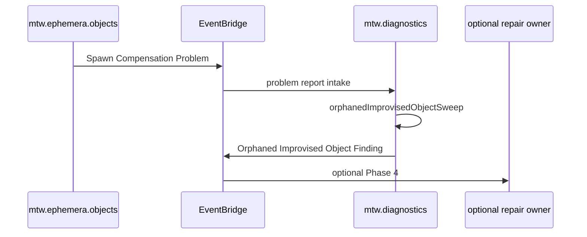

# Orphaned improvised object diagnostics (spawn S1 follow-up)

**Status:** Not started. **Next:** Phase 0 --- decide problem-report wire shape and sweep scope.

This document follows [`taskPlanning/AGENT.md`](../../../../AGENT.md) (durability ladder, open decisions, recommended-order checkboxes). **Dispose** after the initiative ships and lasting rules live in [`lambda/ephemera/dataSource/objects/`](../../../../../lambda/ephemera/dataSource/objects/) and [`lambda/diagnostics/`](../../../../../lambda/diagnostics/) `AGENT*.md` siblings.

**Follow-up to shipped spawn refactor:** two-step spawn+place is steady state ([`objects/AGENT.md`](../../../../../lambda/ephemera/dataSource/objects/AGENT.md), [`positions/AGENT.contract.md`](../../../../../lambda/ephemera/dataSource/positions/AGENT.contract.md) **S1**). [`spawnOneImprovisationObject`](../../../../../lambda/ephemera/dataSource/objects/spawnImprovisationObjectsBatch.ts) compensates with `persistDeleteImprovisationObject` on placement failure; when compensation also fails, it logs only today. This initiative replaces log-only with operational diagnostics.

---

## Purpose

Detect and surface **orphaned improvised objects**: existence rows present (improvisation pair + `Meta::Object`) with **no** positions-lane placement (empty `getMembershipContainers` / absent from all room `positionGraph` object nodes).

Primary operational trigger: **S1 double-failure** --- placement fails after successful existence create, then `persistDeleteImprovisationObject` compensation also fails ([`spawnOneImprovisationObject`](../../../../../lambda/ephemera/dataSource/objects/spawnImprovisationObjectsBatch.ts)). Today that path logs only:

```63:67:lambda/ephemera/dataSource/objects/spawnImprovisationObjectsBatch.ts
            console.error('[mtw.ephemera.objects] spawn placement failed; compensation delete failed', {
                objectId: args.objectId,
                placementError,
                deleteError: deleteResult.errorMessage,
            })
```

Deliver the same signal as a **problem report** on `mtw.ephemera.objects` that triggers a read-only diagnostics **sweep**, which emits **`Orphaned Improvised Object Finding`** on `mtw.diagnostics` for operators (and optional downstream repair).

**Non-goals for initial slice:**

- Automatic repair (delete orphan rows or placement retry) --- product decision; plan Phase 4 only.
- Inverse drift (graph placement without pair/meta rows) --- different finding; out of scope here.
- Changing **S1** / **S2** / **S3** spawn coordinator semantics (already shipped).

---

## Problem statement

After the spawn refactor, existence and placement are **two atomic steps**. **S1** rolls back existence when placement fails. When compensation delete fails, the system can leave durable rows with no graph membership --- invisible to Coyote occupancy, affordance compose, and in-room catalogs that key off **placement**, not existence alone ([`positions/AGENT.contract.md`](../../../../../lambda/ephemera/dataSource/positions/AGENT.contract.md) **S1** note).

Without diagnostics, orphans are discoverable only via CloudWatch grep on the compensation-failure log line. We need the same **problem report -> sweep -> finding** backstop used elsewhere (e.g. `mtw.connections` / `Session Disconnect Problem` -> `staleSessionSweep` -> `Stale SessionId Finding` per [`lambda/diagnostics/AGENT.md`](../../../../../lambda/diagnostics/AGENT.md)).

### Orphan classification (normative for this initiative)

| Signal | Orphan when |
| --- | --- |
| Existence | `(OBJECT#, ASSET#IMPROVISATION)` pair row **and** `(OBJECT#, Meta::Object)` row both present |
| Placement | `internalCache.Positions.getMembershipContainers(objectId)` returns **empty** (no adjacency / no graph-derived membership) |

**Explicit non-orphan:** object on graph with adjacency lag only --- handled by existing object placement drift repair ([`repairObjectPlacementDrift`](../../../../../lambda/ephemera/dataSource/positions/membership/repairObjectPlacementDrift.ts)), not this finding.

---

## Target steady state (after merge)

| Concern | Owner | Entry |
| --- | --- | --- |
| Problem report emission | Objects lane | `spawnOneImprovisationObject` S1 double-fail path (and any future compensation-failure hooks) |
| Problem report intake + sweep trigger | Diagnostics lambda | Subscribe to `mtw.ephemera.objects` problem report; run `orphanedImprovisedObjectSweep` |
| Read-only classification | Diagnostics lambda | Enumerate candidate `OBJECT#` ids; verify pair + meta + empty containers |
| Finding emission | Diagnostics lambda | `mtw.diagnostics` / `Orphaned Improvised Object Finding` |
| Optional repair | Objects or positions lane (TBD) | Consume finding --- delete rows or retry placement (**O1**) |

### Event flow (target)



---

## Getting Started

1. Skim [`taskPlanning/AGENT.md`](../../../../AGENT.md) for checkbox and verification conventions.
2. Read spawn **S1** steady state:
   - [`lambda/ephemera/dataSource/objects/AGENT.md`](../../../../../lambda/ephemera/dataSource/objects/AGENT.md) (**Spawn + place**, **S1**)
   - [`lambda/ephemera/dataSource/positions/AGENT.contract.md`](../../../../../lambda/ephemera/dataSource/positions/AGENT.contract.md) (object room membership **S1** compensating delete)
   - [`spawnImprovisationObjectsBatch.ts`](../../../../../lambda/ephemera/dataSource/objects/spawnImprovisationObjectsBatch.ts) and [`spawnImprovisationObjectsBatch.test.ts`](../../../../../lambda/ephemera/dataSource/objects/spawnImprovisationObjectsBatch.test.ts)
3. Read diagnostics house patterns (problem report vs finding):
   - [`lambda/diagnostics/AGENT.md`](../../../../../lambda/diagnostics/AGENT.md) (**Connections problem-report intake**, **Room Occupancy Drift sweep**)
   - [`packages/mtw-interfaces/ts/eventBridge/connections/index.ts`](../../../../../packages/mtw-interfaces/ts/eventBridge/connections/index.ts) (`Session Disconnect Problem` shape: `sourceOperation`, `attemptCount`, `dedupeKey`)
   - [`packages/mtw-interfaces/ts/eventBridge/diagnostics/index.ts`](../../../../../packages/mtw-interfaces/ts/eventBridge/diagnostics/index.ts) (finding types + `DiagnosticsEventSerializer`)
   - [`lambda/diagnostics/dataSource/index.ts`](../../../../../lambda/diagnostics/dataSource/index.ts) (intake dedupe + sweep dispatch)
4. Read placement read surface used by sweep:
   - [`packages/mtw-gateways/ts/ephemera/positions/`](../../../../../packages/mtw-gateways/ts/ephemera/positions/) (`getMembershipContainers`, adjacency query helpers)
   - [`packages/mtw-gateways/ts/ephemera/improvisation/`](../../../../../packages/mtw-gateways/ts/ephemera/improvisation/) (pair reads; `ASSET#IMPROVISATION`)
5. **Command authority:** [`lambda/ephemera/AGENT.testing.md`](../../../../../lambda/ephemera/AGENT.testing.md) and diagnostics Jest from `lambda/diagnostics/`.

**Baseline before edits:**

```bash
cd lambda/ephemera
npm run test -- --watchAll=false \
  dataSource/objects/spawnImprovisationObjectsBatch.test.ts \
  dataSource/objects/applyObjectsChange.test.ts

cd lambda/diagnostics
npm run test -- --watchAll=false \
  dataSource/index.test.ts \
  app.test.ts
```

---

## Open decisions (implementation --- plan only)

Plan-only: decisions we are making in order to implement the next slice(s). When a decision ships, record it in durable `AGENT.contract.md` / `AGENT.implementation.md` / `AGENT.md` and remove the row here.

| ID | Decision | Blocks slice | Status |
| --- | --- | --- | --- |
| **O1** | **Repair owner and behavior:** (a) no repair v1 --- finding only; (b) objects lane `persistDeleteImprovisationObject` on finding; (c) positions lane placement retry when `targetRoomId` known on problem report. | Phase 4 | Open |
| **O2** | **Sweep scope on problem report:** full-table scan vs targeted check of `objectId` from report payload only. Recommendation: **targeted first** (report carries `objectId`); optional full sweep via direct invoke for ops. | Phase 2 | Open |
| **O3** | **Problem report `detail-type` name:** e.g. `Spawn Compensation Problem` on `mtw.ephemera.objects` (mirror `Session Disconnect Problem` on `mtw.connections`). | Phase 1 | Open |
| **O4** | **EventBridge contract home:** extend [`packages/mtw-interfaces/ts/eventBridge/ephemera/`](../../../../../packages/mtw-interfaces/ts/eventBridge/ephemera/) with an `objects` submodule vs colocate problem report in new `eventBridge/ephemera/objects/index.ts`. | Phase 1 | Open |
| **O5** | **Finding payload:** `{ objectId }` only vs include `stableKey` / `diagnosticRunId` / optional `sourceOperation` echo. Recommendation: **`objectId` required**; `diagnosticRunId` for sweep correlation (house pattern). | Phase 2 | Open |

---

## Recommended order

Pending work uses `[ ]`; completed work uses `[X]`. Mark each nested line `[X]` as it is done.

- [ ] **Phase 0 --- Decide**
  - [ ] Lock **O1**--**O5** (at minimum **O2**, **O3**, **O4**, **O5** before implementation).
  - [ ] Confirm orphan litmus (pair + meta + empty containers) with one worked example in plan or test fixture.

- [ ] **Phase 1 --- Problem report (objects lane)**
  - [ ] Add EventBridge contract + serializer for **`Spawn Compensation Problem`** (or locked name) on **`mtw.ephemera.objects`**: `objectId`, `targetRoomId`, `sourceOperation`, `placementError`, `deleteError`, `attemptCount`, `dedupeKey`, `timestamp` (mirror connections problem-report fields where applicable).
  - [ ] Wire `ephemeraObjectsDataSource` (or shared stream helper) to **`streamEvent`** the problem report on S1 double-fail --- **in addition to** existing `console.error` (keep log until ops confirms EventBridge delivery).
  - [ ] Unit tests: compensation double-fail emits problem report with expected payload + dedupeKey stability.

- [ ] **Phase 2 --- Sweep + finding (diagnostics lambda)**
  - [ ] Implement [`orphanedImprovisedObjectSweep/`](../../../../../lambda/diagnostics/) (new module): classify orphans per litmus above; use gateway reads (`ImprovisationComponentData` / pair get, meta get, `queryMembershipContainersFromDynamo` or diagnostics-local equivalent).
  - [ ] Add **`Orphaned Improvised Object Finding`** to [`packages/mtw-interfaces/ts/eventBridge/diagnostics`](../../../../../packages/mtw-interfaces/ts/eventBridge/diagnostics/index.ts) + serializer round-trip tests.
  - [ ] Subscribe diagnostics DataSource to **`mtw.ephemera.objects`** problem report; invocation dedupe by `dedupeKey` (reuse [`intakeDeduper`](../../../../../lambda/diagnostics/dataSource/intakeDeduper.ts) pattern --- generalize or parallel handler).
  - [ ] Direct invoke entry: `{ type: 'OrphanedImprovisedObjectSweep', objectIds?: string[], diagnosticRunId?, nowMs? }` on **`api.diagnostics`** (full scan when `objectIds` omitted; targeted when provided from problem report).
  - [ ] Tests: problem report triggers sweep; malformed report dropped; dedupe; finding emission for confirmed orphan; no finding when placement exists.

- [ ] **Phase 3 --- Durable docs**
  - [ ] Update [`lambda/diagnostics/AGENT.md`](../../../../../lambda/diagnostics/AGENT.md): problem-report intake, sweep, finding contract.
  - [ ] Update [`lambda/ephemera/dataSource/objects/AGENT.md`](../../../../../lambda/ephemera/dataSource/objects/AGENT.md): S1 double-fail emits problem report (not log-only).
  - [ ] Update [`lambda/ephemera/dataSource/positions/AGENT.contract.md`](../../../../../lambda/ephemera/dataSource/positions/AGENT.contract.md): cross-reference orphan finding (existence-without-placement).
  - [X] Trim follow-up bullets from parent spawn refactor plan or link here once Phase 1--3 ship (parent plan disposed; follow-up tracked in this document).

- [ ] **Phase 4 --- Optional repair (product gate --- O1)**
  - [ ] If **O1** = delete: objects lane handler on finding -> `persistDeleteImprovisationObject` (idempotent).
  - [ ] If **O1** = retry placement: positions/objects coordinator with `targetRoomId` from problem report or finding enrichment.
  - [ ] If **O1** = none: document ops runbook (manual delete or sweep-only).

- [ ] **Phase 5 --- Close**
  - [ ] Run verification commands below.
  - [ ] Delete this planning file (git retains history).

---

## Wire shapes (draft --- lock in Phase 0)

### Problem report (`mtw.ephemera.objects`)

Proposed **`detail-type`:** `Spawn Compensation Problem`

```typescript
{
  type: 'Spawn Compensation Problem'
  objectId: EphemeraObjectId
  targetRoomId: EphemeraRoomId
  sourceOperation: 'spawnOneImprovisationObject' | string
  placementError: string
  deleteError: string
  attemptCount: number
  dedupeKey: string   // e.g. `${objectId}::spawnCompensation::${attemptCount}`
  timestamp: string
}
```

**Emission site:** replace-or-augment log block in [`spawnOneImprovisationObject`](../../../../../lambda/ephemera/dataSource/objects/spawnImprovisationObjectsBatch.ts) when `!placeResult.ok && !deleteResult.ok`.

**Dedupe:** diagnostics intake suppresses repeated reports with the same `dedupeKey` within one lambda invocation (same as [`Session Disconnect Problem`](../../../../../lambda/diagnostics/dataSource/intakeDeduper.ts)).

### Finding (`mtw.diagnostics`)

Proposed **`detail-type`:** `Orphaned Improvised Object Finding`

```typescript
{
  type: 'Orphaned Improvised Object Finding'
  objectId: EphemeraObjectId
  diagnosticRunId: string
  timestamp: string
}
```

Diagnostics remains **report-only** for v1 unless Phase 4 (**O1**) ships.

---

## Progress

| Milestone | Status |
| --- | --- |
| Task plan created | Done |
| **O1**--**O5** decided | Not started |
| Problem report contract + emission | Not started |
| Sweep + finding | Not started |
| Durable docs updated | Not started |
| Optional repair (**O1**) | Not started |

---

## Verification

After Phase 1--2:

```bash
cd lambda/ephemera
npm run test -- --watchAll=false dataSource/objects/

cd lambda/diagnostics
npm run test -- --watchAll=false \
  orphanedImprovisedObjectSweep/ \
  dataSource/index.test.ts \
  app.test.ts
```

**Problem report wired at S1 double-fail:**

```bash
rg -n "Spawn Compensation Problem|spawnCompensation" \
  lambda/ephemera/dataSource/objects/
```

**Finding type registered:**

```bash
rg -n "Orphaned Improvised Object Finding" \
  packages/mtw-interfaces/ts/eventBridge/diagnostics/ \
  lambda/diagnostics/
```

**Diagnostics intake subscribes to objects problem report:**

```bash
rg -n "Spawn Compensation Problem|mtw.ephemera.objects" \
  lambda/diagnostics/dataSource/
```

---

## Related documentation

| Doc | Role |
| --- | --- |
| [`taskPlanning/AGENT.md`](../../../../AGENT.md) | Task planning framework |
| [`lambda/diagnostics/AGENT.md`](../../../../../lambda/diagnostics/AGENT.md) | Diagnostics sweeps and problem-report intake |
| [`lambda/ephemera/dataSource/objects/AGENT.md`](../../../../../lambda/ephemera/dataSource/objects/AGENT.md) | Objects lane steady state |
| [`lambda/ephemera/dataSource/positions/AGENT.contract.md`](../../../../../lambda/ephemera/dataSource/positions/AGENT.contract.md) | Placement normative rules (**S1**) |
| [`packages/mtw-interfaces/ts/eventBridge/AGENT.md`](../../../../../packages/mtw-interfaces/ts/eventBridge/AGENT.md) | EventBridge contract authoring |
| [`lambda/ephemera/AGENT.testing.md`](../../../../../lambda/ephemera/AGENT.testing.md) | Jest commands |
