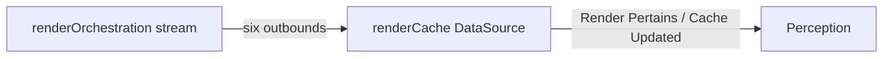

# `renderOrchestration` - pass-through readiness

**Status: ACTIVE TASK PLAN.** Next focus: execute **Recommended order** from the top (inventory and stream skeleton before deep refactors).

This document is the **task plan** for [`lambda/ephemera/dataSource/renderOrchestration/`](../../../../../lambda/ephemera/dataSource/renderOrchestration/): orchestration-side work for the pass-through pattern, separate from [`mtw.ephemera.renderCache`](../../../../../lambda/ephemera/renderCache/) so "who decides hit/miss/generate" stays separate from "who emits the subscribable readiness signal."

**Refinement rule:** Changes to orchestration responsibilities that affect shared semantics belong here **and** in the [canonical contract](../AGENT.passThrough.contract.planning.md).

**Framework:** This file follows [`taskPlanning/AGENT.md`](../../../../AGENT.md) (Getting Started, Progress, Recommended order, Verification). Requirement-level unknowns stay authoritative in the contract doc; this plan tracks **implementation** questions in [Open implementation questions](#open-implementation-questions).

---

## Getting Started

Follow the root [**"Getting Started" Pattern for Complex Tasks**](../../../../../AGENT.md#getting-started-pattern-for-complex-tasks): foundations, this doc, integration points, code, tests, how to pick work, baseline commands.

1. **Task planning foundations** --- Read [`taskPlanning/AGENT.md`](../../../../AGENT.md) once: what belongs in a task plan vs package docs, durability, **Recommended order** checkbox rules, and **Verification** expectations.

2. **Canonical contract** --- Skim [`../AGENT.passThrough.contract.planning.md`](../AGENT.passThrough.contract.planning.md) for payloads, six-outbound taxonomy, legacy terminal mapping, and [**Uncertainties**](../AGENT.passThrough.contract.planning.md#uncertainties-explicit-next-refinement-phase). **Why:** product rules and unresolved *requirement* questions live there; this task plan does not replace it.

3. **Sub-epic context** --- Read [`lambda/ephemera/AGENT.ephemeraPerceptionVertical.contractAlign.planning.md`](../../../../../lambda/ephemera/AGENT.ephemeraPerceptionVertical.contractAlign.planning.md) for phase B (orchestration), contract-as-tests guardrails, and dependency on [`renderCache`](../renderCache/AGENT.passThrough.planning.md) work.

4. **Package reference** --- [`lambda/ephemera/dataSource/renderOrchestration/AGENT.md`](../../../../../lambda/ephemera/dataSource/renderOrchestration/AGENT.md) describes current behavior (conversation `sendMessage`, ingress). [`AGENT.planning.md`](../../../../../lambda/ephemera/dataSource/renderOrchestration/AGENT.planning.md) holds v2 tasks (e.g. Task 7, fan-out **S**); merge only where the pass-through contract agrees.

5. **Core integration files** --- Trace the passive path: [`orchestrationHandler.ts`](../../../../../lambda/ephemera/dataSource/renderOrchestration/orchestrationHandler.ts) -> [`findRender.ts`](../../../../../lambda/ephemera/dataSource/renderOrchestration/findRender.ts) -> [`generateRoomPreview.ts`](../../../../../lambda/ephemera/dataSource/renderOrchestration/generateRoomPreview.ts); state-driven fan-out: [`fanOutStateChangedToPassiveRenders.ts`](../../../../../lambda/ephemera/dataSource/renderOrchestration/fanOutStateChangedToPassiveRenders.ts). Conversation materialization: [`roomStateRender/materialize.ts`](../../../../../lambda/ephemera/conversations/conversationTypes/roomStateRender/materialize.ts).

6. **Tests** --- Baseline and extend [`orchestrationHandler.test.ts`](../../../../../lambda/ephemera/dataSource/renderOrchestration/orchestrationHandler.test.ts), [`findRender.test.ts`](../../../../../lambda/ephemera/dataSource/renderOrchestration/findRender.test.ts), or add a dedicated contract test module. Prefer stream assertions over conversation mocks as slices land ([Encoding the contract in unit tests](../AGENT.passThrough.contract.planning.md#encoding-the-contract-in-unit-tests)).

7. **Run tests before changing behavior** --- From repo root, `lambda/ephemera` uses Jest (`npm test` in [`lambda/ephemera/package.json`](../../../../../lambda/ephemera/package.json)). Run the full lambda package test suite or scope to this DataSource's tests once you know the Jest project pattern for this tree. After each slice, update **Recommended order** checkboxes in this document and re-run **Verification**.

---

## Agreed product decisions

Resolved product items are recorded in the [contract doc](../AGENT.passThrough.contract.planning.md); this section is a **stable summary** for orchestration only.

- **Roles:** Orchestration owns **policy and branching** (pointer, exact match, current-cache, generation, errors, defer). The **subscribable "this cache row answers this question"** story is owned by **`renderCache`** (`Render Pertains` / `Cache Updated`), not duplicated here on the stream.
- **Handoff:** Orchestration emits only on the **`mtw.ephemera.renderOrchestration`** DataSource stream. **`renderCache`** **subscribes**; no orchestration **invoke** into `renderCache` and no **`api.ephemera`** handoff for this path.
- **No `Put Cache Record` from orchestration (pass-through generation):** Do not enqueue **`Put Cache Record`** via **`sendPutCacheRecord`**, **`publishPutCacheRecord`** / **`defaultPublishPutCacheRecord`**, or any future **`messageBus`** helper for orchestration-owned generation completion. **`renderCache`** subscribes to **`Render Generated`** and performs the single durable write. Other domains may still enqueue **`Put Cache Record`** for their own writes.
- **Replace conversation outcomes:** Remove **`conversation.sendMessage`** / **`materializeRoomStateRender`** as the carrier for orchestration outcomes; replace with the **six outbound** types on the DataSource stream (canonical table: [Orchestration outbounds](../AGENT.passThrough.contract.planning.md#orchestration-outbounds-draft-taxonomy---six-types)). Do not add new features that deepen the conversation dependency; progress signals follow the same rule.
- **Legacy bus:** Target architecture does **not** emit **`RenderReady`**, **`RenderInvalidate`**, or **`RenderError`** through the old **`roomStateRender`** / **`messageBus`** path for orchestration outcomes; cutover is **remove** legacy emission, not parallel bus + stream.
- **Passive state fan-out:** **S = A union P** with **`allowGeneration`** capped per contract ([set algebra](../AGENT.passThrough.contract.planning.md#state-driven-fan-out-set-and-allowgeneration-set-algebra)). Every perspective in **S** gets a **`findRender`** run; **`fanOutStateChangedToPassiveRenders`** must extend from **A**-only to **S** (see package Task 7 / contract uncertainty 10).
- **Hit paths on stream:** **`Current Cache Valid`** and **`Exact Match Found`** carry **IDs only** + routing; **`renderCache`** refetches before emitting **`Render Pertains`**.
- **Generation path:** **`Generation Started`** may repeat until **singleFlight** and idempotency are fully wired (overlap with contract uncertainty 6). **`Render Generated`** carries full generation output with **no** Dynamo durability promise; **`renderCache`** emits durable outbounds after write.
- **Not orchestration outbounds:** **`Render Pertains`** / **`Cache Updated`** remain **`renderCache`** outbounds.

---

## Single-flight generation (architectural commitment)

**Intent:** After deterministic fast-path checks (pointer, exact match, policy gates), **multiple concurrent callers** for the **same logical generation** (same component + perspective / stable routing identity) must **not** each run a separate LLM **or** race separate cache writes. Wrap the **generation step** in **`mtw-lambda-patterns`** **`singleFlight`** (**coalesce** mode): one **leader** runs **`computation()`**; **followers** wait and return **`retrieval()`** after **`COMPLETED`**, so downstream sees **one authoritative completion** for that flight barring total cohort failure.

**Why:** The **singleFlight** record (**category** + **`argumentHash`**) is the cohort key; callers need not coordinate via an in-flight **`renderCache`** row. **`retrieval`** reads whatever durable state the leader wrote (or an in-flight placeholder shape), per implementation.

**Library limits:** **`singleFlight`** does **not** guarantee **exactly-once** side effects inside **`computation`** (e.g. **`Generation Started`** at the top of work). Leader expiry and self-promotion can run **`computation()`** again --- **at least one** **`Generation Started`** is expected; **more than one** is an edge case until idempotency (conditional write / nonce) or pattern extensions. **Exactly one LLM call** per logical job is **not** guaranteed across timeout and recovery.

**Downstream:** Clients may treat multiple **Generating**-class signals as idempotent UI. **Perception** aggregates duplicate **intermediate** events (contract uncertainty 6). **Terminal** dedupe stays a **Perception** obligation.

**Code reference:** [`packages/mtw-lambda-patterns/ts/singleFlight`](../../../../../packages/mtw-lambda-patterns/ts/singleFlight).

Implementation hashing, Dynamo wiring, and **`computation`** vs **`retrieval`** split are tracked under [Open implementation questions](#open-implementation-questions) and **Recommended order** (singleFlight step).

---

## Contract alignment (requirement uncertainties)

**Authoritative list:** [`../AGENT.passThrough.contract.planning.md`](../AGENT.passThrough.contract.planning.md#uncertainties-explicit-next-refinement-phase).

Unresolved **product** questions (payloads, **`Where types live`**, remaining contract gaps) stay in that document. This task plan links to it and does **not** collapse those uncertainties here.

---

## Open implementation questions

These are **how** we implement agreed rules, not whether the product rules apply. Link to contract uncertainty ids when useful (e.g. UC6: duplicate intermediates acceptable). Normative **payload fields** belong in the contract doc, not duplicated as decisions here.

| Id | Question |
| --- | --- |
| **OI-1** | **`argumentHash`** and **`category`** for ephemera **`singleFlightFactory`**: stable routing identity for the generation cohort key. |
| **OI-2** | **`computation`** vs **`retrieval`**: where LLM runs, where **`renderCache`** writes belong, and ordering of **`Generation Started`** / **`Render Generated`** vs leader expiry and duplicate emissions (ties UC6). |
| **OI-3** | Wiring to existing **`getItem`** / optimistic patterns; Dynamo interaction details for **singleFlight** records. |
| **OI-4** | **Cutover order:** sequence of changes across [`findRender`](../../../../../lambda/ephemera/dataSource/renderOrchestration/findRender.ts), [`materialize`](../../../../../lambda/ephemera/conversations/conversationTypes/roomStateRender/materialize.ts), [`generateRoomPreview`](../../../../../lambda/ephemera/dataSource/renderOrchestration/generateRoomPreview.ts), and new stream emissions (minimize broken intermediate state if not on a long-lived branch). |
| **OI-5** | **`streamEvent`** (or agreed) API: module placement, envelopes, interim ephemera-local types vs **`mtw-interfaces`** (contract uncertainty 8 / **Where types live**). |
| **OI-6** | **Tests:** which suite owns stream assertions first; fixture shape; when to switch from conversation mocks to stream assertions. |
| **OI-7** | **Integration test** timing: thin cross-layer test with **`renderCache`** --- sequencing with [`renderCache` pass-through plan](../renderCache/AGENT.passThrough.planning.md) subscription work. |
| **OI-8** | Fan-out set **S**: wiring **`RenderRequested`** shape for perspectives in **P** but not **A**, and **`allowGeneration`** behavior (contract uncertainty 10, Task 7 in [`AGENT.planning.md`](../../../../../lambda/ephemera/dataSource/renderOrchestration/AGENT.planning.md)). |

---

## Scope and non-goals

- **In scope:** Six orchestration outbounds on the DataSource stream; removal of **`Put Cache Record`** enqueue from orchestration on pass-through generation success; passive fan-out **S** + **`allowGeneration`**; **singleFlight** around generation; migration off conversation **`sendMessage`** for orchestration outcomes; contract-oriented unit tests and eventual thin integration test.
- **Out of scope here:** Normative TypeScript payload types (contract + agreed module). Final perception fan-in ([`perception` plan](../perception/AGENT.perceptionRefactor.planning.md)). **`currentCachePointers`** behavior ([stub plan](../currentCachePointers/AGENT.cachePointersRefactor.planning.md)).

---

## Links

| Doc | Role |
| --- | --- |
| [`taskPlanning/AGENT.md`](../../../../AGENT.md) | Task planning framework |
| [`../AGENT.passThrough.contract.planning.md`](../AGENT.passThrough.contract.planning.md) | **Canonical cross-cutting contract** (draft) |
| [`../renderCache/AGENT.passThrough.planning.md`](../renderCache/AGENT.passThrough.planning.md) | `renderCache` pass-through (**graduated** task plan) |
| [`lambda/ephemera/dataSource/renderOrchestration/AGENT.md`](../../../../../lambda/ephemera/dataSource/renderOrchestration/AGENT.md) | Package behavior reference |
| [`lambda/ephemera/dataSource/renderOrchestration/AGENT.planning.md`](../../../../../lambda/ephemera/dataSource/renderOrchestration/AGENT.planning.md) | Local v2 planning (related; do not merge blindly) |
| [`lambda/ephemera/AGENT.ephemeraPerceptionVertical.planning.completionRubric.md`](../../../../../lambda/ephemera/AGENT.ephemeraPerceptionVertical.planning.completionRubric.md) | Rubric **section 4** |
| [`lambda/ephemera/AGENT.ephemeraPerceptionVertical.contractAlign.planning.md`](../../../../../lambda/ephemera/AGENT.ephemeraPerceptionVertical.contractAlign.planning.md) | Sub-epic: phase order + contract encoding in tests |
| [`../currentCachePointers/AGENT.cachePointersRefactor.planning.md`](../currentCachePointers/AGENT.cachePointersRefactor.planning.md) | **`mtw.ephemera.currentCachePointers`** (stub) |
| [`packages/mtw-lambda-patterns/ts/singleFlight`](../../../../../packages/mtw-lambda-patterns/ts/singleFlight) | **`singleFlight`** implementation |

---

## Progress

| Milestone | Status |
| --- | --- |
| Task plan graduated (structure per `taskPlanning/AGENT.md`) | Done |
| Inventory: legacy conversation / **`publishPutCacheRecord`** / **`materialize`** paths mapped to six outbounds | Not started |
| Stream emissions: skeleton for six outbound types + tests (skip/todo per contract encoding) | Not started |
| Remove **`Put Cache Record`** enqueue from orchestration on generation success (`generateRoomPreview` / helpers) | Not started |
| Passive fan-out: **S** + **`allowGeneration`** in **`fanOutStateChangedToPassiveRenders`** | Not started |
| **singleFlight** around generation (**OI-1**--**OI-3**) | Not started |
| Retire conversation **`sendMessage`** for orchestration outcomes; verification clean | Not started |
| Contract tests active for pass-through slice; skip inventory current | Not started |
| Thin integration test with **`renderCache`** (when both sides ready) | Not started |

---

## Recommended order

Pending work uses `[ ]`; completed work uses `[X]`. Apply checkboxes to each actionable line; for nested bullets, mark each line `[X]` as done so partial progress is visible.

- [ ] **Inventory** --- Map every orchestration outcome path that uses **`conversation.sendMessage`**, **`materializeRoomStateRender`**, **`publishPutCacheRecord`**, or related **`messageBus`** terminals to a target six-outbound (see contract **Legacy bus terminals** and **Exit `conversation.sendMessage`**). Document gaps in **OI-4**.
- [ ] **Stream skeleton** --- Implement **`streamEvent`** (or agreed) emissions for **`Current Cache Valid`**, **`Exact Match Found`**, **`Generation Started`**, **`Render Generated`**, **`Orchestration Error`**, **`Generation Deferred`** per contract mapping; add or extend tests with **`it.skip` / `describe.skip`** and reasons where behavior is incomplete ([Encoding the contract in unit tests](../AGENT.passThrough.contract.planning.md#encoding-the-contract-in-unit-tests)).
- [ ] **Stop duplicate durability** --- Remove **`publishPutCacheRecord`** / **`sendPutCacheRecord`** from orchestration-owned generation success; coordinate timing with **`renderCache`** subscription work ([`renderCache` plan](../renderCache/AGENT.passThrough.planning.md)) per **OI-7**.
- [ ] **Passive fan-out (set S)** --- Extend **`fanOutStateChangedToPassiveRenders`** from **A** to **S** with **`allowGeneration`** policy (**OI-8**, Task 7 in [`AGENT.planning.md`](../../../../../lambda/ephemera/dataSource/renderOrchestration/AGENT.planning.md)).
- [ ] **singleFlight generation** --- Wire **`singleFlight`** (coalesce) around the generation step; resolve **OI-1**, **OI-2**, **OI-3** in code; un-skip related tests when stable.
- [ ] **Conversation removal** --- Remove **`getRoomStateRenderHandle`** / **`sendMessage`** / legacy **`RenderReady`**-class bus paths for orchestration outcomes per contract; assert stream outputs in tests (**OI-6**).
- [ ] **Integration** --- Add thin cross-layer test with **`renderCache`** when both producer and consumer slices exist (**OI-7**).
- [ ] **Close the loop** --- Update **Progress**, **Verification** skip inventory, and this **Recommended order** when each slice ships.

---

## Verification

**Unit / package tests**

- From [`lambda/ephemera/`](../../../../../lambda/ephemera/), run `npm test` (Jest). Scope to this package's tests if your Jest config supports path patterns (e.g. `renderOrchestration`).

**Contract test expectations**

- Rules: [Encoding the contract in unit tests](../AGENT.passThrough.contract.planning.md#encoding-the-contract-in-unit-tests).
- Primary files: [`orchestrationHandler.test.ts`](../../../../../lambda/ephemera/dataSource/renderOrchestration/orchestrationHandler.test.ts), [`findRender.test.ts`](../../../../../lambda/ephemera/dataSource/renderOrchestration/findRender.test.ts).

**Grep / hygiene (adjust as code moves)**

- Orchestration must not enqueue pass-through **`Put Cache Record`** after cutover: search for **`publishPutCacheRecord`**, **`sendPutCacheRecord`**, **`defaultPublishPutCacheRecord`** under `dataSource/renderOrchestration/` and ensure generation-success paths are clean.
- Track migration of **`sendMessage`** / **`materializeRoomStateRender`** for orchestration outcomes.

**Skip inventory**

Maintain a short list here or in the test file header as **`it.skip` / `describe.skip`** appear (reason should reference contract phase or uncertainty id). *None in this package yet; update when contract tests add skips.*

| Location | Skip reason (summary) |
| --- | --- |
| --- | *Add rows as skips land* |

---

## Contract tests (progressive activation)

Canonical rules: [`../AGENT.passThrough.contract.planning.md`](../AGENT.passThrough.contract.planning.md#encoding-the-contract-in-unit-tests). This package adds unit tests for the six outbound types, **`findRender`** / intake branches, and non-duplication of the final correlated readiness signal (owned by **`renderCache`**). Over time, assert **stream** outputs instead of conversation **`sendMessage`** mocks. Integration tests follow when **`renderCache`** consumes orchestration signals.
