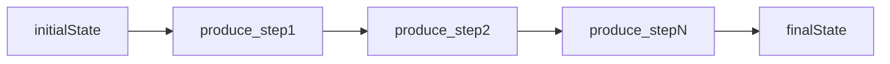

# Ephemera LLM pipeline framework (linear reducers)

**Status:** Phase 1 complete (design and types shipped). Next step: Phase 2 (core runner and helpers).

## Purpose

Introduce a **small, explicit framework** for **linear pipelines** of **async reducer steps** that share a single evolving **pipeline state** object. **`PipelineState`** is a use-case-specific type (generic parameter `S`), intentionally shaped like `Partial<{ inputA, outputA, inputB, outputB, ... }>` so that:

- **Pipeline input** is written once (for example priming `inputA`).
- **LLM steps** read named inputs from **`PipelineState`**, build prompts (invariant prefix + dynamic tail, including existing Bedrock cache-point patterns), invoke the model, then **validate and extract** named outputs back into the same **`PipelineState`**. **Per-call metadata** (token usage, latency, model id, error details, etc.) should be storable in optional **`metaA`**, **`metaB`**, ... slots on the same **`PipelineState`** so later steps and orchestration can use it without ad hoc side channels.
- **Orchestration / enrich steps** are ordinary async functions that may read **any prior** `input*` / `output*` fields and **derive the next step's inputs** (for example `outputA` + `inputA` -> `inputB`).
- Pipelines **interleave** LLM and orchestration steps in a fixed order; this is **not** a graph or DAG runtime.

The goal is to **deduplicate glue** (invoke, extract, validate, metrics, failure policy) across Coyote and other multi-call LLM flows **without** building a generic workflow engine. **Implementation** belongs under [`lambda/ephemera/llm/pipeline/`](../../../../lambda/ephemera/llm/pipeline/) (new directory), alongside existing transport/parsers in [`lambda/ephemera/llm/`](../../../../lambda/ephemera/llm/). Steady-state documentation: index from [`lambda/ephemera/llm/AGENT.md`](../../../../lambda/ephemera/llm/AGENT.md) and, as needed, a small [`lambda/ephemera/llm/pipeline/AGENT.md`](../../../../lambda/ephemera/llm/pipeline/AGENT.md) for pipeline-specific navigation. This task plan is **task-scoped** and should be retired when the initiative completes (see [`taskPlanning/AGENT.md`](../../../AGENT.md)).

## Scope

### In scope

- A **typed sequential runner** (for example `runPipeline(initial, steps)` or a fluent builder) where each step declares:
  - a **name** (for logging, tests, and spans),
  - which **slot keys** on **`PipelineState`** it reads (documented in types),
  - an async **body** that returns a **partial `PipelineState` patch** or uses an explicit **mutator** pattern (design choice in Phase 1),
  - for LLM steps: integration with existing **Bedrock** helpers and **parse** utilities under [`lambda/ephemera/llm/`](../../../../lambda/ephemera/llm/); the **framework code** itself lives under [`lambda/ephemera/llm/pipeline/`](../../../../lambda/ephemera/llm/pipeline/).
- **Discriminated or generic-friendly** step kinds at minimum:
  - **Orchestration step:** pure/async TS; no model call.
  - **LLM step:** prompt parts, invocation options, **extract + validate** pipeline into typed `outputX`.
- **Failure semantics** aligned with existing ephemera patterns: structured failure objects, optional **stub** paths, and **no partial player-visible output** where product rules require all-or-nothing (callers choose policy per pipeline).
- **Unit tests** for the runner (ordering, merge rules, error propagation) and **one migrated or greenfield** consumer slice to prove fit.

### Out of scope (explicit non-goals)

- **DAGs**, parallel fan-out, dynamic branching, or visual workflow definitions.
- Replacing feature-specific **domain validation** (Coyote seam combine, Acme merge rules, etc.); those stay next to the domain.
- **Cross-Lambda** orchestration (Step Functions, SQS); this is **in-process** within ephemera handlers unless a later task says otherwise.

## Material decisions

- **PipelineState updates (decided):** Use **Immer** `produce` so each step updates **`PipelineState`** via an immutable **draft** pattern, consistent with similar usage elsewhere in the codebase. Prefer **shallow top-level slot keys** on **`PipelineState`** in v1 so drafts stay simple; nested structures only when a slot truly needs them.
- **Typing strategy (decided):** The framework is **generic over `S extends Record<string, unknown>`** (pipeline state). Each use case defines its own **`S`** (slot shape for that pipeline only; for example a Coyote-specific `CoyoteHypothesisPipelineState`). **No nominal branding** (`unique symbol`, `__pipelineBrand`, etc.): distinct pipelines are distinguished by **different slot maps and value types**, not by extra phantom fields. A **generic factory** constructs the pipeline object for a given **`S`**, producing **class-constrained execution objects** (runner, steps, and helpers) so all reads and writes are tied to that **`S`**; no single shared concrete state type for every feature.
- **LLM step boundary (decided):** **Thin wrapper** around existing **`invokeBedrock*`** plus **feature-owned** prompt builders (message assembly, **cache points**, and domain-specific options stay in the feature). The framework still wires **invoke -> typed result -> extract/validate -> write `output*`**, and should support writing **call metadata** into **`metaA`**, **`metaB`**, ... (or similarly named slots on **`S`**) so downstream steps, telemetry, and harnesses can read usage and diagnostics in one place.
- **Telemetry (decided):** Minimum **structured log or span per step name** for operator visibility. **Per-call token usage and related invoke fields** live in **`meta*`** on **`PipelineState`** (see LLM step boundary above), not in a parallel untyped bag.
- **First adopter (decided):** **Coyote hypothesis** --- the **clustering => plan-phase** stretch of [`generateHypothesis`](../../../../lambda/ephemera/dataSource/coyoteGame/generateHypothesis.ts) (stage-one seam / combine through stage-two plan output). That is the first vertical slice because **plan-phase is slated to split into more LLM steps**; the framework should land there before wider rollout.
- **Code location (decided):** New package-style folder [`lambda/ephemera/llm/pipeline/`](../../../../lambda/ephemera/llm/pipeline/) for the runner, step types, and tests; keep **`lambda/ephemera/llm/`** for shared Bedrock/parsing primitives used by both **`pipeline/`** and feature code.

## Phase 1 design note

Phase 1 ships **TypeScript contracts only** under [`lambda/ephemera/llm/pipeline/`](../../../../lambda/ephemera/llm/pipeline/): no runnable `runPipeline`, no DAG. **Runtime runner, unit tests, and LLM helpers** are Phase 2. **Coyote hypothesis migration** is Phase 3.

**Execution model:** Sequential fold over ordered steps. Each step mutates an Immer **`Draft<S>`** (primary contract); Phase 2 applies **`produce`** once per step so each step sees the immutable state produced by prior steps.

**Public types (index):** [`index.ts`](../../../../lambda/ephemera/llm/pipeline/index.ts) re-exports the following:

| Type / value | Role |
| --- | --- |
| [`AnyPipelineState`](../../../../lambda/ephemera/llm/pipeline/pipelineSteps.ts) | Constraint `Record<string, unknown>`; each pipeline supplies a concrete `S` (no nominal branding). |
| [`PipelineStep`](../../../../lambda/ephemera/llm/pipeline/pipelineSteps.ts), [`OrchestrationStepDefinition`](../../../../lambda/ephemera/llm/pipeline/pipelineSteps.ts), [`LlmAdapterStepDefinition`](../../../../lambda/ephemera/llm/pipeline/pipelineSteps.ts), [`PipelineStepDraftFn`](../../../../lambda/ephemera/llm/pipeline/pipelineSteps.ts) | Discriminated step kinds; **`name`** for logs/spans; **`meta*`** usage documented on LLM kind. |
| [`RunPipelineFn`](../../../../lambda/ephemera/llm/pipeline/pipelineRunner.ts), [`PipelineRunResult`](../../../../lambda/ephemera/llm/pipeline/pipelineRunner.ts), [`PipelineRunOptions`](../../../../lambda/ephemera/llm/pipeline/pipelineRunner.ts), [`PipelineTelemetryHooks`](../../../../lambda/ephemera/llm/pipeline/pipelineRunner.ts) | Runner signature and discriminated success/failure; optional telemetry hooks (usage stays on state **`meta*`**). |
| [`PipelineContext`](../../../../lambda/ephemera/llm/pipeline/pipelineContext.ts), [`CreatePipelineContextFn`](../../../../lambda/ephemera/llm/pipeline/pipelineContext.ts) | Factory return shape fixing **`S`** (implementation in Phase 2). |

**Typing note:** We intentionally avoid **defensive nominal branding** of pipeline state. The framework stays generic over **`S`**; features differentiate pipelines with **distinct slot types and names**, matching how ephemera models most domain data.

Steady-state API documentation remains for Phase 4 [`lambda/ephemera/llm/pipeline/AGENT.md`](../../../../lambda/ephemera/llm/pipeline/AGENT.md).

## Getting started

Follow the ordered **categories** below (see [Getting Started pattern for complex tasks](../../../../AGENT.md#getting-started-pattern-for-complex-tasks) in root [`AGENT.md`](../../../../AGENT.md)). A category can be light if it does not apply yet; keep **Why** / **Focus** so the next reader knows what to skim vs study.

1. **Understand project foundations**
   - **Why**: Task plans sit under [`taskPlanning/`](../../../); this initiative touches shared LLM utilities and downstream feature code.
   - **Read**: [`taskPlanning/AGENT.md`](../../../AGENT.md) (durable vs task-only content, **Recommended order** checkbox rules). Root [`AGENT.md`](../../../../AGENT.md) for documentation hierarchy.

2. **Read this document**
   - **Why**: Phases and decisions may change; the durable checklist is **Recommended order** and **Verification**.
   - **Focus**: **Purpose**, **Scope**, **Material decisions**, then **Recommended order** for the current milestone.

3. **Understand core integration points**
   - **Why**: The framework must compose with existing transport and parsers without owning domain types.
   - **Focus**: [`lambda/ephemera/llm/AGENT.md`](../../../../lambda/ephemera/llm/AGENT.md) (invoke, fenced JSON/Markdown patterns). **Pipeline framework** will ship under [`lambda/ephemera/llm/pipeline/`](../../../../lambda/ephemera/llm/pipeline/). Feature pipelines today: for example [`lambda/ephemera/dataSource/coyoteGame/generateHypothesis.ts`](../../../../lambda/ephemera/dataSource/coyoteGame/generateHypothesis.ts) (sequential Bedrock + parse + combine), [`lambda/ephemera/dataSource/actions/parseCommand.ts`](../../../../lambda/ephemera/dataSource/actions/parseCommand.ts) (multi-step parse/enrich).

4. **Review implemented code**
   - **Why**: Reuse patterns for timeouts, success/failure results, and extractors instead of inventing parallel abstractions.
   - **Primary files**: [`invokeBedrockConverseText.ts`](../../../../lambda/ephemera/llm/invokeBedrockConverseText.ts), [`splitMarkdownReasoningAndJson.ts`](../../../../lambda/ephemera/llm/splitMarkdownReasoningAndJson.ts), [`extractJsonObjectText.ts`](../../../../lambda/ephemera/llm/extractJsonObjectText.ts); Coyote [`invokeBedrockHypothesis.ts`](../../../../lambda/ephemera/dataSource/coyoteGame/invokeBedrockHypothesis.ts) and [`dataSource/coyoteGame/AGENT.md`](../../../../lambda/ephemera/dataSource/coyoteGame/AGENT.md) for multi-stage context.

5. **Check testing patterns**
   - **Why**: Ephemera uses **Jest** from [`lambda/ephemera`](../../../../lambda/ephemera); new tests live next to sources or in colocated `*.test.ts` files per existing convention.
   - **Files**: Mirror style from [`invokeBedrockConverseText.test.ts`](../../../../lambda/ephemera/llm/invokeBedrockConverseText.test.ts), [`splitMarkdownReasoningAndJson.test.ts`](../../../../lambda/ephemera/llm/splitMarkdownReasoningAndJson.test.ts); add [`lambda/ephemera/llm/pipeline/*.test.ts`](../../../../lambda/ephemera/llm/pipeline/) for the framework, plus feature pipeline tests under `dataSource/`.

6. **Identify next task**
   - **Why**: Progress lives in **Recommended order**; readers often open only this plan.
   - **Focus**: First unchecked phase and nested items (see [`taskPlanning/AGENT.md` Recommended order checkboxes](../../../AGENT.md#recommended-order-checkboxes)). After shipping a slice, mark checkboxes and refresh **Verification**.

7. **Run tests before starting**
   - **Why**: Confirms baseline before edits.
   - **Commands**: See **Verification** in this document (Jest from `lambda/ephemera`, plus `npm run build` as appropriate).

## Recommended order

Use `[ ]` for pending and `[X]` for complete. Mark nested lines as you finish each sub-step.

- [X] Phase 1 - design and types
  - [X] Document the **`PipelineState` model** (`Partial` of named input/output slots), **per-use-case `S`**, and the **generic factory** that fixes **`S`** and returns typed execution objects (TypeScript types only; no runtime DAG).
  - [X] Specify the **runner API** (sequential `reduce`, error handling, and **Immer `produce`** application per step) and **step kinds** (orchestration vs LLM adapter).
  - [X] Align with **Material decisions** (structured spans; **`meta*`** for usage; **`PipelineState`** updates via Immer and generic **`S`** as above).
  - [X] Write a short **design note** in this plan or a linked temp doc if needed; avoid duplicating full API docs here.

- [ ] Phase 2 - implement core runner and helpers
  - [ ] Add implementation under [`lambda/ephemera/llm/pipeline/`](../../../../lambda/ephemera/llm/pipeline/), keeping **feature-agnostic** boundaries: orchestration lives here; domain prompts and Coyote types stay in `dataSource/`. Cross-link from [`lambda/ephemera/llm/AGENT.md`](../../../../lambda/ephemera/llm/AGENT.md).
  - [ ] Provide **unit tests** for step order (each `produce` sees the prior **`PipelineState`**), failure propagation, and step naming.
  - [ ] Optional: minimal **LLM step helper** that accepts prompt assembly + invoke options + extract/validate callbacks, and persists **invoke metadata** into **`PipelineState` `meta*`** slots without pulling in Coyote or actions types.

- [ ] Phase 3 - first vertical slice integration (Coyote clustering => plan-phase)
  - [ ] Migrate the **Coyote hypothesis** **clustering => plan-phase** pipeline ([`generateHypothesis`](../../../../lambda/ephemera/dataSource/coyoteGame/generateHypothesis.ts) and its helpers) to use the runner end-to-end, or add a thin pilot caller that exercises the same stages.
  - [ ] Preserve existing **external behavior** (outputs, stubs, caching contracts) unless the task explicitly changes product behavior.
  - [ ] Add integration-focused tests (mocked Bedrock where existing tests do).

- [ ] Phase 4 - documentation and cleanup
  - [ ] Add or update **[`lambda/ephemera/llm/pipeline/AGENT.md`](../../../../lambda/ephemera/llm/pipeline/AGENT.md)** for pipeline-specific navigation (runner, `PipelineState`, step kinds). Point **[`lambda/ephemera/llm/AGENT.md`](../../../../lambda/ephemera/llm/AGENT.md)** at `pipeline/` for the linear-reducer framework; keep `llm/AGENT.md` as the parent scope doc (transport, parsers, and now **Pipeline**).
  - [ ] Update any affected feature `AGENT.md` files with a single pointer to the shared pattern.
  - [ ] Delete or archive this task plan when the initiative is complete per [`taskPlanning/AGENT.md`](../../../AGENT.md).

## Verification

- `cd` to [`lambda/ephemera`](../../../../lambda/ephemera) and run `npm run build`.
- Run Jest for new and affected tests, for example:
  - `npm run test -- --runInBand llm/pipeline/` (and `llm/` for sibling modules as needed)
  - plus targeted tests for any migrated feature pipeline.
- Confirm **ReadLints** clean on edited TypeScript files in the workspace.
- After each phase, update **Recommended order** checkboxes in this document to match shipped work.

## Progress

| Milestone | Status |
| --- | --- |
| Phase 1 design agreed (generic `S` / `PipelineState`, factory, runner API, Immer `produce` contract) | Done |
| Core runner + unit tests in `lambda/ephemera/llm/pipeline/` | Not started |
| Coyote clustering => plan-phase pipeline on the runner | Not started |
| Durable docs: `llm/AGENT.md` + `llm/pipeline/AGENT.md` | Not started |
| This task plan retired | Not started |
