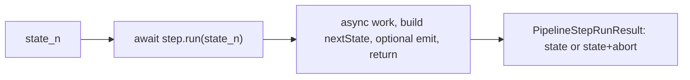

# Ephemera LLM pipeline: return-state runner refactor (planning)

**Status:** **Phase 3 complete.** Next step: **Phase 4** (closeout: full **`AGENT.md`**, delete this plan).

Task-planning conventions: [`taskPlanning/AGENT.md`](../../../../AGENT.md).

## Purpose

Refactor [`lambda/ephemera/llm/pipeline/`](../../../../../lambda/ephemera/llm/pipeline/) so pipeline steps receive **read-only committed state** and **return the next full `S`** (or an **abort discriminant** carrying that **`S`**), instead of mutating an Immer **`Draft<S>`** and throwing after side-effecting the draft. The **runner does not use Immer** --- it folds **`PipelineStepRunResult<S>`** from each step. Individual steps **may** use Immer **`produce`** internally (sync, after async work) to build the next state immutably; that is a step implementation detail, not framework infrastructure.

This addresses a production failure in Coyote hypothesis thinking persistence and removes a class of brittleness introduced when ISS7532 adopted draft-mutator steps plus ISS7883 moved thinking writes to async message-bus drain.

This file is task-scoped. Delete or archive when the refactor ships and steady-state behavior is recorded in [`lambda/ephemera/llm/pipeline/AGENT.md`](../../../../../lambda/ephemera/llm/pipeline/AGENT.md).

## Problem statement

### Production symptom (2026-06-18)

During Coyote hypothesis generation, CloudWatch logged:

```text
TypeError: Cannot perform 'IsArray' on a proxy that has been revoked
    at marshall (... @aws-sdk/util-dynamodb ...)
    at .../packages/mtw-utilities/ts/dynamoDB/mixins/primitives.ts
```

Timeline: **`hypothesisPlanSelectionLlm`** step **start** (index 3), ~230ms before the error. The failing write is almost certainly persistence of the **`candidates`** segment **`Thinking Result`** emitted at the end of **`seamCombineRender`** (index 2), not plan-select itself.

Root cause chain:

1. [`seamCombineRender`](../../../../../lambda/ephemera/dataSource/coyoteGame/generators/pipelines/hypothesis/coyoteHypothesisPipeline.ts) builds thinking **`verbose`** from values read off the step's Immer draft (`roomObjectsByRoom`, prompt parts, etc.).
2. [`emitHypothesisThinkingResult`](../../../../../lambda/ephemera/dataSource/coyoteGame/generators/pipelines/hypothesis/hypothesisThinkingPersistence.ts) **`publish`es** that object by reference on the internal bus.
3. The step completes; the runner calls **`finishDraft`**, revoking draft proxies.
4. [`mtw.ephemera.thinking.results`](../../../../../lambda/ephemera/dataSource/thinking/results/index.ts) handles the event asynchronously and **`marshall`es** **`verbose`** --- after revocation.

ISS7883 removed producer-side **`messageBus.flush()`** after emit; persistence now drains at lambda boundary via **`flushAndSettle`**. That is correct for bus architecture but exposes draft references that were previously marshalled while the draft was still alive.

### Architectural critique (not limited to this bug)

The current runner (ISS7532) treats each step as an **async mutator** over one accumulating state bag **`S`**:

- Steps implement **`run(draft: Draft<S>) => Promise<void>`** ([`pipelineSteps.ts`](../../../../../lambda/ephemera/llm/pipeline/pipelineSteps.ts)).
- The runner uses **`createDraft` / `finishDraft`** per step ([`pipelineRunner.ts`](../../../../../lambda/ephemera/llm/pipeline/pipelineRunner.ts)) --- **not** one draft for the whole pipeline (each step forks from committed state), but steps still **see and mutate a proxy graph** during async work.
- Side effects (thinking-result emit) run **inside** the step while state is still draft-backed.
- The original ISS7532 plan said **`produce` per step**; implementation diverged to **`createDraft`/`finishDraft`** for async safety without updating the mental model in all docs.

A read-only-state / returned-update model aligns better with:

- Async Bedrock invokes and bus persistence (plain data at boundaries).
- Sequential scripts the pre-ISS7532 Coyote code already used (locals flowing down a function).
- Minimal surprise: features do not hold Immer proxies.

## Scope and boundaries

### In scope

- New step contract and runner implementation under [`lambda/ephemera/llm/pipeline/`](../../../../../lambda/ephemera/llm/pipeline/).
- Migrate sole production consumer: [`coyoteHypothesisPipeline.ts`](../../../../../lambda/ephemera/dataSource/coyoteGame/generators/pipelines/hypothesis/coyoteHypothesisPipeline.ts) (7 steps).
- Update [`defineLlmInvokeStep`](../../../../../lambda/ephemera/llm/pipeline/llmInvokeStep.ts) to the new contract.
- Unit tests: [`runPipeline.test.ts`](../../../../../lambda/ephemera/llm/pipeline/runPipeline.test.ts).
- Consumer tests: [`coyoteHypothesisPipeline.test.ts`](../../../../../lambda/ephemera/dataSource/coyoteGame/generators/pipelines/hypothesis/coyoteHypothesisPipeline.test.ts) as needed.
- Coyote thinking-result **success** emits stay **in the completing step** (**D4**): after **`nextState`** is built as plain **`S`**, before **`return { state: nextState }`**; verbose builders read **`nextState`** only (fixes revoked-proxy class without a permanent **`structuredClone`** band-aid).
- Update steady-state doc: [`lambda/ephemera/llm/pipeline/AGENT.md`](../../../../../lambda/ephemera/llm/pipeline/AGENT.md).

### Out of scope

- Migrating other ephemera flows (e.g. Acme enrich in [`parseCommand`](../../../../../lambda/ephemera/dataSource/actions/parseCommand.ts)) --- noted as future adopters only.
- Changing thinking bus / Dynamo contracts ([`lambda/ephemera/dataSource/thinking/AGENT.md`](../../../../../lambda/ephemera/dataSource/thinking/AGENT.md)).
- Coyote prompt / parser / trope contract tuning ([`taskPlanning/lambda/ephemera/dataSource/coyoteGame/AGENT.tuneLLMPipeline.planning.md`](../../dataSource/coyoteGame/AGENT.tuneLLMPipeline.planning.md)).
- Workflow engine features (DAG, dynamic branching) --- still non-goals per pipeline AGENT.

### Phase 0 hotfix (skipped --- **D5**)

Phase 0 would snapshot **`verbose`** at emit (`structuredClone` / etc.) in [`hypothesisThinkingPersistence.ts`](../../../../../lambda/ephemera/dataSource/coyoteGame/generators/pipelines/hypothesis/hypothesisThinkingPersistence.ts) to restore thinking **`Meta::Result`** writes before the full refactor lands. **Skipped:** that band-aid only buys time when production must work during a long gap; it does not help Phase 1--2 implementation. **D5:** rely on Phase 2 (**D4** plain **`nextState`** emit) only; accept broken thinking persistence until then if hypothesis runs in prod meanwhile.

## Blast radius

| Area | Notes |
| --- | --- |
| Framework | ~6 files under [`llm/pipeline/`](../../../../../lambda/ephemera/llm/pipeline/) |
| Production consumer | **One:** [`coyoteHypothesisPipeline.ts`](../../../../../lambda/ephemera/dataSource/coyoteGame/generators/pipelines/hypothesis/coyoteHypothesisPipeline.ts) |
| Tests | [`runPipeline.test.ts`](../../../../../lambda/ephemera/llm/pipeline/runPipeline.test.ts), [`coyoteHypothesisPipeline.test.ts`](../../../../../lambda/ephemera/dataSource/coyoteGame/generators/pipelines/hypothesis/coyoteHypothesisPipeline.test.ts) |

Code volume is moderate; **design decisions (D1--D5) are complete** --- remaining work is implementation (Phases 1--4).

## Target architecture (sketch)



**Principles locked for implementation:**

- Steps receive **`Readonly<S>`** (or **`S`** treated read-only by convention).
- Steps return **`PipelineStepRunResult<S>`** (see **D1**, **D3**). Typical success: **`{ state: nextS }`**. Product abort (replacing mutate-then-**`abort()`**): **`{ state: nextS, abort: true }`** after building **`nextS`** in locals / sync **`produce`** --- no throw for expected failure.
- **Runner:** no Immer, no **`createDraft`/`finishDraft`**. On success result, **`state = result.state`**. On **`abort: true`**, stop with **`PipelineRunFailure`** whose **`state`** is **`result.state`** (**D3**). Unexpected failures remain **`throw`** (preconditions, bugs).
- **No `Draft<S>` in framework step signatures.**
- **Immer inside steps (optional):** when a step needs nested slot updates, it runs **`produce`** synchronously **after** all **`await`s**, using results gathered in locals. Never hold or export draft references past that sync **`produce`** return.
- **Thinking success emit (Coyote, D4):** in the three segment-complete steps, call **`emitHypothesisThinkingResult`** only after **`nextState`** is assembled, using **`nextState`** (not draft, not pre-build locals) for verbose builders; then **`return { state: nextState }`**. No emit on **`{ state, abort: true }`** paths. No runner **`onStepCommitted`** hook; no external emit map.

**Clarification:** The current runner already commits per step (`createDraft` -> `run` -> `finishDraft`). The change is **what steps are allowed to touch** and **where Immer lives** (step-internal sync **`produce`**, not runner-owned drafts).

### Locked decisions (design)

**D1 -- Full `S` replace (Decided)**

- Each step owns constructing the complete next **`S`**. Explicit threading of prior slots; no implicit merge at the runner.
- For Coyote's shallow top-level slot bag, **`{ ...state, stageOneResult, ... }`** is often enough without Immer. Immer **`produce`** is available when a step's update logic is clearer as a sync draft recipe.

**D2 -- No Immer in runner; optional Immer inside steps (Decided)**

- The runner is a dumb sequential fold: no dependency on Immer.
- Framework docs must **not** imply the runner applies patches via **`produce`**.
- Steps that use **`produce`** must treat it like any other sync pure function: async phase collects **`X, Y, Z`**, sync phase assigns **`nextState = produce(state, updater)`**. The returned **`S`** is plain and safe for bus persistence.

**D3 -- Abort discriminant return (Decided)**

Replaces today's **mutate draft, then `abort()` throw** pattern with **return or throw**, not both for product failure.

Framework types (sketch):

```typescript
type PipelineStepRunSuccess<S> = { state: S };
type PipelineStepRunAbort<S> = { state: S; abort: true };
type PipelineStepRunResult<S> = PipelineStepRunSuccess<S> | PipelineStepRunAbort<S>;

type PipelineStepRunFn<S> = (state: Readonly<S>) => Promise<PipelineStepRunResult<S>>;
```

**Runner behavior:**

| Step outcome | Runner |
| --- | --- |
| **`{ state }`** (success) | **`state = result.state`**, continue to next step |
| **`{ state, abort: true }`** | Return **`{ ok: false, state: result.state, abort: true, failedStepName, failedStepIndex }`** (extend **`PipelineRunFailure`** with **`abort: true`**; **`error`** optional or a sentinel --- see Phase 2 Coyote mapper) |
| **`throw`** | Return **`{ ok: false, state: lastCommittedState, abort: false, error }`** (unexpected; no partial **`S`** from the throwing step unless we add that later) |

**Coyote migration (Phase 2):**

- Replace **`draft.* = ...; abort()`** with: build **`nextState`**, then **`return { state: nextState, abort: true }`**.
- Replace **`mapPipelineRunToGenerateHypothesisResult`** stub branch: today checks **`error instanceof CoyoteHypothesisPipelineAbortError`**; after migration check **`!result.ok && result.abort === true`** ( **`CoyoteHypothesisPipelineAbortError`** / **`abort()`** helper can be removed or kept as a deprecated alias only in tests until deleted).
- **`finalizeHypothesisThinkingOnRunFailure`** continues to use **`runResult.state`** for failure verbose --- unchanged intent; **`state`** now comes from the abort discriminant, not **`finishDraft`**.

**Why discriminant over throw-with-state:** step API stays **return OR throw**; product abort is a **returned outcome**, not an exception carrying hidden draft side effects.

**D4 -- Thinking success emit in step after plain `nextState` (Decided)**

Option **(c)**: keep **`emitThinkingResultForSegmentIfActive`** in the step bodies that complete a thinking segment; do **not** add a runner hook or Coyote post-step emit table.

**Step pattern (success path only):**

```typescript
const nextState = { ...state, combined: combinedResult.combined, ... };
await emitThinkingResultForSegmentIfActive(
  nextState,
  deps,
  thinkingHarness,
  'candidates',
  buildCandidatesThinkingResultVerbose({
    roomObjectsByRoom: nextState.roomObjectsByRoom!,
    stageOneResult: nextState.stageOneResult!,
    combined: nextState.combined!,
    stageOnePromptParts: nextState.stageOnePromptParts,
  })
);
return { state: nextState };
```

**Rules:**

- Emit runs **after** async work and **after** **`nextState`** is plain **`S`**; **before** **`return { state: nextState }`**.
- Verbose builders take fields from **`nextState`** (or a single **`buildXVerbose(nextState)`** helper), not Immer drafts or stale locals.
- **No** success emit on **`return { state: nextState, abort: true }`** paths.
- Refactor **`emitThinkingResultForSegmentIfActive`** signature: accept **`CoyoteHypothesisPipelineState`** (plain **`S`**) instead of **`draft`**.

**Emit steps (unchanged names):** **`seamCombineRender`** (`candidates`), **`parsePlanSelectionHandoff`** (`planSelect`), **`parseNarrativeBeatRecord`** (`narrativeBeats`).

**Rejected for Coyote:** (a) runner **`onStepCommitted`** --- couples generic runner to Coyote segment mapping; (b) Coyote wrapper post-step loop --- splits segment completion from emit with no clarity win for three call sites.

**D5 -- Skip Phase 0 hotfix (Decided)**

- **Do not** ship emit-time **`structuredClone`** / **`current()`** as a interim patch.
- Fix thinking persistence in **Phase 2** only (**D4**).
- Phase 0 remains documented only as an escape hatch if production cannot wait (re-open **D5** if that changes).

## Open decisions (implementation --- plan only)

**None remaining.** **D1--D5** are locked under **Locked decisions (design)** above. When implementation ships, record norms in [`llm/pipeline/AGENT.md`](../../../../../lambda/ephemera/llm/pipeline/AGENT.md) and delete this plan.

| ID | Decision | Status |
| --- | --- | --- |
| **D1** | Full **`S`** replace | **Decided** |
| **D2** | No Immer in runner; optional sync **`produce`** inside steps | **Decided** |
| **D3** | **`PipelineStepRunResult`**: **`{ state }`** or **`{ state, abort: true }`** | **Decided** |
| **D4** | Thinking success emit in step after plain **`nextState`** | **Decided** |
| **D5** | Skip Phase 0 hotfix; fix in Phase 2 | **Decided** |

### Phase 1 notes (not design forks)

**[`defineLlmInvokeStep`](../../../../../lambda/ephemera/llm/pipeline/llmInvokeStep.ts)** --- mechanical port only (test-only consumer today; Coyote uses **`defineLlmStep`** + custom **`invokeBedrockHypothesis*`**):

- **`buildParams(state: Readonly<S>)`**, **`applyOutputs(state, extracted) => S`** (spread or step-internal **`produce`**) --- follows **D1** / **D2** automatically.
- Helper **`run`** returns **`PipelineStepRunResult<S>`** like any other step.
- **Bedrock invoke failure:** keep **`throw`** (unexpected path); no abort discriminant in the helper until a future adopter needs it.
- Update [`runPipeline.test.ts`](../../../../../lambda/ephemera/llm/pipeline/runPipeline.test.ts) **`defineLlmInvokeStep`** cases in the same Phase 1 pass.

## Progress

| Phase | Description | Status |
| --- | --- | --- |
| **0** | Optional hotfix: clone **`verbose`** at emit | **Skipped** (**D5**) |
| **1** | New step contract + runner + **`runPipeline.test.ts`** | **Complete** |
| **2** | Migrate **`coyoteHypothesisPipeline.ts`** + thinking emit from plain **`nextState`** in step (**D4**) | **Complete** |
| **3** | Regression test: async bus persist after step commit (revoked-proxy guard) | **Complete** |
| **4** | Update **`llm/pipeline/AGENT.md`**; delete this plan | Not started |

**Phase 1 landed:** Framework runner uses return-state fold (no Immer). **Phase 2 landed:** Coyote consumer migrated. **Phase 3 landed:** pipeline + async **`receiveEvents`** regression tests guard revoked-proxy **`marshall`** failures (see Phase 3 notes below). Phase 4 closeout (full **`AGENT.md`**, delete this plan) remains.

## Getting started

1. Skim task-plan conventions: [`taskPlanning/AGENT.md`](../../../../AGENT.md).
2. Read current runner and step contract:
   - [`pipelineRunner.ts`](../../../../../lambda/ephemera/llm/pipeline/pipelineRunner.ts)
   - [`pipelineSteps.ts`](../../../../../lambda/ephemera/llm/pipeline/pipelineSteps.ts)
   - [`llm/pipeline/AGENT.md`](../../../../../lambda/ephemera/llm/pipeline/AGENT.md)
3. Read the production failure path:
   - [`coyoteHypothesisPipeline.ts`](../../../../../lambda/ephemera/dataSource/coyoteGame/generators/pipelines/hypothesis/coyoteHypothesisPipeline.ts) (**`emitThinkingResultForSegmentIfActive`**, **`seamCombineRender`**)
   - [`hypothesisThinkingPersistence.ts`](../../../../../lambda/ephemera/dataSource/coyoteGame/generators/pipelines/hypothesis/hypothesisThinkingPersistence.ts)
   - [`thinking/results/persistThinkingResult.ts`](../../../../../lambda/ephemera/dataSource/thinking/results/persistThinkingResult.ts)
4. Testing authority: [`lambda/ephemera/AGENT.testing.md`](../../../../../lambda/ephemera/AGENT.testing.md). Use **`npm run test`** from **`lambda/ephemera/`** (Jest).
5. Baseline verification before edits (from **`lambda/ephemera/`**):

```bash
npm run test -- --watchAll=false llm/pipeline/runPipeline.test.ts
npm run test -- --watchAll=false dataSource/coyoteGame/generators/pipelines/hypothesis/coyoteHypothesisPipeline.test.ts
```

## Recommended order

Pending work uses `[ ]` and completed work uses `[X]`. Mark nested bullets `[X]` as each sub-step lands.

- [X] Phase 0 (optional) - production hotfix --- **skipped** (**D5**): no emit-time clone; Phase 2 fixes persistence
- [X] Phase 1 - runner contract
  - [X] Add **`PipelineStepRunResult<S>`** and **`PipelineStepRunFn<S>`** in [`pipelineSteps.ts`](../../../../../lambda/ephemera/llm/pipeline/pipelineSteps.ts); extend **`PipelineRunFailure`** with **`abort?: boolean`**.
  - [X] Rewrite [`pipelineRunner.ts`](../../../../../lambda/ephemera/llm/pipeline/pipelineRunner.ts): fold **`PipelineStepRunResult`** (no Immer); on **`abort: true`**, fail with **`result.state`**; on **`throw`**, fail with last committed **`state`** and **`abort: false`**.
  - [X] Mechanical port [`llmInvokeStep.ts`](../../../../../lambda/ephemera/llm/pipeline/llmInvokeStep.ts) to new step contract (see **Phase 1 notes**); invoke failure stays **`throw`**.
  - [X] Rewrite [`runPipeline.test.ts`](../../../../../lambda/ephemera/llm/pipeline/runPipeline.test.ts): ordering, async-before-return, **`abort: true`** partial **`state`**, unexpected **`throw`**, telemetry hooks, **`defineLlmInvokeStep`** cases.
  - [X] Remove **`Draft`** from public step surface in [`index.ts`](../../../../../lambda/ephemera/llm/pipeline/index.ts) exports if no longer needed.

- [X] Phase 2 - Coyote consumer migration
  - [X] Rewrite seven steps in [`coyoteHypothesisPipeline.ts`](../../../../../lambda/ephemera/dataSource/coyoteGame/generators/pipelines/hypothesis/coyoteHypothesisPipeline.ts): **`{ state: nextS }`** or **`{ state: nextS, abort: true }`**; remove **`abort()`** / **`CoyoteHypothesisPipelineAbortError`** product path; update **`mapPipelineRunToGenerateHypothesisResult`** to use **`result.abort`**.
  - [X] Update **`emitThinkingResultForSegmentIfActive`** and the three segment-complete steps per **D4** (**`nextState`**, emit, then **`return { state: nextState }`**).
  - [X] Confirm **`finalizeHypothesisThinkingOnRunFailure`** still receives plain **`runResult.state`** (should be unchanged).
  - [X] Update [`coyoteHypothesisPipeline.test.ts`](../../../../../lambda/ephemera/dataSource/coyoteGame/generators/pipelines/hypothesis/coyoteHypothesisPipeline.test.ts) and any harness mocks.

- [X] Phase 3 - regression guard
  - [X] Add test: publish thinking result from pipeline path after step returns plain **`S`**, then **`ephemeraThinkingResultsDataSource.receiveEvents`** + **`persistThinkingResult`** (mock **`ephemeraDB`**) does not throw on **`marshall`**. **`coyoteHypothesisPipeline.test.ts`**: `pipeline thinking async persist (marshall guard)` / `candidates Thinking Result from pipeline survives async receiveEvents marshall`.
  - [X] Optionally extend [`hypothesisThinkingPersistence.test.ts`](../../../../../lambda/ephemera/dataSource/coyoteGame/generators/pipelines/hypothesis/hypothesisThinkingPersistence.test.ts) bus-to-Dynamo integration case with realistic **`verbose`** shape (**`roomObjectsByRoom`**, **`combined`**).

- [ ] Phase 4 - closeout
  - [ ] Update [`llm/pipeline/AGENT.md`](../../../../../lambda/ephemera/llm/pipeline/AGENT.md): step signature, Immer scope, side-effect guidance.
  - [ ] Short note in [`hypothesis/AGENT.md`](../../../../../lambda/ephemera/dataSource/coyoteGame/generators/pipelines/hypothesis/AGENT.md): thinking success emit uses plain **`nextState`** before step return (**D4**).
  - [ ] Run full targeted verification (below).
  - [ ] Delete this planning file.

## Verification

From **`lambda/ephemera/`**:

```bash
npm run test -- --watchAll=false llm/pipeline/
npm run test -- --watchAll=false dataSource/coyoteGame/generators/pipelines/hypothesis/coyoteHypothesisPipeline.test.ts
npm run test -- --watchAll=false dataSource/coyoteGame/generators/pipelines/hypothesis/hypothesisThinkingPersistence.test.ts
npm run test -- --watchAll=false dataSource/thinking/results/
```

After deploy (manual):

- Trigger Coyote hypothesis generation; confirm no **`revoked`** **`marshall`** errors in CloudWatch.
- Confirm **`Meta::Result`** rows for **`candidates`** / **`planSelect`** / **`narrativeBeats`** segments persist with full **`verbose`** when expected.

## Related docs and history

- Original framework initiative: ISS7532 (**`0ce8fc3e9`** runner, **`a83b2f573`** Coyote migration). Planning doc was removed after Phase 1; steady-state intent lives in [`llm/pipeline/AGENT.md`](../../../../../lambda/ephemera/llm/pipeline/AGENT.md).
- Thinking bus migration: ISS7883 (**`54b56b430`**) --- **`publish`** without producer **`flush`**.
- Pre-pipeline Coyote shape: inline **`runHypothesisPipeline`** in **`generateHypothesis.ts`** (locals, no Immer) --- **`a83b2f573^`**.
